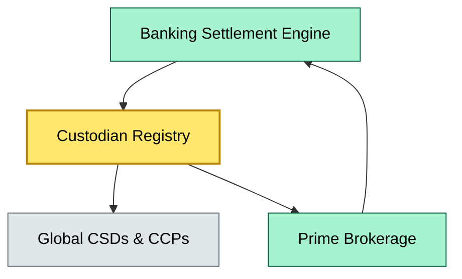

# C1-07 Industry landscape (key players, market share, today's dynamics) — BRIEF
> **Category:** C1 Foundations · **Difficulty:** ◑ (Core) · **Banking-relevant:** yes / 💳

> **One-liner:** The global securities custody market is dominated by a handful of systemically important omnibus-account providers that hold trillions in client assets, and understanding their market-share concentration and competitive positioning is essential for any enterprise architect designing or integrating settlement, safekeeping, or collateral-management systems.

> **Why an enterprise architect / trainee cares:** In a linked banking context, custody is the ultimate vault and settlement integration point; banks that do not yet know which registry and clearing layers connect to which custodian are unequipped to make credible technology decisions on DVP, triparty repo, or cross-border collateral optimization.

## Quick definition
Securities custody is the business of holding financial assets (equity, debt, derivatives, fund units) on behalf of beneficial owners while recording ownership in electronic form on an omnibus or segregated ledger. The custodian intermediates between issuers/repo counterparties and the asset manager/pension fund, ensuring safe-keeping, income collection, corporate-action processing, and settlement finality.

## Key ideas / terms
- **Omnibus account:** A pooled holding account where many clients' securities are held under one nominee title.
- **Triparty repo:** A repo transaction where a *triparty agent* (often the custodian) matches the repo holder and the issuer of cash, ensuring smooth collateral substitution.
- **DPCC / S&C / BNY:** Global systemic custodians (BNY Mellon, State Street/ State Street Global Services, SS&C) controlling the majority of AUM.
- **Safekeeping fee / fee basis:** How custody revenue is calculated (percentage of AUM, per-position, or per-transaction).
- **Segregated vs. omnibus:** Segregated (each client owns their own sub-ledger) is safer; omnibus (one pooled ledger) is cheaper but statistically riskier in a default scenario.
- **Client security lending:** Generating yield by lending securities to short-sellers, a high-volume, high-margin revenue stream.

## The mental model
In the banking architecture stack, custody sits at the *settlement layer* as the authoritative source of truth for "who owns what." It feeds data into the bank's *settlement and collateral management engine*, while itself receiving credit and derivative claim tickets from the *clearing layer* (CCP / CSD). A bank's enterprise system must be able to reconcile in near real time with the custodian's registry, because any mismatch in the custody ledger propagates instantly into margin calls, fund-flow failures, and regulatory shortfalls.

## When to use / when NOT to use
- ✅ **Use when:** You are scoping a system that interfaces with a major custodian or needs to model end-to-end settlement risk.
- ⚠️ **Avoid when:** You are only dealing with a single small jurisdiction or an internal "notional" custodian; the dynamics do not change the architecture.

## Banking 💳 example
A global investment bank runs a $50 bn T+2 repo book with its triparty agent (e.g. BNY Mellon). If the bank's enterprise settlement engine cannot reconcile the custodian's collateral position against the CCP's margin model in near real time, the CCP levies a liquidity haircut that cascades into the bank's LCR and NSFR calculations. The control leverage is therefore the *integration* between the bank's internal position engine and the custodian's digital API (e.g. BNY Mellon's DRW / Acacia platform).

## Common confusions (don't mix these up)
- **Custodian vs. sub-custodian:** A custodian *outsources* safekeeping to a local sub-custodian in a host market; the risk-ownership does not move.
- **Depository vs. custodian:** A depository holds securities in *physical* form or under *segregated* ledger structures for national-level settlement; a custodian is a *service provider* that sits on top of or alongside it.
- **Clearing vs. custody:** Clearing is *risk mutualization* (CCP netting, CCP default fund); custody is *safe-keeping* and *title record*.

## Interview / recall prompt
  - “Explain industry-landscape custody risks in two minutes without notes.”
    - 1. Name the big three (BNY, State Street, SS&C) and what they control (~70 % of global AUM).
    - 2. Distinguish omnibus from segregated; explain which regulators favor which.
    - 3. Triparty repo and client securities lending as revenue levers.
    - 4. The integration pattern: bank settlement engine ↔ custodian API ↔ central CSD / CCP.
    - 5. Concentration risk = systemic importance, not just commercial importance.

## Status
☐ Not started · See detail doc: `details/C1-07-industry-landscape.md`

---
**One diagram required. Both brief + detail must exist before ✓.**
