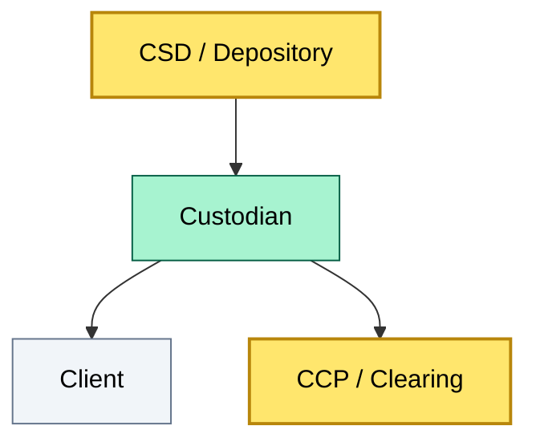

# C1-08 Custody & AM glossary: essential vocabulary — BRIEF
> **Category:** C1 Foundations · **Difficulty:** ● (Foundational) · **Banking-relevant:** yes / 💳

> **One-liner:** A curated, precise glossary of custody and asset-management terminology that equips presolving enterprise architects to move confidently from surface-level buzzwords to exact definitions, avoiding the costly confusion between "settlement," "clearing," "custody," and "depository."

> **Why an enterprise architect / trainee cares:** In banking design reviews, RMS, CCP bridge, and DORA compliance discussions, ambiguous terms become *integration failures*. This glossary is the *shared vocabulary* that lets the BA, the risk officer, and the custodian product owner speak the *same* *bounded context*.

## Quick definition
A glossary is a *controlled vocabulary* that classifies a domain's terms by their *functional role* (e.g., title-transfer, risk-mitigation, income collection) and their *lifecycle stage* (e.g., onboarding, position maintenance, corporate action). In custody specifically, it isolates *who holds title*, *who bears loss*, *who reconciles*, and *who reports* — because mixing these up leads directly to *operational* and *regulatory* failures.

## Key ideas / terms
- **Title-transfer:** The legal act of moving ownership from whoever held the security before to the new holder.
- **Settlement:** The exchange of cash and securities that concludes a trade, converting a *trade* into a *book-entry*.
- **Clearing:** The process where a *clearing house* or *CCP* guarantees the trade, mutualizing counterparty risk.
- **Depository:** A *national* or *regional* entity that holds securities in *physical* or *dematerialized* form (e.g., DTCC, Euroclear).
- **Reconciliation:** The process of comparing expected and actual positions across systems to detect *discrepancies*.
- **P&L tracking:** The measurement of profit or loss on a holding or trade, usually at the *cash* and *investment* level.
- **Income collection:** The active pursuit and securing of coupon, interest, and dividend payments on held securities.
- **Corporate action:** Events issued by a *corporate issuer* that affect holdings (e.g., *splits*, *mergers*, *voting rights*).
- **Proxy voting:** The exercise of *shareholder* *voting rights* by a custodian on behalf of *beneficial owners*.
- **Segregation:** The holding of *client* assets in *separate* *legal* or *accounting* buckets, distinct from the *custodian's own* assets.
- **Passivity:** A *no-action* stance where a custodian does not *reinvest* or *rebalance* without explicit *client instruction*.
- **User-holder account:** The *end investor's* holding within an *omnibus* or *segregated* *sub-ledger*.
- **Nominee:** A *registered legal owner* (often the custodian's *name*) under which *securities* appear on *CSD/Depository* *ledgers*.
- **Beneficial owner:** The *true* *economic owner* of an *asset*, who may differ from the *nominee* holding *title*.
- **Lending agent:** A *third-party* *service* that *manages* *securities lending* programs on behalf of the *custodian* or *asset manager*.
- **Tri-party service:** A *combined* *repo* *clearing* and *settlement* *service* provided by a *specialized agent* (often a *major custodian*).
- **Credit risk:** The threat that a *counterparty* will *fail* to *deliver* or *return* securities or cash.
- **Operational risk:** The risk of *loss* from failed or defective *processes*, *people*, or *systems*.
- **Cyber risk:** The *risk* of *data* breach or *system* failure due to *cyber* *penetration*.
- **Liquidity transformation:** The *difference* between *short-term* liabilities (repo borrowing) and *long-term* assets (securities), a *core* *function* of *triparty*.
- **Credit transformation:** The *act* of *re*allocating *counterparty* *risk* via a *CCP* or *guarantees*.
- **Amortized cost:** An *accounting* method where a *security* is *valued* at its *acquisition* *price* *adjusted* for *amortized* *amortization*.
- **Book-entry system:** A *registry* *of* *ownership* *maintained* as *electronic* *book-entries*, *instead* of *physical* *instruments*.
- **Systemic provider:** A *vendor* or *counterparty* whose *failure* is *material* *enough* to *disrupt* *financial* *stability*.
- **Referral:** A *transaction* *classification* used in *securities* *lending* and *repo* to *reclassify* *securities*.
- **Returnable loan:** A *securities* *lending* *lending* *type* where *securities* are *borrowed* with an *obligation* to *return* *specifically*.
- **Inflated loan:** *Same* as *returnable* in *US* *terminology*?
- **Accretion:** The *process* of *increasing* or *expanding* the *size* or *value* of a *holdings*
- **Default fund:** A *mutualized* *pool* of *resources* held by a *CCP* to *cover* *participant* *losses* in a *default*.
- **European** **single** **access** **point** (ESAP): A *mechanism* used by *CSDs* to *provide* a *single* *legal* *access* *point* for *settlement* *participants.
| **CSD** | *Central* *Securities* *Depository* *entry*
- **DTCC** | *Depository* *Trust* *&* *Clearing* *Corporation* *entries*
- **T2S** | *Target* *2* *Securities* *SEPA-style* *settlement* *platform*
- **CLEAR** | *CLEAR* *SE* *ASP* *index* *clearing*

## The mental model
In the *banking* *architecture* *stack*:
1. **Depository / CSD** = the *physical* *or* *book-entry* *vault* where a *security* *exists*.
2. **Custodian** = a *service* *provider* that *reads* from *and writes to* the *CSD* *entry* on behalf of *many* *clients*.
3. **CCP / Clearing** = the *risk* *mutualizer* that *netting* and *default-fund* *guarantees* *trades*.
4. **Settlement engine** = the *internal* *bank* *system* that *routes* *cash* *and* *security* *instructions* to the *CSD*.
5. **Glossary** = the *shared* *language* that *prevents* *sub-system* *miscommunication*.

## One diagram (mandatory)

## When to use / when NOT to use
- ✅ **Use when:** You are onboarding a *new* *participant* to *custody* *or* *asset* *management* and need a *single* *source* *of* *truth* for *definitions*.
- ⚠️ **Avoid when:** You are *writing* *depth-level* *legal* *or* *regulatory* *text*; the *glossary* is *not* a *compliance* *manual*.

## Banking 💳 example
A *bank's* *enterprise* *architect* *must* *know* that a *securities* *lending* *reference* *to* a *CCP* *default* *fund* *is* *not* a *deposit* *insured* *by* *the* *FDIC* *—* *only* *the* *CCP's* *mutualized* *resource* *applies*. The *glossary entry* *for* *default* *fund* *thus* *sets* the *correct* *expectation* *for* *the* *risk* *officer*.

## Common confusions (don't mix these up)
- **Custodian vs. Sub-custodian:** A *custodian* *outsources* *some* *functions* *to* a *sub-custodian* *in a* *foreign* *jurisdiction*; it *does* *not* *delegate* *ownership.
- **Clearing vs. Settlement:** *Clearing* *is* *risk* *mitigation* (netting, mutualization); *settlement* *is* *final* *exchange* *and title* *transfer.
- **Physical vault vs. Book-entry:** A *physical vault* holds *parchment* *certificates*; a *book-entry system* holds *digital* *records;* *most* *assets* *today* *are* *book-entry.

**Interview / recall prompt:**
- "Explain custody & AM glossary terms in two minutes without notes."
  - 1. Distinguish *custodian* (service provider) from *depository* (physical holder).
  - 2. Clarify *clearing* (risk mutualization) vs *settlement* (final transfer).
  - 3. Know *segregation* vs *omnibus* (pooled) structures.
  - 4. Define *corporate action*, *income collection*, *proxy voting*.
  - 5. Explain *securities lending* as a *revenue* *and* *risk* *instrument*.

## Status
☐ Not started · See detail doc: `details/C1-08-glossary.md`

---
**One diagram required. Both brief + detail must exist before ✓.**
