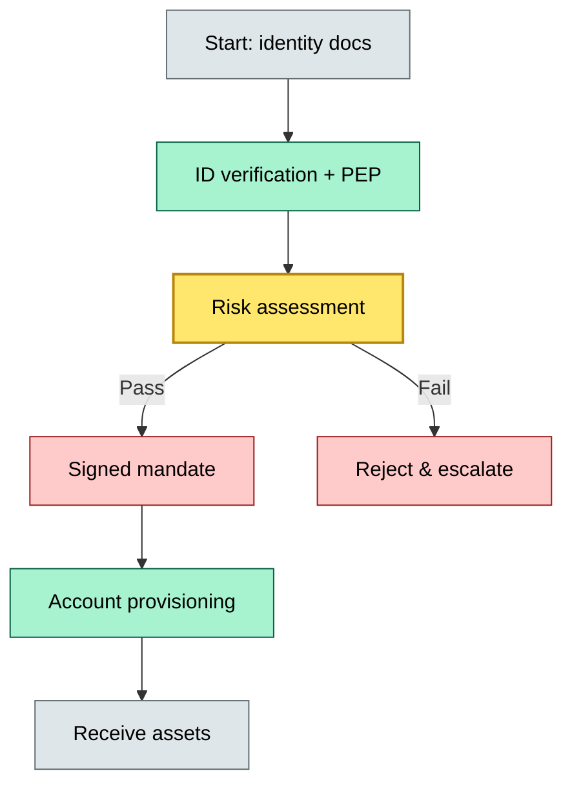

# [C2] Client onboarding — BRIEF
> **Category:** C2 Core Business Flows · **Difficulty:** ◑ · **Banking-relevant:** yes / 💳

> **One-liner:** Client onboarding is the regulated workflow that establishes identity, assesses risk, signs the custody mandate, and configures the sub-account before any asset is received.

> **Why an enterprise architect / trainee cares:** Onboarding is the first and most audit-heavy point of contact. A failed onboarding leaves the bank exposed to AML, sanctions, and mis-allocated legal title. The architect must insist on a state machine that gates fund reception behind regulatory clearance, not human memory.

## Quick definition
Onboarding is the sequential process of verifying a client's identity, assessing their risk profile and regulatory status, signing a custody mandate or agreement, and provisioning the account structure before assets can be credited.

## Key ideas / terms
- **KYC (Know Your Customer):** Verification of legal identity, beneficial ownership, and source of wealth/funds.
- **PEP (Politically Exposed Person):** Enhanced due diligence required for individuals holding prominent public positions.
- **AML (Anti-Money Laundering):** Screening against sanctions lists, monitoring transactions, and filing suspicious activity reports.
- **Suitability assessment:** Determining whether the client's risk tolerance matches the bank's product range.
- **Mandate / mandate letter:** The signed instruction authorizing custody, trading, and corporate actions.
- **Risk appetite:** The level of risk a client is willing and able to bear.

## The mental model
Onboarding sits at the boundary of three systems: (1) identity verification systems (e-KYC, video KYC), (2) risk and compliance engines (OFAC screening, PEP lists), and (3) custody account provisioning (SWIFT BIC setup, GL resets). It is static inflow processing with dynamic downstream consequences. A bank that builds onboarding as a paper chase will discover, two quarters in, that a single missing PEP flag caused a retroactive manual review and a 14-day asset freeze. The architect must treat onboarding as a state machine with irrevocable gates.

## One diagram (mandatory)

## When to use / when NOT to use
- ✅ **Use when:** Opening a new custody mandate, onboarding a new asset class, or responding to regulatory audits.
- ⚠️ **Avoid when:** When the client is already onboarded and only requesting a service change; use an amendment flow instead of full re-onboarding.

## Banking 💳 example
A corporate client in Frankfurt opens a segregated omnibus account. The compliance team screens the CTO against the UN sanctions list (clear), the PEPS database (clear), and runs an AI/ML risk score on the source-of-wealth narrative (score 6/10). The bank runs XML KYC with German BaFin portals, generates a local GL reset, and sends the mandate to legal. The CIO signs with an e-signature. The account is provisioned FOC-M next day. If the PEP screen had triggered a hit (false positive), the asset reception would have been blocked for 14 days.

## Common confusions (don't mix these up)
- **Onboarding** vs **account opening:** Onboarding is the regulatory and identity process; account opening is the technical provisioning. Onboarding must finish before opening can begin.
- **KYC** vs **AML:** KYC is the initial identity verification; AML is the ongoing monitoring for suspicious transactions.

## Interview / recall prompt
"Run me through onboarding a new custody client from document submission to first asset receipt."
- Collect and verify identity documents (passport, proof of address).
- Screen against PEP, sanctions, and negative media lists.
- Conduct a suitability and risk-appetite assessment.
- Generate a signed custody/advisory mandate.
- Provision the account (GL reset, BIC, sub-account).
- Gate: no asset receives until all regulatory gates are cleared.
- Failure modes: incomplete source-of-wealth, false PEP hit, missing e-signature audit trail.

## Status
☐ Not started · See detail doc: `details/C2-01-onboarding.md`

---
**One diagram required. Both brief + detail must exist before ✓.**
