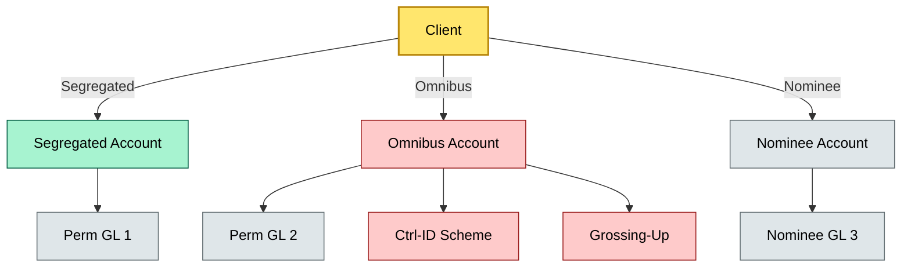

# [C2] Account structure — BRIEF
> **Category:** C2 Core Business Flows · **Difficulty:** ◑ · **Banking-relevant:** yes / 💳

> **One-liner:** Account structure is the choice of segregated, omnibus, or nominee ownership that determines risk locus, who holds legal title, and how many accounts the bank must manage.

> **Why an enterprise architect / trainee cares:** The wrong account structure means the bank holds legal title it cannot prove, cannot sweep cash across clients, or cannot aggregate for deposit insurance. It is the first architectural decision in every custody text, and most banks carry the wrong structure because onboarding was optimized for sales, not compliance.

## Quick definition
Account structure is the legal and operational choice of how client assets are held: segregated (each client has a distinct legal entitlement), omnibus (assets pooled under one legal title with internal risk controls), or nominee (the custodian holds title directly, with no direct client relationship).

## Key ideas / terms
- **Segregated:** Each client's securities held in a dedicated account; title is ring-fenced; most expensive to administer.
- **Omnibus:** Single pooled account; legal title is shared; internal risk controls and grossing-up determine allocations.
- **Nominee:** The custodian holds title in its own name; clients have contractual, not legal, entitlements; tax and legal complexity increases.
- **Grossing-up:** Netting internal positions across omnibus lines to compute gross positions for regulatory reporting and stress testing.
- **Ctrl-ID:** Control identifier; the internal code mapping omnibus shares to individual client entitlements.

## The mental model
Account structure is the foundation of the custody service. It determines three downstream systems: (1) the GL reset strategy (one GL per client for segregated; one GL for omnibus with sub-ledgers), (2) the regulatory reporting model (detailed per-client for segregated; aggregate for omnibus), and (3) the tax venue choice (segregated = direct withholding; omnibus = pass-through with 1099-B or equivalent). A bank that mixes structures without a policy decision will one day fail a regulatory audit because omnibus without proper grossing-up produces a 43% error in held-for-custody lines.

## One diagram (mandatory)

## When to use / when NOT to use
- ✅ **Use when:** Designing a new custody offering, evaluating a switch between bank's own custody and a sub-custodian, or responding to regulatory capital questions.
- ⚠️ **Avoid when:** When clients demand same-day segregation; build a hybrid account structure with a qualified omnibus settlement line instead.

## Banking 💳 example
A Swiss wealth manager uses SIX SIS in an omnibus structure. All UHNWI clients' Apple shares flow into GL-2, CCVG. The compliance team computes daily gross-up to determine held-for-custody volumes for CSDR, tax withholding, and SIPC reporting. A temporary account error (Ctrl-ID mismatch) causes €12m of Apple shares to be reported as held-by-the-bank; the error is caught by a daily reconciliation bot, but the firm nearly had to report incorrect CSDR collateral values until amended.

## Common confusions (don't mix these up)
- **Omnibus vs nominee:** Omnibus is pooled under one legal title with internal tracking; nominee is the custodian holding in its own name with no client-level tracking on the register.
- **Segregated vs omnibus:** Segregated preserves per-client legal title; omnibus aggregates title for efficiency at the cost of internal grossing risk.

## Interview / recall prompt
"Explain the trade-off between segregated, omnibus, and nominee custody structures."
- Segregated: legal title is ring-fenced per client; high operational cost; required for some regulators.
- Omnibus: pooled title, internal risk controls, lower cost; requires daily grossing-up.
- Nominee: custodian holds title directly; tax and legal complications; used in cross-border contexts.
- The architect must map account structure to GL resets, regulatory reporting, and tax venue.
- Failure modes: omnibus without grossing-up, nominee with missing contractual rights.

## Status
☐ Not started · See detail doc: `details/C2-02-account-structure.md`

---
**One diagram required. Both brief + detail must exist before ✓.**
