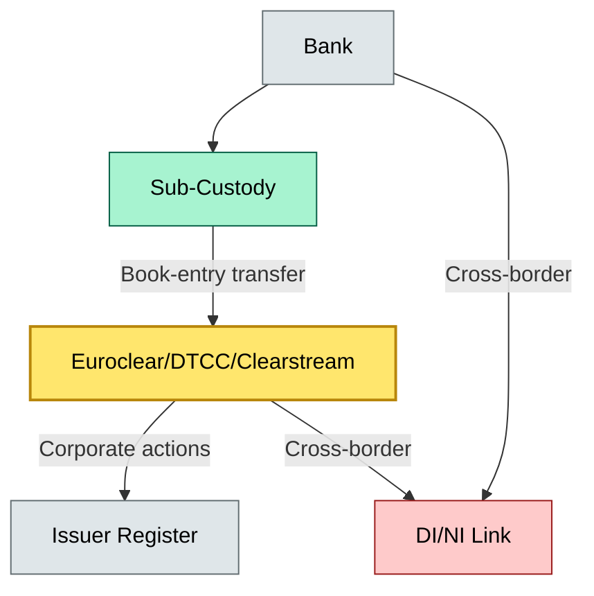

# [C2] Delivery to CSD — BRIEF
> **Category:** C2 Core Business Flows · **Difficulty:** ◑ · **Banking-relevant:** yes / 💳

> **One-liner:** Delivery to CSD is the legal transfer of title through a central securities depository, enforced by the depository's netting and book-entry system.

> **Why an enterprise architect / trainee cares:** The CSD is the apex title-holder for most markets. An error here produces a legal loss that cannot be reversed by IT remediation; the settlement collapse in Greece's T+2 to T+1 transition in 2023 cost €3bn in write-offs due to netting failure. The architect must model the CSD as a black-box boundary with immutable state: once the CSD acknowledges, the bank's audit is complete.

## Quick definition
Delivery to a Central Securities Depository (CSD) is the legal, book-entry process by which a custodian or sub-custodian transfers legal title to a client (or to another institution) via the central securities depository. It is the mechanism that makes settlement possible in most developed markets.

## Key ideas / terms
- **Central Securities Depository (CSD):** A legal entity that holds securities in book-entry form and provides securities settlement services (EU: Clearstream, Euroclear; US: DTCC; UK: Euroclear UKI; Japan: Japan Securities Depository).
- **Book-entry:** The physical form of securities: records on a master ledger, not paper certificates.
- **Netting:** The multilateral process of offsetting buy and sell obligations to reduce the total settlement value.
- **D1/D2:** Domain 1 (cash) and Domain 2 (securities) in TARGET2-Securities (T2S); the CSD moves securities in one domain and cash in another.
- **Settlement bank:** The bank that holds a direct or indirect account with the CSD or with a CSD participant.
- **Standard Settlement Instructions (SSI):** Pre-agreed parameters (BIC, account numbers, address, specimen signatures) that allow the CSD to execute settlements without repeating bilateral checks.
- **T2S:** The European real-time gross settlement system for securities (top-layer) and cash (e-money).
- **Depository interconnect (DI/NI):** The cross-border link between CSDs.
- **Collateral pool:** A group of securities held in the CSD that can be pledged to another institution.

## The mental model
Delivery to a CSD sits at the apex of the title chain: bank \u2192 sub-custodian \u2192 CSD \u2192 institution \u2192 client. If the CSD is the final arbiter of title, then every revenue-impact event (corporate action, recall, dividend) is an API call to the CSD's upstream. The architect must treat the CSD as a black-box boundary with immutable state: once the CSD acknowledges, the bank's audit is complete; its systems can only reconcile, not reverse.

## One diagram (mandatory)

## When to use / when NOT to use
- ✅ **Use when:** Evaluating CSD relationships, redesigning cross-border settlement, or selecting a sub-custodian for a market.
- ⚠️ **Avoid when:** When the asset type is not CSD-eligible (e.g., some crypto-asset tokens); use alternative custody arrangements.

## Banking 💳 example
In 2023, Greece's Amfissa S.A. CSD transitioned from T+2 to T+1. Six months post-go-live, a netting error caused 2,000 transactions to fail settlement; the bank had to unwind €4bn in positions. The operational cause was a database sequence drift between the bank's matching engine and the Amfissa CSD. The risk: the CSD is the apex; if its state diverges from the bank, the bank must absorb the reversion cost.

## Common confusions (don't mix these up)
- **CSD vs. exchange:** The CSD holds legal title; the exchange facilitates price discovery and trade execution.
- **CSD vs. sub-custodian:** The CSD is the apex title-holder; the sub-custodian is the bank's delegated title holder.

## Interview / recall prompt
"Explain how delivery to a CSD works and what the title chain looks like."
- The title chain: bank \u2192 sub-custodian \u2192 CSD.
- CSD = apex legal title; sub-custodian = delegated title holder.
- Book-entry transfer replaces wire-style transfer.
- Netting reduces settlement value (e.g., Euroclear).
- DI/NI links cross-border securities.
- Corporate actions processed at issuer and CSD level.
- Standard Settlement Instructions (SSI) reduce bilateral checks.

## Status
☐ Not started · See detail doc: `details/C2-04-delivery-to-csd.md`

---
**One diagram required. Both brief + detail must exist before ✓.**
