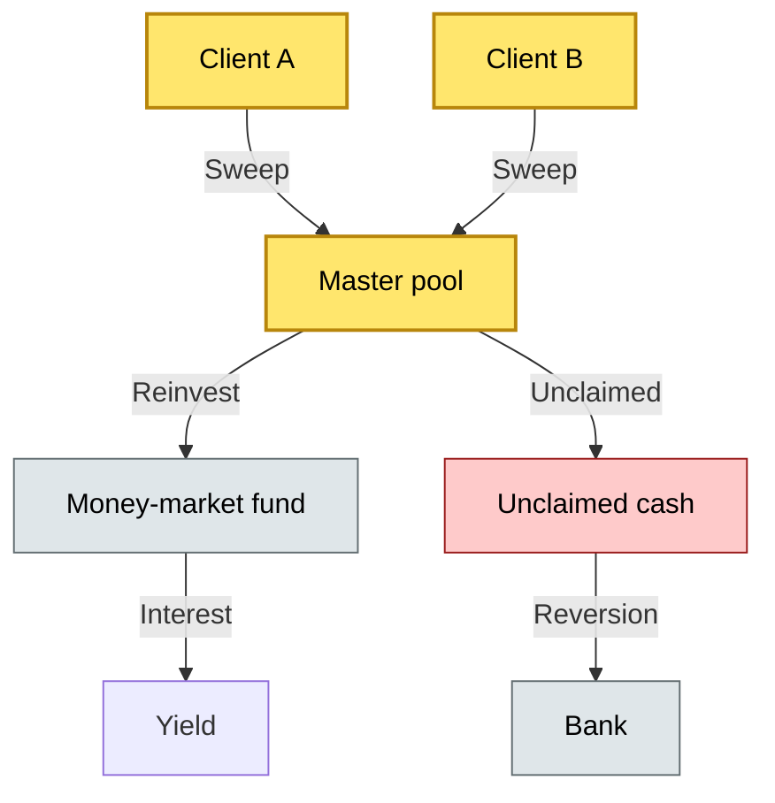

# [C2] Cash management — BRIEF
> **Category:** C2 Core Business Flows · **Difficulty:** ◑ · **Banking-relevant:** yes / 💳

> **One-liner:** Cash management is the institutional process of pooling, sweeping, and reinvesting client and bank cash to maximize liquidity and yield while respecting regulatory segregation and reinvestment mandates.

> **Why an enterprise architect / trainee cares:** Cash is the highest-turnover asset in custody. If cash sits idle, the bank loses yield and the client loses income. If cash is swept incorrectly, the bank may commingle client and proprietary funds, violating CSDR and MiFID II. The architect must design a tension-balanced system: efficient cash movement vs. regulatory segregation.

## Quick definition
Cash management is the operational and strategic process of pooling cash from multiple accounts, sweeping it to a common master account, and reinvesting it in eligible instruments (term accounts, money-market funds, reverse repos) according to a pre-approved mandate.

## Key ideas / terms
- **Cash pooling:** Combining cash from multiple accounts into a single master account to maximize interest yield or minimize loan size.
- **Sweep:** Automated transfer of idle cash from a client account to a master account or money-market fund.
- **Reinvestment:** The process of placing swept or unclaimed cash into interest-bearing instruments.
- **Collective Investment Scheme (CIS):** A pooled investment vehicle; cash management may sweep into a money-market fund (a CIS).
- **Master account:** A central cash account (bank-sovereign or corporate) that holds the pooled cash.
- **Unclaimed cash:** Cash in a client account that has been idle for a statutory period (e.g., 3–5 years) and reverts to the bank.
- **ESMA MAR:** Restrictions on incentive structures for sweep-into-fund arrangements (see MiFID II).
- **CSDR:** Client asset rules requiring segregation; cash from different clients may be pooled for investment but must be individually tracked.
- **Arbitrage risk:** The risk that cash swept into a low-yield instrument could have been lent at a higher rate.
- **Liquidity:** The ability to meet cash and collateral calls on demand.
- **Yield:** The return generated by cash management; target is to exceed the bank's cost of funds by a defined margin.

## The mental model
Cash management sits at the intersection of treasury (funding), asset servicing (investment), and compliance (segregation). The tension: pool cash for yield, but track each client individually for CSDR and MiFID II. The solution is a **glass-box** architecture: one master account, with internal records that map ownership per client. It is a fiduciary optimization problem.

## One diagram (mandatory)

## When to use / when NOT to use
- ✅ **Use when:** Managing a large client cash balance, evaluating a sweep-into-fund mandate, or designing a liquidity crisis play
- ⚠️ **Avoid when:** Client mandate prohibits pooling; use direct deposit or individual money-market placement

## Banking 💳 example
A UK broker-dealer operates a cash sweep into a UK money-market fund. Under ESMA MAR, the broker must not receive sales concessions that create a conflict of interest; the sweep rate must match the fund's published net asset value change. In 2018, a broker-dealer in a different jurisdiction received a 3% incentive on a fund with a 1.5% yield, and MiFID II required disclosure; the broker disclosed 0.2% but the true trade-adjusted incentive was 1.8%, a regulatory breach.

## Common confusions (don't mix these up)
- **Cash pooling vs cash sweep:** Pooling is the consolidation of cash; sweep is the automated movement of idle cash
- **Cash management vs treasury funding:** Cash management serves clients; treasury funding serves the bank's liquidity; they overlap in the master account
- **Reinvestment vs reconveyance:** Reinvestment generates yield; reconveyance returns cash to the client
- **Master account vs client account:** Master account is pooled and bank-owned; client account is individually owned

## Interview / recall prompt
"Explain the tension between cash pooling efficiency and regulatory segregation in custody."
- Master account pools cash for yield; each client is tracked internally per CSDR.
- Reinvestment is governed by a mandate; unclaimed cash reverts.
- ESMA/MiFID restrictions on incentives apply.
- Having a master account reduces funding costs and improves investable yield.
- Sweep-into-fund is often done; ESMA/MiFID regulate incentives and disclosure
- Unclaimed cash may revert to the bank
- Risk: commingling, arbitrage, reinvestment conflict
- T-bundle or e-money account may be used

## Status
☐ Not started · See detail doc: `details/C2-06-cash-management.md`

---
**One diagram required. Both brief + detail must exist before ✓.**
