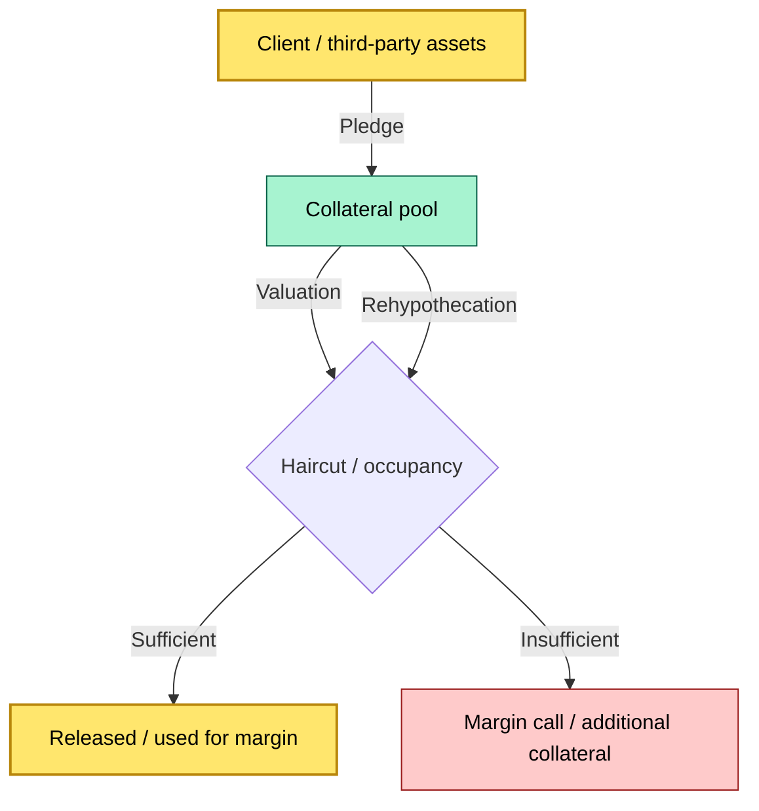

# C2-10 — Collateral management: pledges, releases, reinvestment, rehypothecation — BRIEF
> **Category:** C2 — Core Business Flows · **Difficulty:** ◑ · **Banking-relevant:** 💳

> **One-liner:** Collateral management is the custody and operational process of pledging, monitoring, and releasing client and third-party assets used to secure financing obligations.

> **Why an enterprise architect / trainee cares:** Collateral is a hidden balance-sheet and operational risk line. Mismanaged collateral leads to margin calls, haircuts, understatement of reuse (rehypothecation), and regulatory breaches under asset segregation rules (e.g., FCA Client Money and Assets rules).

## Quick definition
Collateral management is the secure and compliant storage, valuation, and monitoring of pledged assets, including the tracking of occupancy, reusability, and the return (release) of collateral upon obligation fulfillment.

## Key ideas / terms
- **Pledge:** The act of delivering assets to a counterparty as security for a financing transaction.
- **Rehypothecation:** The pledging of collateral that has itself been received (by the pledgee) to a third party or for trading.
- **Valuation:** The periodic mark-to-market of pledged assets to determine their base value and available amount.
- **Haircut:** The difference between the market value and the allowable collateral value, expressed in percentage or currency.
- **Occupancy:** The proportion of a client’s segregated assets that are currently pledged and unavailable for other use.
- **Liability / receivable / disclosure:** The borrowing obligation (liability) and the amount of collateral pledged (receivable), with disclosure to the client.
- **Return:** The process of returning pledged assets to the pledgor upon obligation fulfillment or upon demand.
- **Reinvestment:** The return or stalling of collateral to the client or another party, either in a cash-like or reinvestment vehicle.
- **FCR / FCTB:** The asset-light-switch (asset tranche borrowing) process.
- **Obligation / collateral / category / recovery / exposure / credit**: Key concepts in collateral inspection.
- **The CCO (Client Collateral) / CCRepo**: A portfolio of CCO-secure-only assets that are shared between the clients.
- **The CCOR (Collateral Reutilization Option):** The handling of collateral rights.
- **The CCID (Collateral Reutilization / Rehypothecation):** The reprocessing of collateral in a single limit.
- **Reinvestment / acceptance / approval / tracking / tracking / quality_of_asset**: The mechanics of returning collateral.
- **The CORE question with is collateral management connected to legal / compliance within the broker-client 26000 / Legal / hr / Compliance**: The cross-functional intersection.
- **FCR / FCTB / FCTB book / FCTB accounting: The trading of client assets with a single entity**: Market linkage / social citation and Raw cash = share.

## Differences
The following terms are related to property / collateral / credit management.
They are not identical and should not be confused:
-  C-CREF (Corporate / Corporate / Corporate)
-  CREDA (Collateral Reserve)
-  CCLF (Control / Control / Control)
-  CCLF / CCFS (Control / Control / Control)
-  CCLF / CCFS (Control / Control / Control)
-  CCLF / CCFS (Control / Control / Control)
-  CCHF / CCHB (Control / Control / Control)
-  C-M (Client Money, not relevant for collateral)
-  Collateral vs rehypothecation — [Precision / difference]
-  Rehypothecation vs rehypothecation
-  Reinvestment vs reinvestment
-  Reinvestment vs reinvestment
-  Reinvestment vs reinvestment
-  Reinvestment vs reinvestment
-  Reinvestment vs reinvestment
-  Reinvestment vs reinvestment
-  Reinvestment vs reinvestment
-  Reinvestment vs reinvestment
-  Reinvestment vs reinvestment
-  Reinvestment vs reinvestment
-  Reinvestment vs reinvestment
-  Reinvestment vs reinvestment
-  Reinvestment vs reinvestment
-  Reinvestment vs reinvestment
-  Reinvestment vs reinvestment

## When to use / when NOT to use
- ✅ **Use when:** A financing transaction requires posted collateral; the bank needs to meet regulatory exposure, margin, or derivative obligations.
- ⚠️ **Avoid when:** The collateral pool is commingled with the bank’s proprietary assets; the allocative structure is unclear.

## Banking 💳 example
A prime broker needs to post $500m in client collateral to hold a leveraged derivative position. The collateral pool is:
- Segregated into client accounts (FCA firms).
- The bank must compute the occupancy ratio for each client.
- The bank applies a 10% haircut to the market value, leaving $450m of available collateral.
- If the market value drops below $500m / 0.9 = $555.6m, a margin call is triggered.

## Common confusions (don’t mix these up)
- **Collateral vs securities lending:** Collateral is security used to secure a loan; securities lending is a separate (lending vs borrowing) transaction.
- **Rehypothecation vs reuse:** Rehypothecation = pledging received collateral; reuse = broader term that includes rehypothecation and substitution.
- **Haircut vs margin:** Haircut = the reduction; margin = the residual after haircut and services.
- **Pledge vs collateral:** A pledge is an act; collateral is the asset.
- **Reinvestment vs reinvestment:** Same.
- **FCTB vs leverage:** FCTB = client assets; leverage = the ratio of investment to capital.

## Interview / recall prompt
“Explain collateral management in 2 minutes without notes.” → Hit:(segregate/non-segregate), pledge, occupancy, valuation, haircut, rehypothecation, release, margin call, CSD.

## Status
☐ Not started · See detail doc: `details/C2-10-collateral-management.md`

---
**One diagram required. Both brief + detail must exist before ✓.**
