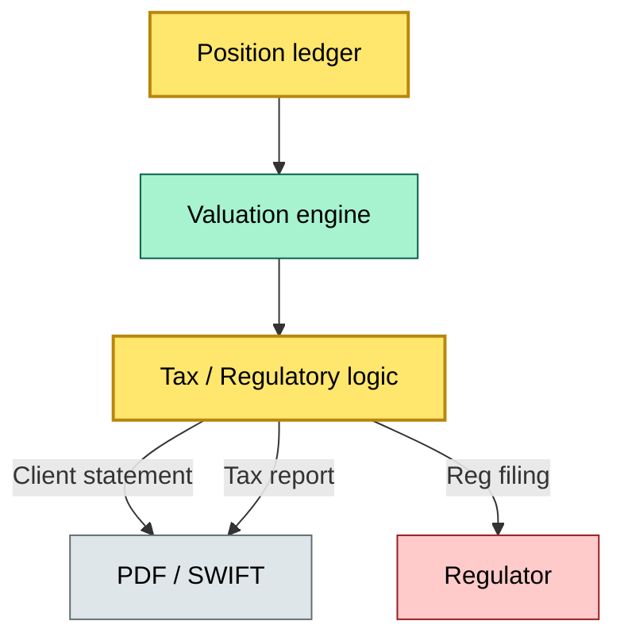

# C2-12 — Reporting and statements: daily, monthly, tax, regulatory — BRIEF
> **Category:** C2 — Core Business Flows · **Difficulty:** ◑ · **Banking-relevant:** 💳

> **One-liner:** Reporting and statements are the output of the custody engine: daily positions, monthly allocations, tax reports, and regulatory filings that make the custody chain auditable and accountable to clients, auditors, and regulators.

> **Why an enterprise architect / trainee cares:** Bad reports mean confused clients, regulatory fines, and audit failures (e.g., SOX, EMIR, MiFID II). The reporting architecture must be a single source of truth, not a patchwork.

## Quick definition
Reporting and statements are the periodic or ad-hoc outputs of the custody engine, generated from the position ledger, valuation, corporate actions, and cash-management data, that deliver client statements, tax reports, and regulator filings.

## Key ideas / terms
- **Client statement:** Periodic report (daily, monthly, quarterly) of held assets, cash, and income.
- **Tax report:** Report of income, dividends, and capital gains for tax authorities.
- **Regulatory report:** Filing to regulator under MiFID II, EMIR, CSCR, etc.
- **Mailing / translation:** Report format (PDF, XML, SWIFT).
- **Cut-off:** The date used to compute a report.
- **Settlement date:** The final settlement date for a report.
- **Position:** The client's assets and liabilities.
- **Return (Net):** The cumulative net return of the portfolio.
- **Integrated / Consolidated:** The level at which the report is compiled.
- **Filing / action:** The filing or action steps in the reporting life cycle.

## When to use / when NOT to use
- ✅ **Use when:** A client or regulator needs a periodic or ad-hoc report.
- ⚠️ **Avoid when:** Reports are generated without reconciliation to the CSD or custody register.

## Banking 💳 example
A US investment manager requires a monthly reconciled statement for a client. The custodian generates an HTML statement showing all positions, cash, and income, reconciles it against the CSD statement, and then sends a PDF to the client and a SWIFT message to the client's bank.

## Common confusions
- **Client statement vs advisory statement:** A custody statement shows holdings; an advisory statement may also show strategy.
- **Tax report vs tax transcript:** A report is current; a transcript is historical.

## Interview / recall prompt
“Explain reporting in 2 minutes without notes.” → Hit: daily, monthly, tax, regulatory; reconciliation, audit; single source of truth.

## Status
☐ Not started · See detail doc: `details/C2-12-reporting-statements.md`

---
**One diagram required. Both brief + detail must exist before ✓.**
