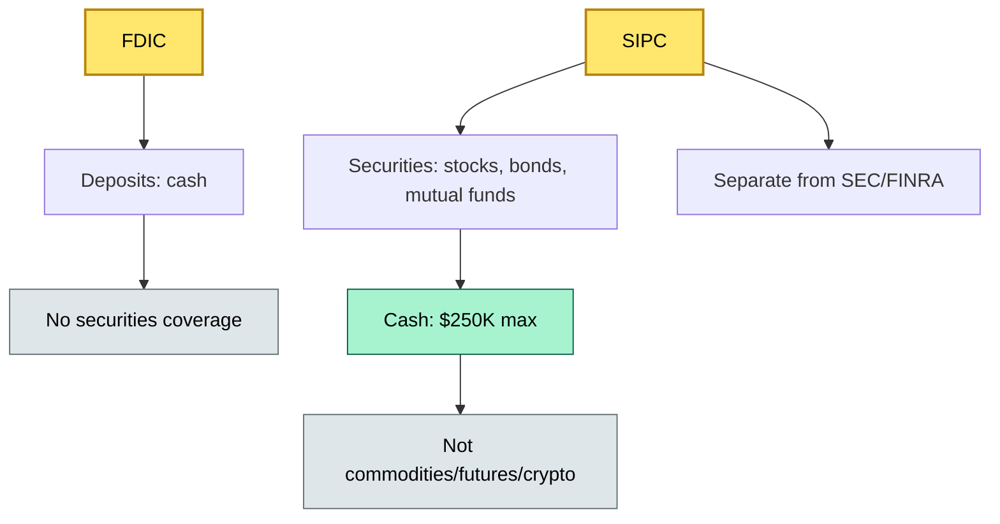

# [C3] SIPC / deposit-type protection and insurance backstop — BRIEF

> **Category:** C3 Regulatory, Risk & Compliance · **Difficulty:** ◑ · **Banking-relevant:** yes / 💳

> **One-liner:** SIPC is a US insurance backstop that protects broker-dealer clients up to $500,000 per person (with $250,000 max in cash) if the broker fails — but it does NOT cover commodities, futures, or crypto.

> **Why an enterprise architect / trainee cares:** Every broker-dealer custody relationship must disclose SIPC coverage in the client agreement. Misrepresenting SIPC as a "guarantee" is a regulator-fineable offense. The architect must tag non-SIPC assets (crypto, commodities) so they are never counted in client insurance disclosures.

## Quick definition
SIPC (Securities Investor Protection Corporation) is a US not-for-profit insurance corporation that provides limited protection for customers of SIPC-member broker-dealers in the event of broker bankruptcy. It is an *insurer*, not a regulator, and coverage is *per client*, not per firm.

## Key ideas / terms
- **SIPC:** $2.5B insurance fund; 2M+ claimants since 1970; first-loss insurer.
- **Coverage:** $500,000 per client; $250,000 max for cash/cash equivalents.
- **Clean claim:** No unfair transfers (no "satisfaction of debt"); SIPC investigates.
- **SIPC not a guarantee:** SIPC ≠ SEC or FDIC; no taxpayer backstop; fund can be depleted (unlikely, but possible).
- **Pro-rata:** Remaining assets split if claims exceed SIPC assets.
- **Excluded:** Commodities (CFTC), futures, fixed annuities, crypto, forex.
- **Trigger:** Broker bankruptcy / SIPC petition; trustee appointed; claim within 90 days.
- **Segregated accounts:** Rule 15c3-3 (SEC) is the *legal* segregation; SIPC is the *insurance* for segregated assets.

## The mental model
SIPC is a **two-layer sandwich**:
1. **Legal layer (Rule 15c3-3):** Segregated accounts keep client assets separate.
2. **Insurance layer (SIPC):** If the broker fails and the segregated account has a shortfall, SIPC covers up to $500K.

If you confuse the two, you over-promise.

## One diagram (mandatory)

## When to use / when NOT to use
- ✅ **Use when:** Disclosing US brokerage insurance coverage; designing asset-type tagging.
- ⚠️ **Avoid when:** Saying SIPC covers "all client assets" or confusing it with SEC enforcement.

## Banking example
**Charles Schwab** is SIPC-eligible. A client with $100K in VOO (SPY) and $60K cash is covered up to $500K. The same client's $20K in ETH is *not* covered.

## Common confusions
- **FDIC vs SIPC:** FDIC = deposit insurance; SIPC = securities insurance.
- **SIPC vs SEC:** SIPC = insurance; SEC = regulator.
- **SIPC vs Privatbrief (Germany):** Privatbrief = German bank bankruptcy protection (3% of deposits, €100K max); no SIPC equivalent.

## Interview / recall prompt
- "What is the SIPC coverage limit and what is the cash cap?"
- "What asset classes are excluded from SIPC?"
- "How does SIPC differ from SEC enforcement?"
- "What is the difference between SIPC and FDGO / ESMA / FCA?"

## Status
☐ Not started · See detail doc: `details/C3-04-sipc-protection.md`

---
**One diagram required. Both brief + detail must exist before ✓.**
