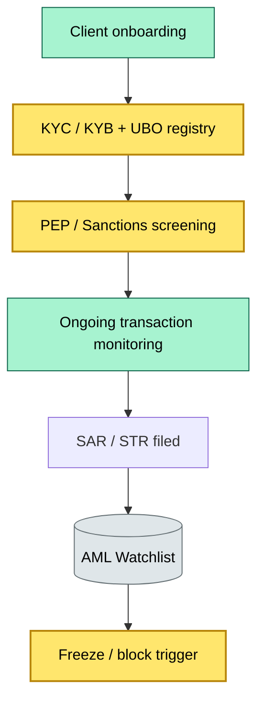

# [C3] FATF / AML / KYC / sanctions — obligation on the custodian — BRIEF

> **Category:** C3 Regulatory, Risk & Compliance · **Difficulty:** ◑ · **Banking-relevant:** yes / 💳

> **One-liner:** FATF sets the global AML / CTF / sanctions minimum; the custodian must continuously verify customers (KYC / KYB / UBO), screen all transactions, report suspicious activity, and freeze sanctioned entities.

> **Why an enterprise architect / trainee cares:** This is the *biggest daily operational burden* of custody and the *heaviest source of fines* when it fails. Every trade, fund, repo, and forward must pass automated sanctions + KYC checks *before* execution. A 100ms look-up is non-negotiable in 2024–2026.

## Quick definition
FATF (Financial Action Task Force) recommendations govern anti-money-laundering, counter-terrorist financing, and sanctions compliance. The custodian must verify identity (KYC), screen against sanctions lists (OFAC, EU, UN, HMT), detect suspicious activity (SAR / STR), and freeze sanctioned entities — continuously, not just at onboarding.

## Key ideas / terms
- **FATF:** 39 member countries + 9 observer countries; sets Recommendations 1-40.
- **KYC:** Verify identity, source of wealth, source of funds.
- **KYB:** Verify legal entity; identify UBOs (usually 25%+ or legal controller).
- **UBO:** Ultimate Beneficial Owner — the natural person ultimately controlling the entity.
- **SBL:** Securities-based money laundering (FATF added this in 2019; covers stocks, bonds, repo, derivatives).
- **PEP:** Politically Exposed Person — enhanced due diligence (EDD) required.
- **OFAC:** Office of Foreign Assets Control (US sanctions).
- **STR / SAR:** Suspicious Transaction Report (UK, EU) / Suspicious Activity Report (US).
- **Sanctions screening:** Real-time / end-of-day matching against global lists.
- **Flag: ALERT**

## The mental model
Every transaction in custody flows through a **4-gate pipeline**:
1. KYC / KYB — identity verified?
2. Sanctions — any match?
3. Risk scoring — is the pattern suspicious?
4. SAR / STR — is it reportable?

If any gate is manual at scale, the bank is non-compliant.

## One diagram (mandatory)

## When to use / when NOT to use
- ✅ **Use when:** Onboarding any client, executing any trade, processing any repo, screening any mutual fund transfer.
- ⚠️ **Avoid when:** Relying on "we did KYC once at onboarding" — it is a continuous obligation.

## Banking example
**HSBC** flagged £52M in suspicious transactions from 2011–2018 but failed to file SARs promptly. The US fined $1.9B (2010); the UK fined £665M (2020). The *screening tools existed* but the *alert-to-action pipeline was broken* — a classic KM / organizational failure.

## Common confusions
- **KYC vs KYB vs UBO:** KYC = customer person; KYB = legal/corporate entity; UBO = ultimate beneficial owner.
- **SAR vs STR:** SAR = US (FinCEN); STR = UK / EU (FIU).
- **Sanctions vs AML:** Sanctions = political restriction; AML = general money-laundering risk (broader).
- **PEP vs HNW:** High-net-worth = standard KYC; PEP = political exposure = enhanced due diligence.

## Interview / recall prompt
- "What is the FATF 'Travel Rule' and how does it apply to securities?"
- "What is the difference between SEC, FCA, and ESS 121?"
- "What are the top 3 failure modes in AML screening?"
- "When does a trade trigger a SAR / STR?"

## Status
☐ Not started · See detail doc: `details/C3-05-fatf-aml-kyc.md`

---
**One diagram required. Both brief + detail must exist before ✓.**
