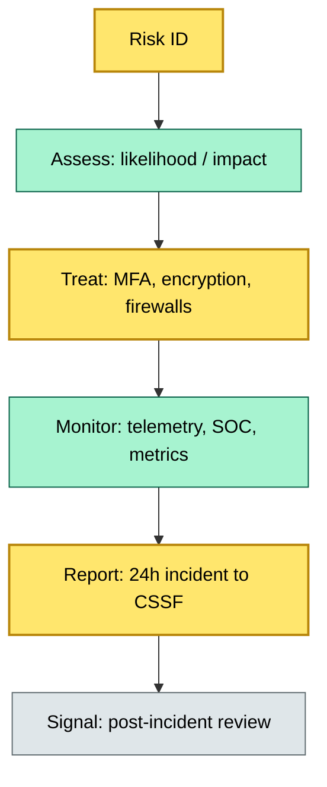

# [C3] Operational risk, business continuity, DORA — BRIEF

> **Category:** C3 Regulatory, Risk & Compliance · **Difficulty:** ◑ · **Banking-relevant:** yes / 💳

> **One-liner:** Operations = business continuity + DORA (EU ICT resilience regulation). DORA makes incident reporting, pen-testing, and migration-paths non-negotiable for any custody entity in the EU.

> **Why an enterprise architect / trainee cares:** This is the *hardest* parallel to 2008 Basel for ICT. DORA's 24-hour incident reporting, RTO / RPO mandates, and BCP / DR visibility mean a "cloud backup" is not enough. The architect must document recovery pathways, live-failover intervals, and 24/7 monitoring/SOC.

## Quick definition
Operational risk = loss from failed processes / people / systems. Business continuity (BCP / DR) is the capability to keep critical operations running during disruption. DORA (EU) is the regulation that codifies all of this into enforceable, time-boxed requirements for any credit institution or investment firm in the EU.

## Key ideas / terms
- **BCP:** Business Continuity Plan — roles / procedures for disruption.
- **DR:** Disaster Recovery — technical recovery (backups, firewalls, heat transfer).
- **DORA:** EU Digital Operational Resilience Act (2022/2554); ICT risk, pen-tests, BCP, incident reporting, asset-name.
- **RTO:** Recovery Time Objective — max acceptable downtime per system.
- **RPO:** Recovery Point Objective — max acceptable data loss per system.
- **BIA:** Business Impact Analysis — defines RTO / RPO per critical operation.
- **MSSP:** Managed Security Service Provider / SOC-as-a-Service — 24/7 monitoring.
- **Active-Active (A/A):** Dual hot-site continuous operations (cost-prohibitive per DORA).
- **Z/2 site:** Dual-wide / 2-site redundant settlement.

## The mental model
DORA is the *non-negotiable* twin to 2008 Basel / FRTB for ICT. It imposes:
- **Incident reporting:** 24-hour window to CSS/FCA/BaFin/ECB (no "we'll get to it").
- **RTO / RPO:** Documented, tested, and reviewed.
- **Penetration testing:** Annual + event-driven.
- **BCP / DR:** Must survive a fire, flood, ransomware, or zero-day.

If the bank cannot answer "how long until settlement resumes after a disaster," it is non-DORA.

## One diagram (mandatory)

## When to use / when NOT to use
- ✅ **Use when:** Designing a settlement / reconciliation data-center stack, choosing RTO / RPO target, or selecting an MSSP.
- ⚠️ **Avoid when:** Saying "cloud backup is enough" or "we'll handle it in the next sprint."

## Banking example
**BNP Paribas:** Dual-hub settlement (Paris + London) with a 1-hour RTO for FX / securities settlement per DORA. Each domestic node = distinct DORA-compliant entity.

## Common confusions
- **BCP vs DR:** BCP = roles / procedures; DR = technical recovery.
- **DORA vs NIS2:** DORA = financial-sector ICT; NIS2 = broader EU critical infrastructure.
- **MSSP vs MDRP:** MSSP = SOC-as-a-Service; MDRP = managed DR / trade-floor (internal).
- **RTO vs RPO:** RTO = time; RPO = data (snapshots).

## Interview / recall prompt
- "What is DORA's reporting deadline for ICT incidents?"
- "What is the difference between RTO and RPO?"
- "Which entities must comply with DORA?"
- "What is a hot-site vs warm-site vs cold backup?"

## Status
☐ Not started · See detail doc: `details/C3-06-dora-business-continuity.md`

---
**One diagram required. Both brief + detail must exist before ✓.**
