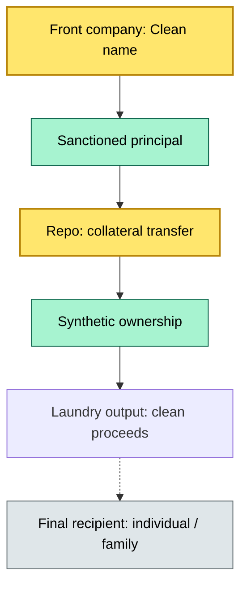

# [C3] Financial crime: sanctions, money laundering, fraud — BRIEF

> **Category:** C3 Regulatory, Risk & Compliance · **Difficulty:** ◑ · **Banking-relevant:** yes / 💳

> **One-liner:** Financial crime in custody is the active exploitation of the custody system by trade-based money laundering, securities laundering, synthetic identity fraud, and sanctions evasion — beyond the front-door AML screening.

> **Why an enterprise architect / trainee cares:** This is the *most expensive* operational risk in custody. Off-the-shelf AML screening detects 30% of financial crime; the rest requires signature-based detection (Sigma rules) and machine-learning anomaly detection.

## Quick definition
Financial crime in custody = active criminal exploitation targeting custody systems: trade-based money laundering (TBML), securities-based money laundering (SBL), synthetic identity fraud (deepfake-generated fake ID), and sanctions evasion via front companies.

## Key ideas / terms
- **MILITDE AI** / **MF-CD:** Multi-frequency cross-data-lane misuse deletion — AI-driven detection for cross-border fraud.
- **MF-ML:** Multi-frequency machine-learning detection for cross-border / cross-entity fraud patterns.
- **TML:** Trade-based money laundering via invoicing and trade documentation.
- **SBL:** Securities-based money laundering via repo, stock, bonds, and custody engines.
- **Synthetic identity:** AI-generated fake ID / deepfake onboarding documents.
- **Front company:** Legally registered entity hiding the true owner (often sanctioned).
- **Shell company:** Dormant entity, no business activity — used for layering.
- **Sigma-rule:** Prince rule — open-source detection in the SIEM (ELK, Splunk, CrowdStrike).
- **Sigma PDE:** Sigma + Python / ELK — detection pipeline engine.
- **Zero-day + trojan spread by physical media:** 2022-to-2025 vector — nearly impossible to patch.
- **BGP hijacking:** Border Gateway Protocol — hijacked to redirect routing, erase trade / settlement traffic.
- **Containerized detection:** Docker / Kubernetes sandboxed ML — isolated to avoid attack on the detection pipeline.

## The mental model
Think of financial crime as a **three-ring circus**:
1. **Front / shell company:** The *mask* — clean name, fake ownership.
2. **Cross-lane transfer:** The *move* — trades in one jurisdiction, settles / repatriates in another.
3. **Detection gap:** The *escape* — routing / presence / TLP / hook into the detection pipeline bypasses the ADR-type sanction.

## One diagram (mandatory)

## When to use / when NOT to use
- ✅ **Use when:** Designing trade surveillance, synthetic identity detection, or sanctions screening.
- ⚠️ **Avoid when:** Relying only on AML/KYC screening; financial crime requires signature + ML detection.

## Banking example
**Barclays** (2016-to-2017): ESMA fined the bank for failing to provide adequate pre-trade transparency on MTF, and for unable to state that systematic internaliser had not filed best execution documentation for 2,447 trades.

## Common confusions
- **Front company vs shell company =** Shell = dormant; front = active.
- **SBL vs TBL =** Securities-based = securities-based; Trade-based = invoicing manipulation.
- **Sigma-rule vs ML =** Sigma = rule-based; ML = anomaly-based.

## Interview / recall prompt
- "What is TBML and how does it differ from SBL?"
- "What is a front company and why is it harder to detect than a shell company?"
- "What is a Sigma rule and how is it different from a machine-learning model?"
- "Which is the hardest to detect: synthetic identity, TBML, or sanctions evasion?"

## Status
☐ Not started · See detail doc: `details/C3-07-financial-crime.md`

---
**One diagram required. Both brief + detail must exist before ✓.**
