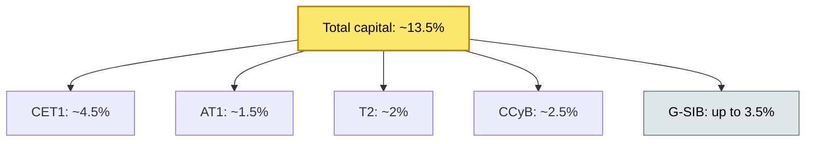

# [C3] Capital & leverage requirements (Basel, liquidity risk) — BRIEF

> **Category:** C3 Regulatory, Risk & Compliance · **Difficulty:** ◔ · **Banking-relevant:** yes / 💳

> **One-liner:** Basel III capital requirements = minimum CET1 / AT1 / T2 + buffers; liquidity = LCR (30-day) + NSFR (1-year). Custody architecture must net exposures and model capital efficiency without compromising the regulatory floor.

> **Why an enterprise architect / trainee cares:** Segregated client assets do NOT count as capital. But repo variation margin, CCP collateral, and liquidity buffers are capital drains. The architect must model the *capital impact* of every custody design — especially repo structures, netting, and margin.

## Quick definition
Capital requirements (Basel III) set minimum capital buffers (CET1, AT1, T2) and add buffers (CCyB, G-SIB). Liquidity risk is measured by LCR (30-day stress) and NSFR (1-year stable funding). For custodians, the key impact is: segregated assets = no capital benefit; repo/margin = capital efficient if netted; variation margin = contingent outflow under LCR.

## Key ideas / terms
- **Basel III:** Post-2008 capital framework; CET1 >= 4.5%; AT1 >= 1.5%; T2 >= 2%; CCyB <= 2.5%; G-SIB <= 3.5%.
- **CET1:** Common equity Tier 1 (common shares, retained earnings).
- **AT1:** Additional Tier 1 (sub-ordinated debt, contingent convertibles).
- **T2:** Tier 2 (revaluation reserves, general provisions).
- **CCyB:** Counter-cyclical capital buffer (up to 2.5% of RWAs).
- **G-SIB:** Global Systemically Important Bank buffer (up to 3.5% extra CET1).
- **LCR:** Liquidity Coverage Ratio >= 100% over 30 days (liquid assets / net outflows).
- **NSFR:** Net Stable Funding Ratio >= 100% over 1 year (available stable funding / required stable funding).
- **RWAs:** Risk-weighted assets (total assets * risk weight).
- **Segregated assets:** Client assets in trust / reserves; NOT counted as capital.
- **Variation margin:** Daily CCP gains/losses; counted as contingent outflow under LCR.
- **LCR-eligible:** Central bank reserves, sovereign bonds, gold; unencumbered; deep market; 0% haircut.
- **IRB:** Internal ratings-based approach; model-based RWAs; requires regulator approval.

## The mental model
Think of capital as a **3-layer highway**:
1. **Core lane (CET1):** The slowest, but most loss-absorbing.
2. **Buffer lanes (CCyB, G-SIB):** Extra capacity during stress.
3. **Utility lane (T2, AT1):** Less loss-absorbing, but cheaper.

Liquidity is the **fuel**: LCR = short-term fuel; NSFR = long-term fuel.

## One diagram (mandatory)

## When to use / when NOT to use
- ✅ **Use when:** Designing repo structures, collateral netting, or liquidity buffers.
- ⚠️ **Avoid when:** Assuming segregated assets = capital-available; they are not.
- ⚠️ **Avoid when:** Assuming LCR = "we have cash in the bank" — it must be HQLA / unencumbered / liquid.

## Banking example
**HSBC** (London / Hong Kong) carries a G-SIB buffer of 3.5% on CET1 — the highest in the UK. A custody sub-unit handling 100bn repo-interchange must net the repo-in and repo-out exposures to avoid duplicating RWAs.

## Common confusions
- **CET1 vs AT1 vs T2:** CET1 = core; AT1 = hybrid; T2 = reserves.
- **LCR vs NSFR:** LCR = 30-day stress; NSFR = 1-year stable funding.
- **Capital vs liquidity:** Capital = loss-absorbing buffer; liquidity = funding.
- **G-SIB vs CCyB:** G-SIB = extra buffer on top of Basel; CCyB = counter-cyclical.

## Interview / recall prompt
- "What is the Basel III minimum CET1 ratio?"
- "What is LCR and what is the minimum ratio?"
- "Why do segregated client assets not count as CET1?"
- "What is the difference between LCR and NSFR?"

## Status
☐ Not started · See detail doc: `details/C3-09-capital-requirements.md`

---
**One diagram required. Both brief + detail must exist before ✓.**
