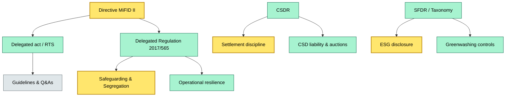

# C3 11 ESMA directives and secondary regulation on custody — BRIEF

> **Category:** C3 — Regulatory & compliance · **Difficulty:** ●/◑/○/◔ · **Banking-relevant:** yes 💳

> **One-liner:** ESMA directives and delegated regulations form the European DNA of custody — dictating segregation, safekeeping, reporting, and outsourcing — and every custodian's operating model is downstream of these rules.

> **Why an enterprise architect / trainee cares:** If you cannot map a system endpoint to a MiFID II / SFDR / CSDR article, you are building blind. These directives are the non-negotiable constraints that shape UI, data model, API shape, and disaster recovery.

## Quick definition

ESMA (European Securities and Markets Authority) writes the rulebook that all EU investment firms must follow. For custody, the headline layer is MiFID II/MiFIR transaction reporting, the Delegated Regulation on safeguarding client assets, the Risk‑mitigation Regulation on central counterparties and settlement discipline, and the Taxonomy Regulation (greenwashing). Secondary regulation (RTS, Guidelines, Q&As) fills in the design specs.

## Key ideas / terms
- **MiFID II:** The core directive creating asset segregation, custody chain traceability, and outline of ancillary-service charges.
- **RTS 1:** Regulatory technical standard on transaction reporting; custody holds must be reported intra-day and day-end.
- **Delegated Regulation 2017/565:** Authorised investment firms and MiFID entities must safeguard client assets in segregated accounts, with strict risk‑management and outsourcing limits.
- **CSDR:** Central securities depositories regulation; drives settlement discipline, auction mechanics, and CSD‑related liability.
- **SFDR & Taxonomy Regulation:** Disclosure of sustainability impact and alignment; custody statements now carry ESG meta-data.

## The mental model

Think of ESMA regulation as a **three-tier sieve**: the directive (MiFID II / MiFIR) sets the policy intent; delegated acts and RTS translate intent into measurable obligations; and ESMA guidelines and Q&As interpret the gray zones. Custody systems must feed data into every tier: repo handling data into MiFID II reporting, netting data into CSDR settlement discipline, and proxy data into SFDR Article 6/8 disclosures. The architecture implication is a **compliance data fabric** — a persistent feed from ledger, trade system, and third-party processor into a single aggregation point that satisfies RegTech and supervisory reporting.

## One diagram (mandatory)

```

## When to use / when NOT to use
- ✅ **Use when:** designing a custody onboarding flow, a change‑management request, or a readiness gap assessment for a new directive.
- ⚠️ **Avoid when:** using EU law as a blanket GDPR justification; MiFID II is not a privacy regulation, and conflating them will break data‑minimisation logic.

## Banking example
A German custodian (or a non-EU branch operating through an EU parent) must segregate German client assets into segregated accounts per Delegated Regulation 2017/565. The same institution, if it touches equities, must report holdings to the national competent authority under MiFID II RTS 1 within T+0. Failure to do so triggers DDP (depositary daily report) reconciliation gaps, which the ECB has penalised in stress‑test exercises.

## Common confusions (don't mix these up)
- **MiFID II** vs **UCITS / AIFMD / KAGB:** MiFID II is client-asset custody; the others are fund-structure regimes. They overlap on safeguarding but differ on liability and investment rules.
- **CSDR** vs **CRR / CRD IV:** CSDR is settlement and CSD governance; CRR/CRD IV are bank capital and conduct rules. A CSD is not a bank, but deposits at a CSD count for repo and liquidity purposes.

## Interview / recall prompt
> "Explain ESMA custody directives in 2 minutes without notes."
- MiFID II creates the segregation and charge framework.
- Delegated act 2017/565 mandates safeguarding and outsourcing limits.
- CSDR imposes settlement discipline and liability timing.
- SFDR / Taxonomy adds ESG disclosure and reporting.
- RTS 1 mandates transaction reporting.

## Status
☐ Not started · See detail doc: `details/C3-11-esma-directives.md`

---
**One diagram required. Both brief + detail must exist before ✓.**
