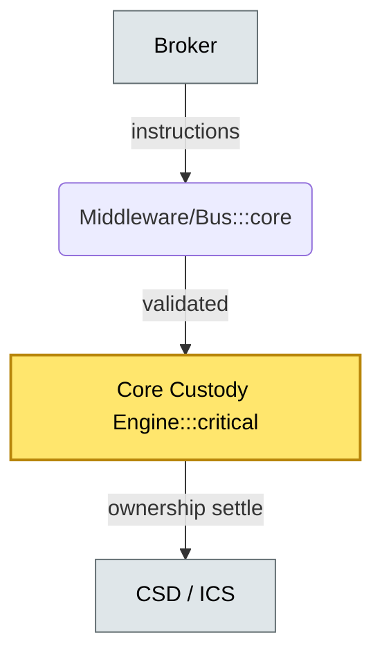

# C4-01 Custody platform landscape — BRIEF
> **Category:** Cx — Core Systems & Middleware · **Difficulty:** ●/◑/○/◔ : ◑ · **Banking-relevant:** yes / 💳

> **One-liner:** _Custody platforms comprise custodial core systems, event middleware, and CSD connections that together record, safekeep, and move client assets through multiple legal ownership layers._

> **Why an enterprise architect / trainee cares:** _You cannot integrate, transform, or outsource custody without knowing which box does what, who owns the gold record, and which systems are regulatory-critical versus nice-to-have._

## Quick definition
Custody platforms are tiered stacks: core custodial engines (DTCC CSD/ICS links, local nominee records), middle-tier middleware (event buses, STP engines, corporate-action processors), and upstream/downstream connectivity (TPAs, broker-dealers, CSDs, SWIFT/IPC). They record ownership, enable safekeeping, and facilitate settlement.

## Key ideas / terms
- **Core custody engine:** System of record for account positions, entitlements, and safekeeping consents.
- **Event middleware:** Bus / BPaaS that normalizes inbound/outbound messages (FXP, FRTB, ISO 15022, ISO 20022).
- **Custodian:** Agent that physically or books-records holds assets on behalf of clients; can sit atop CSDs or CSDs-of-CSDs.
- **CSD / ICS:** Central / International Central Securities Depository; the legal ledger for Dematerialized securities.
- **TPAs:** Third-Party Administrators contractually mandated to process and account for fiduciary transactions.

## The mental model
The custody stack is a pipeline: brokers feed instructions → event middleware transforms and validates → core engine books ownership → CSD settles. The middleware layer complicates (and insulates) the core from format churn, but its scent of the "last mile" to CSDs makes it a single point of adaptation when new regimes (DORA, ESG mandates) arrive. Governance-wise, the core engine is the canonical source of truth; middleware is managed drift.

## One diagram (mandatory)

## When to use / when NOT to use
- ✅ **Use when:** evaluating a custodian stack, a platform transformation, or a vendor-procurement RFP where you must ask "which box is the source of truth?"
- ⚠️ **Avoid when:** treating middleware as a raw data layer; it is integration glue, not the ledger.

## Banking example
A global custodian runs a t+2 flow for emerging-market equity: a local broker sends a corporate-action entitlement file in ISO 15022 via a FIX-based FIXP adapter. The middleware normalizes to ISO 20022, checks CSD settlement eligibility, writes an entitlement record in the core custody DB, and emits a SWIFT MT5xx confirmation to the CSD bridge. The core engine remains the arbiter of client entitlement; the middleware must not hardwire business rules.

## Common confusions (don't mix these up)
- **Core custody engine** vs **Middleware / Event bus:** one is the ledger, the other is transport and format translation.
- **Custodian** vs **CSD:** a custodian holds on behalf of clients; a CSD holds directly or for brokers; CSDs-of-CSDs handle cross-border settlement.

## Interview / recall prompt
- “Explain the custody platform landscape in 90 seconds.”
  - 1) Core engine = source of truth; 2) Middleware = normalize/insulate; 3) CSD/ICS = legal settlement leg; 4) TPA = contractual processor; 5) Gatekeeping: core owns gold record, middleware pays for agility.

## Status
☐ Not started · See detail doc: `details/C4-01-platform-landscape.md`

---
**One diagram required. Both brief + detail must exist before ✓.**
