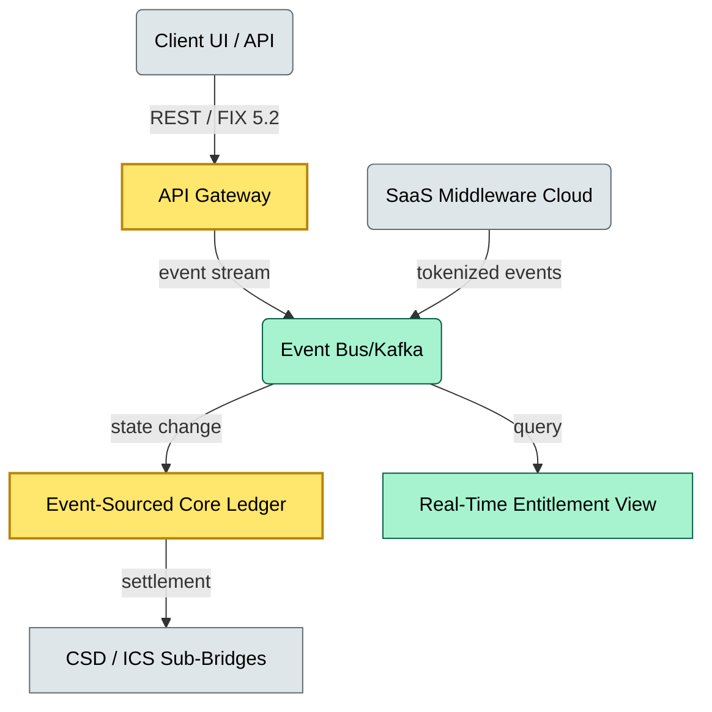

# C4-02 Smart custody platform — BRIEF
> **Category:** Cx — Modernization · **Difficulty:** ●/◑/○/◔ : ◑ · **Banking-relevant:** yes / 💳

> **One-liner:** _Smart custody platforms replace batch-oriented core engines with API-first, event-driven architectures and SaaS-based middleware to deliver real-time entitlements, collateral views, and cross-border settlement._

> **Why an enterprise architect / trainee cares:** _Your bank is asking whether to adopt a SaaS custody stack or continue building bespoke middleware; you need the floor plan and the trade-offs to write an ADR._

## Quick definition
Smart custody is a modernization paradigm in which assets, entitlements, and corporate actions are represented as live, queryable data rather than batch-shipped events. It relies on APIs (REST, GraphQL, FIX 5.0 / 5.2), event buses (Kafka, Azure Event Hubs), and SaaS middleware (DTCC Spark / Euroclear Aurora / Clearstream ICS Connect + modern vendor).

## Key ideas / terms
- **API-first:** all custodial operations exposed through self-documenting interfaces; no direct DB access.
- **Event-driven:** state changes are published as immutable events; consumers subscribe.
- **SaaS middleware:** cloud-native, multi-tenant bus with built-in ISO 20022 transformation.
- **Real-time entitlement:** entitlement computed on demand via graph traversal rather than snapshot.
- **Digital identification:** BYLD / DVC / ISIN master data as semantic, machine-readable objects.

## The mental model
Smart custody is a shift from **pull (snapshots, T+1/T+2 batch)** to **push (events, real-time)**. The middleware becomes a streaming fabric; the core engine becomes a stateful, event-sourced ledger. This changes the risk profile: latency is now a P&L driver, and the API gateway is the new perimeter — so API security, rate-limiting, and versioning are first-class concerns.

## One diagram (mandatory)

## When to use / when NOT to use
- ✅ **Use when:** negotiating a vendor RFP for smart custody, or prescribing a cloud-first transformation roadmap.
- ⚠️ **Avoid when:** assuming SaaS swaps can be adopted without data-sovereignty review; some EU regulators still mandate on-prem controls for core records.

## Banking example
An asset manager uses a SaaS custody platform to manage $2Tnl in ESG-focused equities. The platform exposes a real-time collateral view via GraphQL; the manager's OMS sends a repo instruction through a FIX 5.0/Advisory API; the event bus validates against the event-sourced entitlement ledger and publishes a settlement instruction to Euroclear Aurora. The entire flow completes in sub-second legal messaging time (ELMTime), versus a 3-day T+2 legacy counterpart.

## Common confusions (don't mix these up)
- **Smart custody** vs **traditional custody:** one is real-time / API-first; the other is batch / file-based.
- **Event sourcing** vs **event streaming:** event sourcing persists every state change; event streaming is the transport mechanism; they can co-exist but are architecturally distinct.

## Interview / recall prompt
- “Explain smart custody in 2 minutes.”
  - 1) API-first exposes entitlements; 2) event bus streams state changes; 3) core engine is event-sourced; 4) SaaS middleware encodes standard transformation; 5) trade-off is vendor lock-in vs. speed-to-market.

## Status
☐ Not started · See detail doc: `details/C4-02-smart-custody-modernization.md`

---
**One diagram required. Both brief + detail must exist before ✓.**
