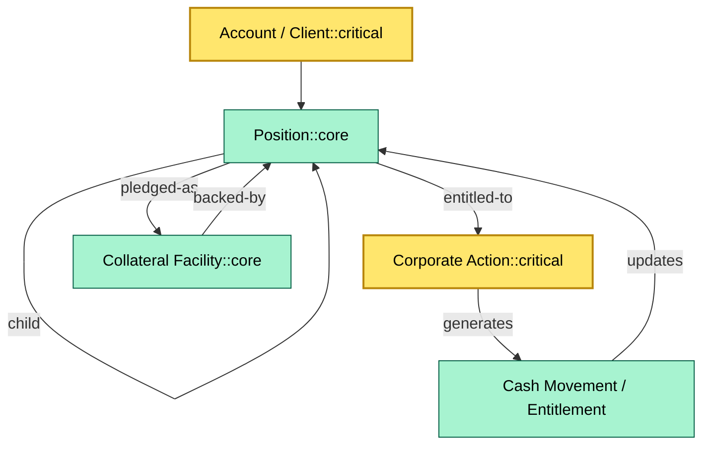

# C4-03 Core data model — BRIEF
> **Category:** Cx — Core Systems · **Difficulty:** ●/◑/○/◔ :  bø · **Banking-relevant:** yes / 💳

> **One-liner:** _The core data model is the canonical schema for accounts, positions, corporate actions, cash loans, and collateral — the atomic records on which every downstream reporting and regulatory obligation depends._

> **Why an enterprise architect / trainee cares:** _If the data model is wrong, every report, every reconciliation, and every audit trail is wrong — and that is a compliance failure, not a tech debt issue._

## Quick definition
The core data model defines the atomic facts a custody system records: account, position, corporate-action event, cash-loan facility, and collateral arrangement. Because these concepts are interrelated (a position is held in an account; a corporate action affects a position; collateral is pledged against a position), the model is graph-like and must enforce referential integrity across lifecycle states.

## Key ideas / terms
- **Account:** legal entity + structural client identifier; can be omnibus or confirmed-individual.
- **Position:** security held in an account; has quantity, currency, and safety-status flags.
- **Corporate action:** entitlement-triggering event (dividend, split, merger, coupon); drives cash/security movement.
- **Collateral facility:** repo / securities loan where assets are posted to secure obligations.
- **Cash loan:** overnight or term borrowing of client cash, with margin and interest terms.
- **Event sourcing (data view):** every change is a fact; current state is derived, not stored alone.

## The mental model
The core data model is the **source-of-truth graph**: account nodes connect to position nodes, which attach to corporate-action events, which may create cash-movement or settlement instructions, and which may be pledged as collateral. Governance means no duplicated "gold records" across silos (trade, custody, collateral); the core model is the single event-sourced log from which materialized views are generated.

## One diagram (mandatory)

## When to use / when NOT to use
- ✅ **Use when:** designing a new data model, a migration, or a reconciliation framework.
- ⚠️ **Avoid when:** assuming the model can be finalized in one sprint; it is governance DNA, not a sprint backlog.

## Banking example
A custodian records a confirmed individual account holding 1,000 shares of Company X. A dividend corporate action is processed: the core model emits a dividend-entitlement event, a cash-movement record for €0.50/share, and a settlement instruction to the CSD. The same account, if later pledged to a counterparty under a collateral facility, becomes ineligible for further lending; the model must block the two use-cases from conflicting.

## Common confusions (don't mix these up)
- **Position vs. derivative obligation:** a position is a long/short holding; a derivative is a contractual right/obligation that may or may not be physically settled.
- **Corporate action vs. trade event:** a corporate action is an exogenous event; a trade event is endogenous to the custody platform.

## Interview / recall prompt
- “Explain the core data model in 2 minutes.”
  - 1) Account = need + structure; 2) Position = what + where + when; 3) Corporate action = entitlement trigger; 4) Collateral / cash loan = pledged assets; 5) graph = single event-sourced source of truth.

## Status
☐ Not started · See detail doc: `details/C4-03-core-data-model.md`

---
**One diagram required. Both brief + detail must exist before ✓.**
