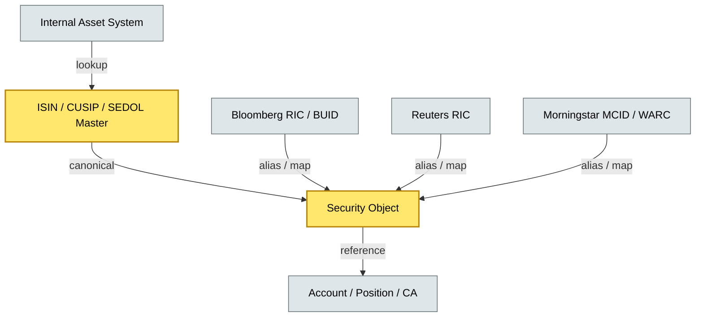

# C4-04 Reference data management — BRIEF
> **Category:** Cx — Reference Data · **Difficulty:** ●/◑/○/◔ : ◑ · **Banking-relevant:** yes / 💳

> **One-liner:** _Reference data management is the discipline of curating canonical identifiers (ISIN, CUSIP, SEDOL, Bloomberg, Reuters) so every client-asset record, transaction, and regulatory filing uses the same name and code._

> **Why an enterprise architect / trainee cares:** _A wrong ISIN or a floating Bloomberg ticker in the core data model is not a data-quality bug; it is a regulatory compliance failure and a $10M+ reconciliation liability._

## Quick definition
Reference data management (RDM) builds and maintains authoritative master databases for financial instruments, securities, counterparties, and identifiers. The foundational identifiers are ISIN, CUSIP, SEDOL, Bloomberg's BBG logger, and Reuters RICs. The goal is to resolve every instrument, entity, and security to a single canonical object, then propagate that mapping to the core data model.

## Key ideas / terms
- **ISIN:** ISO 6166 structured identifier (12 chars: 2-country prefix + 9-national identifier + 1-check digit).
- **CUSIP:** Committee on Uniform Securities Identification Procedures; US / Canada numbering system; 9 digits.
- **SEDOL:** Stock Exchange Daily Official List; 7 characters (6 alphanumeric + 1 check).
- **RIC (Reuters Instrument Code):** cryptic ticker + exchange code (e.g., `ES5.L`); used by Refinitiv workstations and gateways.
- **BBG Logger / BUID:** Bloomberg Universal Identifier; yield language and loan-safe identifier.
- **MCID / WARC:** Morningstar Corporate Actions ID / World-Check Relative ID; historical event and entity linkage.
- **Asset master:** the authoritative record; a security's issuer, coupon, maturity, currency, and coupon description.

## The mental model
Reference data is the **dictionary layer** that makes every transaction and every report intelligible. It is upstream of the core data model: if the ISIN master is wrong, every position, corporate action, and collateral valuation downstream is wrong. Governance means one master per security per jurisdiction, with a stewardship model that prevents drift.

## One diagram (mandatory)

## When to use / when NOT to use
- ✅ **Use when:** designing a new onboarding flow, a data-migration, or a regulatory reporting pipeline.
- ⚠️ **Avoid when:** assuming a "single ISIN" is always the best master; some jurisdictions prefer CUSIP or MIC-normalized local identifiers.

## Banking example
A US large-cap mutual fund's trade-capture system ingests a Bloomberg RIC `ES5.L` for Apple Inc. The RDM resolver maps `ES5.L` to ISIN `US0378331005`; this mapping is cached in the asset master and propagated to the custody core. If the mapping drifts because the fund's Bloomberg subscription lapses, a subsequent dividend report is filed against a stale CUSIP — a regulatory red flag.

## Common confusions (don't mix these up)
- **ISIN vs. CUSIP vs. SEDOL:** all identify a security, but each originates from a different standard; they are not synonyms.
- **RIC vs. ISIN:** RIC is a Bloomberg ticker; ISIN is ISO 6166; one can map to many.
- **Reference data vs. transaction data:** reference data is static (the dictionary); transaction data is the movement through that dictionary.

## Interview / recall prompt
- “Explain RDM in 2 minutes.”
  - 1) ISIN = global; CUSIP = US/CA; SEDOL = UK; RIC = Bloomberg; 2) canonical master prevents downstream drift; 3) stewardship = gate, not free-for-all; 4) regulatory equivalence of identifiers matters; 5) governance = one master per jurisdiction.

## Status
☐ Not started · See detail doc: `details/C4-04-reference-data-management.md`

---
**One diagram required. Both brief + detail must exist before ✓.**
