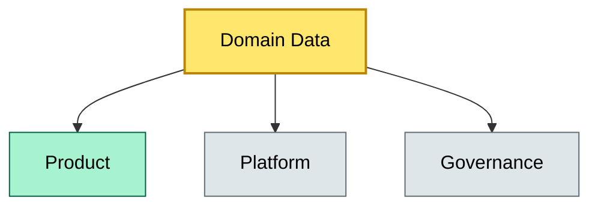

# C4-09 Data Mesh — BRIEF
> **Category:** Cx — Data Management · **Difficulty:** ◑ · **Banking-relevant:** yes / 💳

> **One-liner:** {topic in one complete sentence}

> **Why an enterprise architect / trainee cares:** {why this matters}

## Quick definition
{2–4 sentences}

## Key ideas / terms
- **{Term}:** {one-line}
- **{Term}:** {one-line}

## The mental model
{1 short paragraph}

## One diagram (mandatory)

```

## When to use / when NOT to use
- ✅ **Use when:** {scenario}
- ⚠️ **Avoid when:** {scenario}

## Banking example
{concrete banking example}

## Common confusions (don't mix these up)
- **{X} vs {Y}:** {distinction}

## Interview / recall prompt
{prompt with 3–5 bullets}

## Status
☐ Not started · See detail doc: `details/C4-09-data-mesh.md`

---
**One diagram required. Both brief + detail must exist before ✓.**
