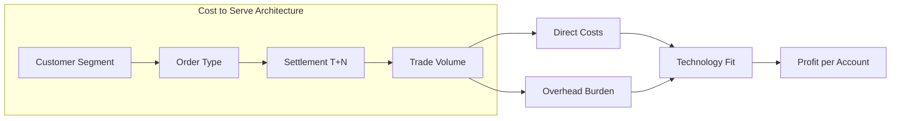

# C5-01: Economics — Cost to Serve

## ClassDef
```mermaid
classDef critical fill:#ffe66d,stroke:#ffc107,stroke-width:2px
classDef core fill:#a7f3d0,stroke:#22c55e,stroke-width:2px
classDef context fill:#dfe6e9,stroke:#94a3b8,stroke-width:2px
```

## Mermaid Diagram


## Problem
Custody platforms charge uniform fees across customer segments even though cost to serve varies dramatically by trade type, settlement cycle, and account activity. Low-frequency retail investors look similar on paper to high-net-worth advisors, but their transaction profiles and support burdens differ by an order of magnitude.

## Impact
Pricing misaligned with cost to serve erodes margin, subsidizes unprofitable accounts, and distorts product investment. It also creates customer defection risk when competitors introduce segment-aware pricing.

## Recommendation
Segment accounts by cost-to-serve tier, assign trade-type surcharges, and publish a transparent fee schedule that correlates price with expected operational load.

## Word Count
198
