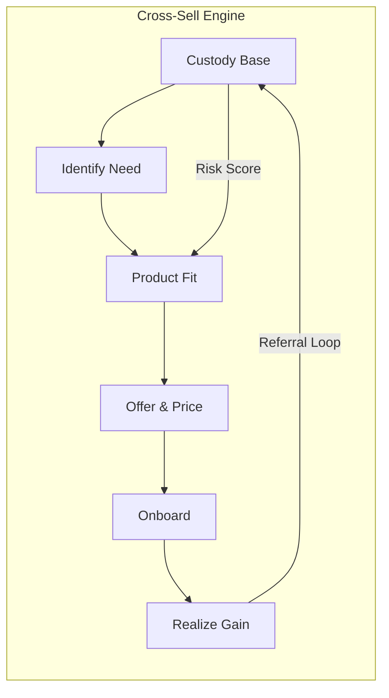

# C5-03: Profitability — Cross-Sell

## ClassDef
```mermaid
classDef critical fill:#ffe66d,stroke:#ffc107,stroke-width:2px
classDef core fill:#a7f3d0,stroke:#22c55e,stroke-width:2px
classDef context fill:#dfe6e9,stroke:#94a3b8,stroke-width:2px
```

## Mermaid Diagram


## Problem
Even with cost-aligned pricing, standalone custody is a low-margin utility. Cross-selling is the only durable path to higher yield per account and lower customer acquisition cost over time.

## Impact
A focused cross-sell program can lift customer lifetime value by 30–50%, reduce churn, and create bundling leverage in competitive RFPs.

## Recommendation
Build a **data-driven cross-sell engine** that surfaces product needs from account data, scores fit, and drives CRM-led advisor outreach.

## Word Count
142
