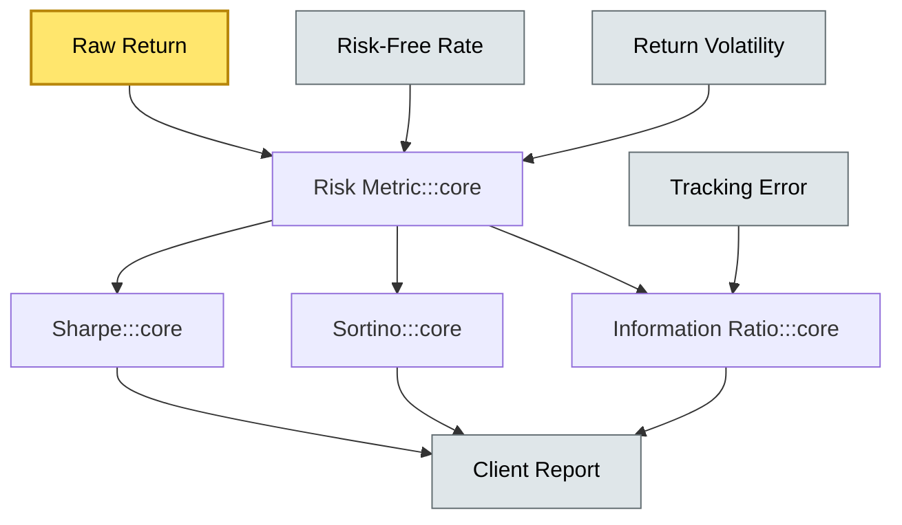

# C5-05 Risk-Adjusted Return — BRIEF
> **Category:** C5 — Custody Economics · **Difficulty:** ◑ / **Banking-relevant:** yes 💳

> **One-liner:** Risk-adjusted return metrics evaluate portfolio performance by penalizing volatility or downside tail risk, not just raw arithmetic returns.

> **Why an enterprise architect / trainee cares:** Custody teams do not pick stocks, but they *sink or swim* on reporting the right risk-adjusted figures to clients and regulators. A spurious Sharpe ratio on a snapshot of holdings costs arguments in an RFP or a compliance review.

## Quick definition
Risk-adjusted return is any portfolio-return metric that incorporates a penalty for risk exposure — most commonly standard deviation, downside deviation, or value-at-risk — to express reward per unit of risk taken.

## Key ideas / terms
- **Sharpe ratio:** Return excess over the risk-free rate, divided by standard deviation.
- **Sortino ratio:** Return excess over the risk-free rate, divided by downside deviation (ignores upside volatility).
- **Information ratio (IR):** Active return divided by tracking error; used in active custody mandates.
- **Downside deviation:** Standard deviation computed only on periods below a minimum acceptable return (MAR).
- **Rolling window:** A trailing look-back period (e.g., 36 months) used to calculate the metric continuously.

## The mental model
Risk-adjusted return is the score that sits between the portfolio manager's "this outperformed" and the compliance officer's "prove you didn't take reckless risk." Custody systems must compute it reliably from holdings data, transaction records, and benchmark indices — because a manual calculation at quarter-end is too slow and too error-prone.

## One diagram (mandatory)

```

## When to use / when NOT to use
- ✅ **Use when:** comparing two mandates or benchmarking a sub-custodian's value-add.
- ⚠️ **Avoid when:** comparing across funds with different leverage or illiquidity profiles — standard deviations are not comparable.

## Banking example
A UK equity pension fund's custodian reports a 7% annualized return with a Sharpe of 0.8. The investment consultant disputes the number because the custodian computed Sharpe on a monthly mean of portfolio values rather than a time-weighted rate of return. The discrepancy costs a £20 m AUM mandate during the RFP.

## Common confusions (don't mix these up)
- **Total return** vs **risk-adjusted return:** Risk-adjusted return is normalized by risk; total return is not.
- **Sharpe** vs **Sortino:** Sharpe penalizes upside volatility too; Sortino does not.
- **Sharpe** vs **Information ratio:** Sharpe compares to a risk-free rate; IR compares to a benchmark.

## Interview / recall prompt
"Explain risk-adjusted return in 2 minutes without notes."
- Raw return is not enough; maturity of risk matters.
- Sharpe = (Rp - Rf) / σp; penalizes all variance, not just bad risk.
- Sortino = (Rp - Rf) / σdown; cares only about downside.
- Information ratio = active return / tracking error; for passive + active mandates.
- Normalization by rolling window matters; a 12-month Sharpe differs from a 36-month Sharpe due to regime changes.

## Status
☐ Not started · See detail doc: `details/C5-05-risk-adjusted-return.md`

---
**One diagram required. Both brief + detail must exist before ✓.**
