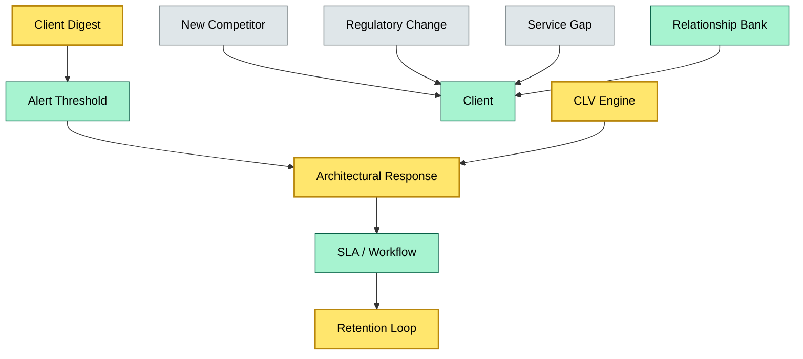

# C5-06 Brand Retention — BRIEF
> **Category:** C5 — Custody Economics · **Difficulty:** ● / **Banking-relevant:** yes 💳

> **One-liner:** Brand retention is the deliberate custody and public-relations strategy that keeps high-value clients from defecting to competitors by preserving institutional knowledge, service continuity, and regulatory trust.

> **Why an enterprise architect / trainee cares:** In custody, the asset manager is the client, but the *relationship* is the product. When a fund's CIO calls, the bank's brand is on the line; a gap in knowledge or trust triggers a migration. Retention is cheaper than acquisition, but it requires architectural continuity — not just a sales brochure.

## Quick definition
Brand retention is the set of processes, governance, and architectural decisions that maintain client trust and loyalty over time, ensuring that switching costs (knowledge, integration effort, regulatory restarts) outweigh the benefits of changing custodian.

## Key ideas / terms
- **Switching costs:** Effort and risk associated with changing custodian; includes technical (integrations), operational (new SOPs), and regulatory (AIFMD / UCITS transitions).
- **Relationship banking:** Deep, advisory-style client connections that go beyond transactional service.
- **Vendor lock-in (positive):** Architecture choices that make leaving difficult — but must be justifiable, not predatory.
- **Client lifetime value (CLV):** The net profit a bank earns from a client over the entire relationship.

## The mental model
Think of brand retention as an immune system, not a shield. A shield asks "will they attack me?" and plans defenses. An immune system monitors the body's health, detects early warning signs of dissatisfaction (slow query response, missed SLA windows, regulatory shadow), and responds with architectural or process adjustments before the client considers departure.

## One diagram (mandatory)

```

## When to use / when NOT to use
- ✅ **Use when:** architecting a multi-year custody platform roadmap or evaluating a merger-integration risk.
- ⚠️ **Avoid when:** trying to justify predatory lock-in — retention must be value-driven, not extractive.

## Banking example
DNB retains a £1 bn Nordic bond mandate not by undercutting price, but by embedding a dedicated relationship bank ( Relationship Manager + Solutions Architect ) and by architecting its Sub-custody Monitoring problem (C2-06) so that the client's IT team cannot replicate the bond-yield rounding logic without a six-month build. The switching cost is not lock-in by deceit; it is genuine, justifiable depth.

## Common confusions (don't mix these up)
- **Brand retention** vs **customer acquisition:** Retention is the ratio of clients kept to clients lost; acquisition is the funnel that brings them in.
- **Brand retention** vs **relationship banking:** Retention is the outcome; relationship banking is the *method* (people, not just systems).
- **Switching costs** vs **vendor lock-in:** Lock-in is often exploitative; switching costs can be legitimate (complexity, integration effort).

## Interview / recall prompt
"Explain brand retention in 2 minutes without notes."
- Retention is cheaper than acquisition; in custody, switching has technical and regulatory depth.
- Early warning signals: SLA misses, regulatory shadow, key-person departure.
- Response must be architectural, not just sales concession.
- Deprotified "relationship bank" is a Land of the Dead 100% retention lever.
- Must be value-justifiable; predatory pricing creates churn, not loyalty.

## Status
☐ Not started · See detail doc: `details/C5-06-brand-retention.md`

---
**One diagram required. Both brief + detail must exist before ✓.**
