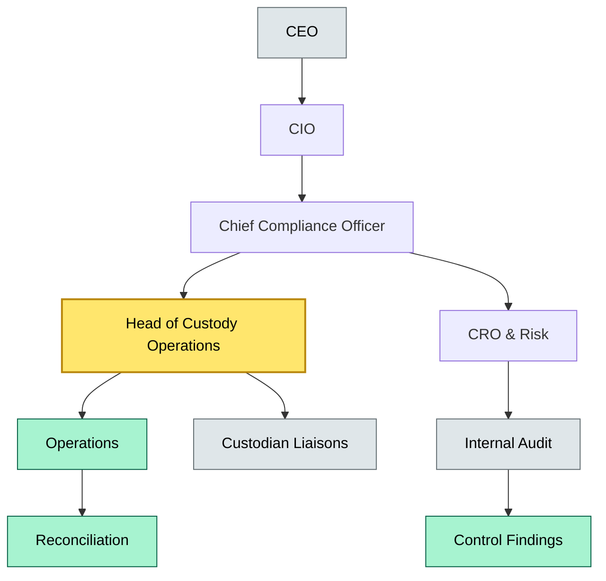

# C6 Org Chart — BRIEF
> **Category:** Cx — Custody & Asset Servicing · **Difficulty:** ◑ · **Banking-relevant:** yes / 💳

> **One-liner:** An org chart maps who holds decision rights, custody, and liability in a client-asset lifecycle.

> **Why an enterprise architect / trainee cares:** It is the governance topography of custody — who can move, freeze, or vest assets, and where operational breaks make audit or regulatory findings.

## Quick definition
An organizational chart for custody defines the reporting lines, approval gates, and custody assignments that govern who can touch client assets, who can override controls, and where system-of-record diverges from legal-entity authority.

## Key ideas / terms
- **Custody:** the legal and operational holding of client assets by a bank or third-party custodian.
- **Decision rights:** the authority to approve trades, releases, reconciliations, and exception handling.
- **Control gaps:** mismatches between formal org reporting and actual custodial authority or system entitlements.

## The mental model
The org chart is not just a hierarchy diagram; it is the control surface between legal ownership, operational execution, and system entitlements. A gap between who the chart says can move assets and who the custody platform actually lets through determines risk concentration.

## One diagram (mandatory)

## When to use / when NOT to use
- ✅ **Use when:** evaluating control coverage, preparing for solo-audit, or mapping RACI gaps.
- ⚠️ **Avoid when:** treating it as legal ownership structure — the org chart shows operational assignments, not beneficial ownership.

## Banking example
In a universal bank, the Head of Custody Operations sits under Compliance, not Operations, because any misstatement of held assets carries regulatory sanction. The internal audit function reports sideways to the Audit Committee, not up the chain, to preserve independence. If the reconciliation team reports to the same VP as the custodian liaisons, the org chart reveals a single point of override.

## Common confusions (don't mix these up)
- **Org chart vs RACI:** The org chart shows reporting lines; RACI shows responsibility per activity.

## Interview / recall prompt
“Explain org chart in custody in 2 minutes without notes.”
- Reporting lines map to control authority, not legal ownership.
- Compliance typically sits above Operations in custody to preserve independence.
- Audit must be structurally independent of custody and operations.
- System entitlements must mirror the org chart, or a control gap exists.

## Status
☐ Not started · See detail doc: `details/C6-01-org-chart.md`
