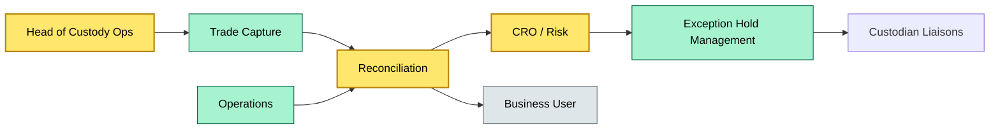

# C6 RACI Activity — BRIEF
> **Category:** Cx — Custody & Asset Servicing · **Difficulty:** ◑ · **Banking-relevant:** yes / 💳

> **One-liner:** A RACI matrix assigns a single R, A single C, and any number of I/S to each activity in the custody workflow.

> **Why an enterprise architect / trainee cares:** It is the only instrument that translates org reporting lines into accountability for specific custody tasks.

## Quick definition
RACI stands for Responsible, Accountable, Consulted, and Informed. In custody, each activity — trade matching, settlement, reconciliation, exception handling — has exactly one Accountable role and at least one Responsible; multiple Consulted or Informed roles are allowed.

## Key ideas / terms
- **Accountable (A):** the single owner of the outcome; sign-off authority.
- **Responsible (R):** the executor who does the work.
- **Consulted (C):** must be asked before the task; expertise or veto input.
- **Informed (I):** told afterward; status or audit trail.

## The mental model
RACI is a contract enforced by governance, not by soft consensus. In custody, the Accountable role is typically Compliance or the Head of Custody, while Responsible is Operations; crossed wires here become headline risk.

## One diagram (mandatory)

## When to use / when NOT to use
- ✅ **Use when:** defining a custody workflow, onboarding a new line of business, or faced with a solo finding.
- ⚠️ **Avoid when:** using RACI for legal title — it governs workflow accountability, not contractual ownership.

## Banking example
Trade capture: Responsible = Operations; Accountable = Head of Custody Ops; Consulted = Compliance. Reconciliation of a failed settlement: Responsible = Reconciliations; Accountable = CRO; Consulted = Fixed Income; Informed = Front Office. During a solo test, if the same person is both Responsible and Accountable on reconciliation, the finding is: single point of override.

## Common confusions (don't mix these up)
- **RACI vs org chart:** Org chart shows reporting; RACI shows task-level ownership.

## Interview / recall prompt
“Explain RACI in custody in 2 minutes without notes.”
- Each activity has exactly one Accountable; more than one is a control failure.
- Responsible is the DOER; Accountable is the decision owner.
- Consulted is before, Informed is after.
- The matrix must be reviewed at least annually and on any M&A event.

## Status
☐ Not started · See detail doc: `details/C6-02-raci-activity.md`
