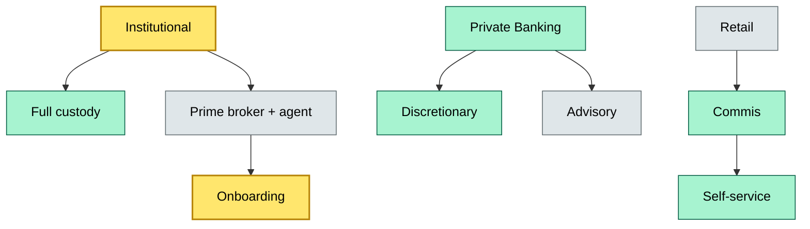

# C6 Client Service Model — BRIEF
> **Category:** Cx — Custody & Asset Servicing · **Difficulty:** ○ · **Banking-relevant:** yes / 💳

> **One-liner:** A client service model defines how a custody bank segments, approaches, and delivers service to different client types.

> **Why an enterprise architect / trainee cares:** It is the primary determinant of custody product shape, fee model, and regulatory exposure.

## Quick definition
A client service model is the operating framework that standardizes client segmentation, service touchpoints, pricing, and relationship management across institutional, private banking, wealth, and retail custody segments.

## Key ideas / terms
- **Segmentation:** client classification into institutional, wealth, private, or retail.
- **Tiered service:** gold, platinum, standard tiers with differing SLA and amenity levels.
- **Service blueprint:** the map of every client touchpoint from onboarding to exit.

## The mental model
The client service model is the demand-side interface to custody. It decides which assets, risks, and reporting standards apply, and therefore what the custody backend must support rather than what it *would like* to support.

## One diagram (mandatory)

## When to use / when NOT to use
- ✅ **Use when:** designing a new custody service or managing a client segmentation migration.
- ⚠️ **Avoid when:** assuming one model fits all — the toolchain, risk tolerance, and compliance burden differ per segment.

## Banking example
Institutional: full line and agent custody, prime-broker facility, ESMA transparency reporting. Wealth: advisory-only custody with discretionary mandates, simplified reporting. Retail: commis-style, lowest touch, AML-heavy onboarding. A private bank serving institutional clients on a retail product risks both reputational and regulatory failure.

## Common confusions (don't mix these up)
- **Client service model vs delivery channel:** Model is *how*; channel is *where* (branch, digital, API).

## Interview / recall prompt
“Explain client service model in custody in 2 minutes without notes.”
- Segmentation drives product, pricing, and regulation.
- Tiers must have different SKUs, SLAs, and compliance profiles.
- The service blueprint maps every touchpoint and exception path.
- A wrong-segmentation move generates both operational cost and regulatory friction.

## Status
☐ Not started · See detail doc: `details/C6-03-client-service-model.md`
