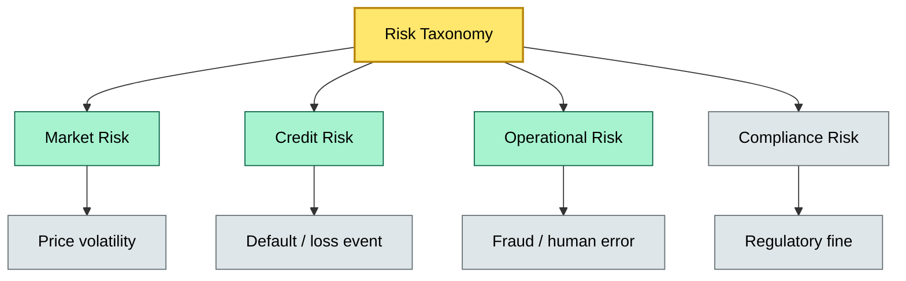

# C7-01 Risk Categories — BRIEF
> **Category:** C7 — Risks & Controls · **Difficulty:** ●/◑/○/◔ · **Banking-relevant:** yes / 💳

> **One-liner:** Risks are classified by source (external, operational, strategic, compliance) so enterprises can allocate capital, governance layers, and monitoring intensity proportionally to the actual threat they face.

> **Why an enterprise architect / trainee cares:** Without a common taxonomy, Risk, Audit, and Ops tell different stories about the same risk. A born risk taxonomy forces alignment on what counts as a "high" risk, what controls belong, and where the buck stops.

## Quick definition
Risk categories are a framework for classifying threats to an organization’s objectives by origin and impact dimension. They are not just labels; they are a governance tool that decides which committee owns the risk, which standards apply (IEC 31000, COSO, ISO 31000), and which risk appetite threshold triggers action.

## Key ideas / terms
- **Risk category:** A bucket grouping risks by shared source, impact vector, or controllability (e.g., Market, Credit, Operational, Compliance).
- **Risk appetite:** The amount and type of risk an organization is willing to pursue or retain, expressed in qualitative or quantitative terms.
- **Risk tolerance band:** The quantitative or qualitative limit within which a specific risk is acceptable without further escalation.
- **Risk register:** The living inventory that pairs each risk (with category) with its probability, impact, mitigation plan, and owner.

## The mental model
Risk categories turn an infinite set of anxieties into a manageable governance matrix. A bank’s CRO uses categories to set capital floors (credit = high EL, market = high P&L volatility, operational = high frequency but lower individual severity). The category determines which risk owner sits on the enterprise risk committee, which KPIs are monitored, and which stress-test scenario is run. Siblings are risk treatment strategies (toleration, mitigation, transfer, avoidance) and risk identification methods (top-down, bottom-up, horizon scanning).

## One diagram (mandatory)

```

## When to use / when NOT to use
- ✅ **Use when:** You need to assign risk owners, set monitoring cadences, or map risks to capital requirements.
- ⚠️ **Avoid when:** You are inventing new categories for every edge case; keep the taxonomy stable and only add cohorts.

## Banking example
A retail bank’s risk register tags a "customer KYC data outage" as **Operational Risk / External Dependency** (not Compliance) because the root cause is a cloud-provider API failure. This category means the Chief Operating Risk Officer owns it, it feeds the annual operational risk capital model under the Basel IRB / SA-CCR framework, and the CTO’s resilience budget is the primary control.

## Common confusions (don't mix these up)
- **Risk category** vs **Risk type:** Category tells you *where* it comes from (Market / Credit / Ops); type tells you *what* it does (interest-rate, legal, process).

## Interview / recall prompt
"Explain risk categories in 2 minutes without notes."
- Taxonomy is a governance tool, not a folder structure.
- Category determines owner, appetite band, and capital treatment.
- Basel / EBA frameworks expect explicit risk type mapping within categories.

## Status
☐ Not started · See detail doc: `details/C7-01-risk-categories.md`

---
**One diagram required. Both brief + detail must exist before ✓.**
