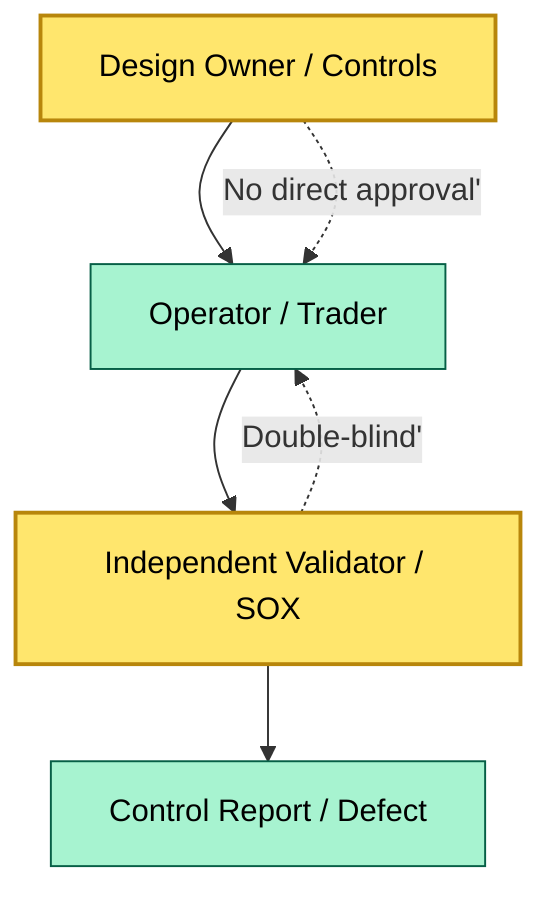

# C7-02 Strong Control — BRIEF
> **Category:** C7 — Risks & Controls · **Difficulty:** ●/◑/○/◔ · **Banking-relevant:** yes / 💳

> **One-liner:** A strong control is a safeguard that is independently designed, executed, and verified, so that no single individual can both commit and approve a material transaction without an algorithmic or human check.

> **Why an enterprise architect / trainee cares:** "Strong control" is the phrase banks use in SOX, Basel 3, and DORA. Without understanding the three independent dimensions (design, execution, verification), you cannot design automated controls that satisfy an auditor or defend a Control Deficiency rating.

## Quick definition
A strong control requires that the person who designs the control is separate from the person who executes it, and separate from the person who verifies it. In banking, this maps to segregation of duties (SoD), dual-control, and independent validation. The goal is to reduce the probability that a material misstatement or fraud occurs and goes undetected.

## Key ideas / terms
- **Segregation of duties (SoD):** No single role has conflicting authority, custody, and recordkeeping over the same transaction or risk.
- **Dual control:** Two authorized individuals must act together (e.g., two signatures on a payment) to execute a critical operation.
- **Independent verification:** An entity not involved in design or execution inspects the control's output, often with sampling or automated exception reporting.
- **Control deficiency:** When a control is designed but not operating, or is operated but not designed correctly; severity is High / Medium / Low (SOX 404).

## The mental model
A strong control is a triangle: design, execution, verification. You can eliminate two vertices and the control collapses. The banking control function treats this triangle as a burden, but regulators treat it as a non-negotiable feature of a resilient governance layer. Siblings are control self-assessment (CSA), continuous monitoring, and control testing ( walkthroughs, tests of operating effectiveness, IT-general controls).

## One diagram (mandatory)

```

## When to use / when NOT to use
- ✅ **Use when:** You are designing a payment flow, access-provisioning workflow, or model-risk workflow that must satisfy SOX 404 or DORA.
- ⚠️ **Avoid when:** You design a control that is technically strong but destroys throughput so badly that the business adopts a workaround that bypasses it.

## Banking example
A bank’s "same-day ACH outbound payment" requires two roles: the **Payment Originator** (business user who creates the instruction) and the **Payment Approver** (Treasury officer with a separate system role). The originator cannot see the approver’s N-number; the approver must witness a transaction screenshot. The **Compliance team** independently pulls daily logs and samples 5% of payments for fraud pattern review. Three people, three systems, no shared login.

## Common confusions (don't mix these up)
- **Strong control** vs **effective control:** Strong refers to the segregation/design; effective refers to whether it actually prevents or detects the error.

## Interview / recall prompt
"Explain strong control in 2 minutes without notes."
- Triad: design, execution, verification must be independent.
- SoD rules are the primary lever in payment, treasury, and IT access.
- A control can be strong but ineffective; effectiveness is measured by testing.

## Status
☐ Not started · See detail doc: `details/C7-02-strong-control.md`

---
**One diagram required. Both brief + detail must exist before ✓.**
