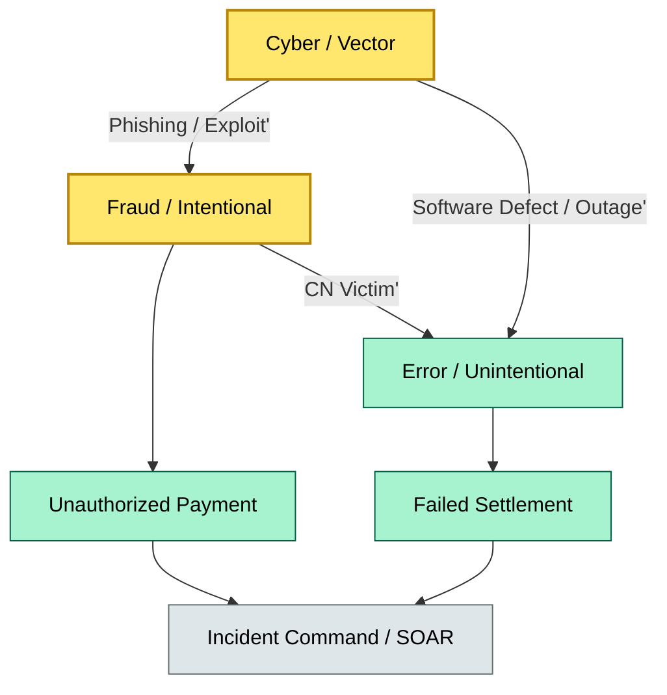

# C7-03 Fraud Error Cyber — BRIEF
> **Category:** C7 — Risks & Controls · **Difficulty:** ●/◑/○/◔ · **Banking-relevant:** yes / 💳

> **One-liner:** Fraud, error, and cyber are three distinct but overlapping failure modes; in custody and treasury they converge when a CN (corrupted narrative) masquerades as a legitimate transaction, and when technology-enabled error amplifies both types.

> **Why an enterprise architect / trainee cares:** If you treat fraud, error, and cyber as separate teams, you miss the 40% of incidents where all three appear together. A custody platform must detect and stop a CN-driven fraud attack that exploits a software bug and is delivered through a phishing channel.

## Quick definition
Fraud = intentional deception for gain. Error = unintentional mistake, omission, or misapplication of a rule. Cyber = any threat exploiting a vulnerability in information technology, people, or process. In banking custody, they intersect: a phishing email (cyber) leads to a trade instruction (error) that is actually a falsified order (fraud) and exploits a middleware defect (cyber).

## Key ideas / terms
- **CN (Corrupted Narrative):** A deceptive story or document used to exploit a process.
- **Social engineering:** Psychological manipulation to trick an authorized user into revealing credentials or bypassing a control.
- **Business Email Compromise (BEC):** Email-based fraud targeting treasury / treasury-adjacent functions.
- **DPSA (Detect-Protect-Suppress-Avoid):** A layered security posture for risk mitigation.
- **Cyber resilience:** The ability to continue services during and after a cyber incident, aligned to DORA Article 9.

## The mental model
Fraud is the intent, error is the mistake, cyber is the vector. A custody platform needs three detection layers: rule-based fraud (behavioral analytics), exception-based error (reconciliation failure), and anomaly-based cyber (network telemetry + IOC feeds). A single control that covers all three is called "defense in depth."

## One diagram (mandatory)

```

## When to use / when NOT to use
- ✅ **Use when:** Designing detection logic for custody, treasury, or market operations where fraud/error/cyber overlap.
- ⚠️ **Avoid when:** You assume one team (Fraud, IT Security, Ops) owns the full lifecycle; unified incident response is mandatory.

## Banking example
Month-end, a dealer receives a "counterparty confirmation" email from a known prime broker. The email contains a malicious macro that installs a info-stealer (cyber). The dealer, trusting the sender, opens it (social engineering → fraud). The malware spoofs the dealer’s workstation and instructs the bond-custody system to repo a block of Treasuries (fraud). The order submission gateway has a known bug in the XML parser (cyber root cause), but the primary driver was the stolen credentials (fraud), and the bug allowed the malformed payload to bypass a safety check (error in manual review).

## Common confusions (don't mix these up)
- **Fraud vs Error:** Intent is the only differentiator; ask "was this done on purpose to deceive?"
- **Cyber vs Fraud:** Cyber is the *mechanism*; fraud is the *motive*. If the same incident is both, classify by primary harm (financial loss = fraud; regulatory breach = cyber).

## Interview / recall prompt
"Explain the fraud-error-cyber intersection in 2 minutes without notes."
- Three domains, one incident; separate teams create blind spots.
- Custody / treasury is the convergence point.
- DORA + SOX + FRB guidelines require unified reporting.

## Status
☐ Not started · See detail doc: `details/C7-03-fraud-error-cyber.md`

---
**One diagram required. Both brief + detail must exist before ✓.**
