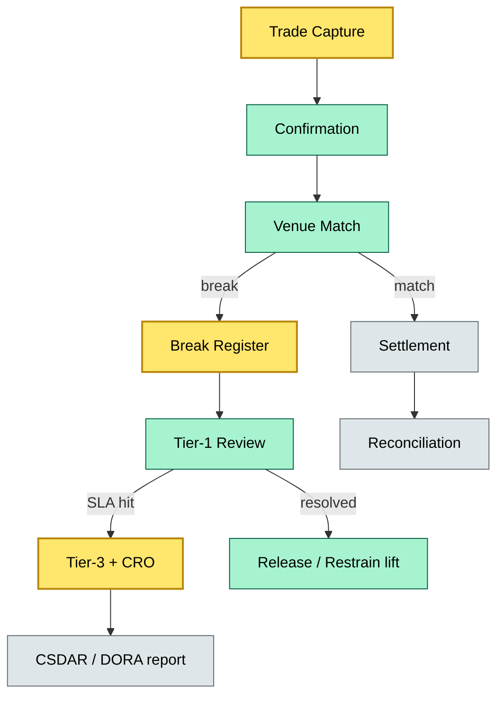

# C7-04 Break Management — BRIEF
> **Category:** C7 — Controls · **Difficulty:** ◑ vs ○ • **Banking-relevant:** yes / 💳

> **One-liner:** _Break management is the pre-trade risk-control workflow that flags, restrains, and resolves when-trade items so that custody settlement proceeds without unconstrained value-at-risk._

> **Why an enterprise architect / trainee cares:** _You must understand break management because every trade breaks somehow; without a disciplined capture-review-restrain-resolve cycle, custody books accumulate DRSs and DvPs that default to T+3 settlement drift, capital charge blow-outs, and regulatory fine lines. You stop sounding naive about "matching" and start talking about control gates._

## Quick definition
When a trade fails to match in the Custody system against the trading venue, the mismatched quantity becomes a break. Break management is the governance and workflow that identifies, classifies, and resolves these mismatches under defined SLA and authority thresholds. It applies to both instruction breaks (wrong quantity / ISIN / cash leg) and settlement breaks (delivery-versus-payment / cash-versus-cash / when-issued / initial-margin breaks).

## Key ideas / terms
- **Break:** A mismatch between booked intent and confirmed trade / settlement, recorded in the break register with a cause code.
- **SLA (Service Level Agreement):** The maximum number of business days a break may remain open before auto-escalation or exception handling is triggered.
- **Restraining:** The process of placing a hold on the disputed position or cash to prevent ongoing downstream impacts while the break is investigated.
- **Auto-escalation:** The sponsorship tier (break tier 1–3) that adds successively senior signatories and wider notification when a break exceeds its SLA.
- **When-issued (WI) break:** A break occurring in the WI or embedded-derivative leg of a corporate action or bond whose coupon / maturity is not yet finalized.

## The mental model
Break management sits between the trade confirmation engine and the settlement back office, acting as a control valve. When a break fires, the system flags the mismatch, routes it to a break owner, and applies a restraint to the book so that the mismatch does not propagate into the nightly call and settling processes. The custody tech stack uses a break-register microservice, an exception workflow runner, and an integration bus into the matching engine. Most banks tie break SLAs to CSDR / DORA expectations: unresolved breaks post any CURC or CSD deadline are automatically reported as operational-risk events.

## When to use / when NOT to use
- ✅ **Use when:** A trade or settlement mismatches; an authority threshold is triggered; a WI break exceeds the yield-lock period and jeopardizes the CSD deadline.
- ⚠️ **Avoid when:** You need a long-term treasury view—break management is tactical, 1–5 day horizon, not a permanent position.

## Banking example
A prime broker receives an instruction to buy €50 m Nomura 2034, 4.25 %, but the CSD requires a 50m vs 48.5m break (when-issued adjustment). The break register captures this as a WI break at T+0. The break owner, the custody operations tier-1 on-call, must validate the CSD adjustment memo against the forumbond rounding rule, release the restraint, and update the book before the DVPS date. If unresolved, the dispute escalates to the CSA committee, triggering a DORA-level operational-risk flag and a potential CSDR conformité breach because the settlement fails T+2.

## Common confusions (don't mix these up)
- **Break management** vs **dispute management:** Break management is the pre-settlement control that prevents a mismatch from becoming a live dispute; dispute management is the post-settlement legal / recovery process.
- **Instruction break** vs **settlement break:** An instruction break is wrong data at the front office; a settlement break is a confirmed trade that still fails to match at the CSD.

## Interview / recall prompt
> "Explain break management in 2 minutes without notes."
- A break is a mismatch caught at the confirmation / CSD matching stage.
- The break register captures cause, SLA, and auto-escalation tier.
- Restraint lifts the position from settlement until investigation completes.
- Unresolved breaks post-CSD deadline trigger regulatory reporting (CSDAR / DORA).
- WI breaks are the highest-frequency class because of embedded-derivative rounding.

## Status
☐ Not started · See detail doc: `details/C7-04-break-management.md`

---
**One diagram required. Both brief + detail must exist before ✓.**
