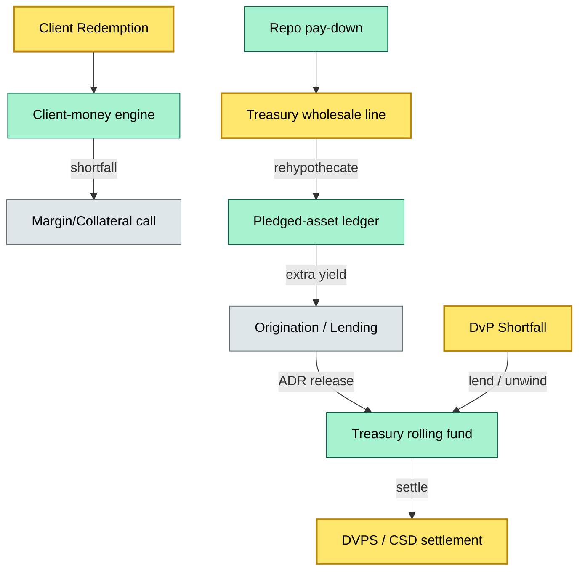

# C7-06 Liquidity Funding — BRIEF
> **Category:** C7 — Controls · **Difficulty:** ◑ vs ◑ • **Banking-relevant:** yes / 💳

> **One-liner:** _Liquidity funding is the closed-loop cash-and-security financing model that lets a custodian cover settlement net shortfalls, repo prefunding, and customer-driven liquidity demands by pooling the client book, rehypothecating pledged assets, and tapping wholesale lines._

> **Why an enterprise architect / trainee cares:** _Custody books are net-fed by client cash and net-short by settlement outflows; without a disciplined liquidity-funding architecture, a T+2 DvP shortfall can cascade into a fail queue and a CSDR fine. You must know how the fragile liaison between client funds, rehypothecated collateral, and the internal ALCO transfer-pricing engine works._

## Quick definition
Liquidity funding is the treasury and custody function that ensures the custodian has sufficient cash and highly liquid securities to settle net outflows at T+1 / T+2 and to prefund repo maturities, margin calls, and client-driven funding requests. It encompasses the client-money segregation, the pledged-asset (rehypothecation) ledger, the internal transfer pricing, the wholesale funding program, and the stress-tested liquidity buffer.

## Key ideas / terms
- **Client-money segregation:** Rules (UFAP, TOTB, 12b-1-style buffers) that prevent commingling of client cash with the custodian's own funds.
- **Rehypothecation:** The practice of using client-pledged securities as collateral for the custodian's own funding, generating an extra basis point of return.
- **Transfer pricing:** The internal money-market rate charged to business lines for the borrowing or lending of funds within the bank.
- **PPF / GCF / MMF:** Principal-only fund, Government and Credit Fund, Money-Market Fund—the tri-party / inter-dealer repo instruments back-ending the liquidity-funding model.
- **LCR / NSFR:** The Basel-derived liquidity buffers that the custodian's internal ALCO must hold against 30-day net cash outflows.
- **ADR-driven disbursement:** The automated daily-range / release-factor (0 %–100 %) that triggers the flow of liquidity from the custody platform to the treasury / settlement account.

## The mental model
Liquidity funding is the circulatory system of the custody value chain: cash bleeds from client redemptions and bond-coupon withholding, while inflows arrive via trade settlement and repo pay-downs. The custody platform's balance-sheet model must net these flows, apply segregation rules, and, when a shortfall appears, either draw from a wholesale line, activate unsecured borrowing, or trim the rehypothecation book. The architecture is a tri-layer—(1) client-money engine, (2) pledged-asset / repo ledger, (3) treasury wholesale-funding dashboard—each with its own control gate and stress test. Regulators watch this closely: a failed settlement becomes a DORA operational-risk event; an LCR breach triggers supervisory action.

## When to use / when NOT to use
- ✅ **Use when:** A trade is netted at T+1 and a cash shortfall surfaces; a repo matures; a margin call arrives; an LCR breach test triggers.
- ⚠️ **Avoid when:** You need long-term structural hedging—liquidity funding is a tactical, T+0–T+29 horizon; treasury manages the structural liquidity profile.

## Banking example
A French custody bank's client portfolio shows a €120 m net outflow after a sovereign bond redemption and a failed repo prefunding. The client-money engine flags a segregation shortfall under the 10 % TOTB rule. The pledged-asset ledger shows €200 m of rehypothecated bonds on the cash collateral account; the TRR (Total Repurchase Requirement) calculation allows partial unwind. The treasury desk draws €120 m from the GCF / PPF line, the ALCO transfer-pricing engine charges the custody business 14 bps for the 2-day borrow, and the CSD settlement completes. The LCR stress test confirms the 30-day net cash outflow is still under the 60 % buffer.

## Common confusions (don't mix these up)
- **Liquidity funding** vs **cash management:** Liquidity funding is the capital-market-scale process of funding settlement and repo prefunding; cash management is the day-to-day operational sweep of client accounts.
- **Rehypothecation** vs **rehypothecation with client consent:** Rehypothecation without explicit client agreement is a breach of client-money rules in many jurisdictions.

## Interview / recall prompt
> "Explain liquidity funding in 2 minutes without notes."
- Client redemptions net against trade settlements; shortfalls hit the custody balance sheet.
- The pledged-asset ledger tracks rehypothecated collateral for yield generation.
- Wholesale funding lines (GCF / PPF / MMF) cover the gap when internal collateral is insufficient.
- Transfer pricing ensures the business line pays for the borrow.
- LCR / NSFR stress tests guarantee the 30-day buffer is never breached.

## Status
☐ Not started · See detail doc: `details/C7-06-liquidity-funding.md`

---
**One diagram required. Both brief + detail must exist before ✓.**
