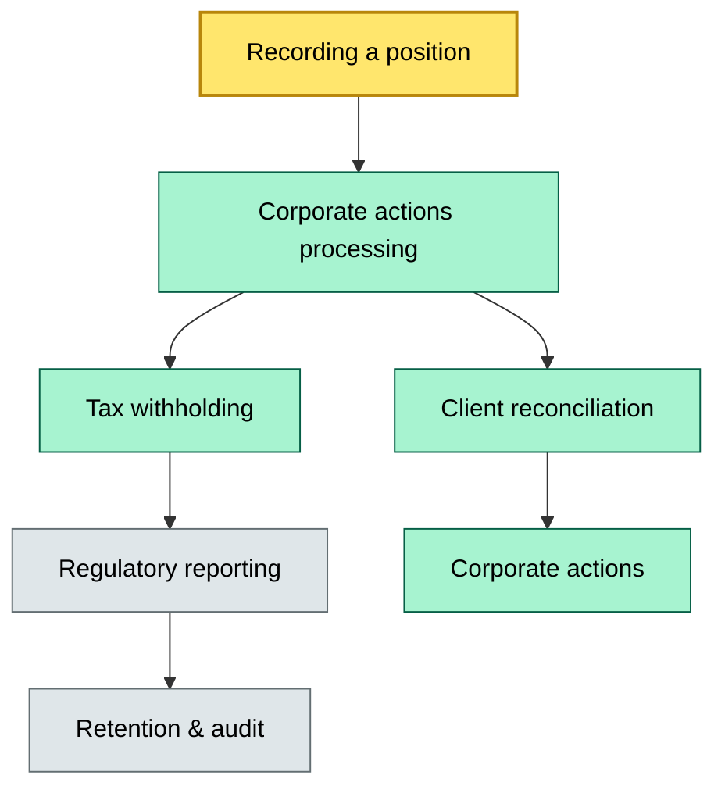

# C8-04 Custody capability map — BRIEF
> **Category:** Cx — Custody & Settlement · **Difficulty:** ◉/◑/○/◔ · **Banking-relevant:** yes / 💳
>
> **One-liner:** A comprehensive taxonomy that classifies every custody capability by function, lifecycle stage, and risk tier so banks can align systems, processes, and recoverability targets to a single governance backbone.
>
> **Why an enterprise architect / trainee cares:** Custody spans onboarding, safekeeping, corporate actions, tax, regulatory reporting, and dormancy. Without a capability map, banks duplicate functions, miss SLA commitments, and can't defend recoverability or cost-to-serve numbers to the CRO.

## Quick definition
A custody capability map is a structured registry that assigns every function performed by a custodian to a unique capability node, links it to the data model, the participants who invoke it, the lifecycle states it governs, and the recoverability / cost tier it requires. It is the single source of truth for system alignment, process design, and operational risk reporting.

## Key ideas / terms
- **Capability:** A discrete function or outcome that a custodian performs (e.g., "record a trade," "process a corporate action").
- **Lifecycle stage:** A phase in an instrument's or position's life (inception → active → dormant → terminated).
- **Risk tier:** A classification (critical / core / context) that sets SLA, SLA-credit, automation, and recovery expectations.
- **Capability node:** A single row in the map linking a capability to one or more participants, processes, and data domains.

## The mental model
Think of the custody capability map as the encyclopedia of everything the custodian *does*, cross-referenced by *when it does it* and *how badly it must recover if it fails*. It sits above the data architecture (100°F) and below the bank governance model (090°F). A sibling concept is the business capability map (Snowflake / TOGAF) — the custody map is its financial-services-specific, instrument-scoped refinement. The bank cares about it because it is the bridge between the front-of-book (trading) and the back-of-book (safekeeping & compliance).

## One diagram (mandatory)

```

## When to use / when NOT to use
- ✅ **Use when:** Designing a new custody platform, onboarding a sub-custodian, or defending a gap analysis to the CRO
- ⚠️ **Avoid when:** Early-stage discovery — a capability map is heavy; start with a process flowchart and expand

## Banking example
A global custodian classified "record a trade" as a critical capability (24x7 recoverability, RPO < 1 h, RTO < 1 h) while "manual tax-form issuance" was core (RPO < 4 h, RTO < 4 h). When the Latin-American unit tried to automate issuing French W-8BEN forms through the critical path, the capability map revealed the data-domain mismatch (French tax data lives in a GDPR-bound store) and forced a split-path architecture that reduced SLA credits by 40 %.

## Common confusions (don't mix these up)
- **Capability map** vs **process map:** A capability map lists 'what' the bank can do; a process map shows 'how' it is done.
- **Risk tier** vs **SLA credit:** Risk tier sets the recovery target; SLA credit is the contractual penalty if the bank fails to meet it.

## Interview / recall prompt
> "Explain custody capability mapping in 2 minutes without notes."
- A capability map taxonomizes every custody function by lifecycle stage and risk tier
- It anchors data architecture, SLA design, and sub-custodian agreements
- It prevents duplicate functions and defends recoverability claims

## Status
☐ Not started · See detail doc: `details/C8-04-custody-capability-map.md`

---
**One diagram required. Both brief + detail must exist before ✓.**
