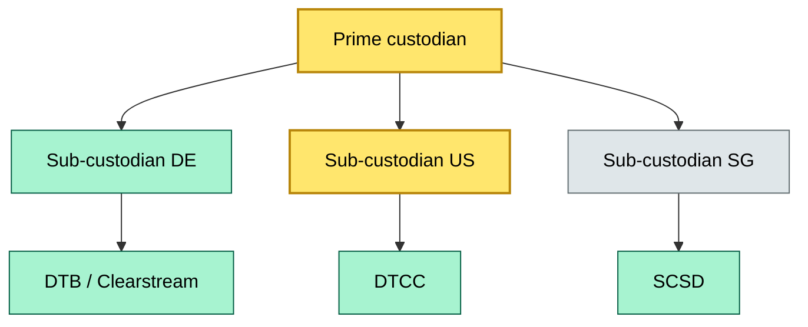

# C8-05 Sub-custodial network — BRIEF
> **Category:** Cx — Custody & Settlement · **Difficulty:** ◉/◑/○/◔ · **Banking-relevant:** yes / 💳
>
> **One-liner:** The mesh of contractual, data, and process interconnections between a prime custodian and the sub-custodians it delegates safekeeping or settlement functions to across jurisdictions.
>
> **Why an enterprise architect / trainee cares:** Every jurisdiction has different CSD rules, data-sovereignty laws, and currency boundaries. Without a modeled sub-custodial network, a bank cannot defend third-party risk capital to the Basel III / Basel IV CRO, and it will miss SLA gaps between the prime and local custodians.

## Quick definition
A sub-custodial network is a web of prime-to-sub-custodian relationships that determines where securities are held, who reconciles, and which data crosses borders. It is the operational skeleton that lets a global custodian offer local safekeeping without being local.

## Key ideas / terms
- **Prime custodian:** The ultimately accountable entity
- **Sub-custodian:** Legally licensed local entity to which the prime delegates safekeeping
- **Opportunity leakage:** Revenue or cost lost when sub-custodians mis-allocate or under-allocate entrusted assets
- **SSCA (Sub-custodian score card):** The operational-risk ranking applied to each sub-custodian thread

## The mental model
Think of the sub-custodial network as a spoke-and-hub mesh: the prime is the spine, each sub-custodian is a spoke, and the local CSD or settlement system is the hub. Data flows along the spokes, but control (golden-copy of positions, client attribution, regulatory reporting) must return to the spine. The mental model mistakes are:
- Treating sub-custodians as "outsources" (they are risk transfer partners with regulatory contracts)
- Ignoring the data-sovereignty boundary (German data cannot legally leave the EU without adequate protection)

A sibling is the core banking settlement flow: sub-custodians are to settlement what prime is to custody.

## One diagram (mandatory)

```

## When to use / when NOT to use
- ✅ **Use when:** Onboarding a new jurisdiction, designing a sub-custodian SSA, or defending concentration risk to a regulator
- ⚠️ **Avoid when:** Book is small and single-jurisdiction; a simple process list suffices

## Banking example
A global custodian's sub-custodian network had a single Brazilian sub-custodian. When a new CRT tax regime required Brazilian tax withholding to be calculated at source, the prime could not change the rate because the sub-custodian contract was 5 years fixed. The capability map (C8-04) had classified "Brazilian tax withholding" as critical, but the sub-custodial network lacked a secondary sub-custodian thread. The bank had to lodge a regulatory complaint and then add a second Brazilian sub-custodian.

## Common confusions (don't mix these up)
- **Sub-custodian vs. correspondent bank:** Sub-custodian holds the security; correspondent bank moves the currency
- **Sub-custodian network vs. data mesh:** Network = organizational and contract topology; data mesh = technical data-sharing architecture

## Interview / recall prompt
> "Explain sub-custodial network in 2 minutes without notes."
- It is the legal and data mesh connecting a prime to local custodians across jurisdictions
- Each thread has its own SLA, data sovereignty rules, and currency boundaries
- It is a risk-transfer layer, not a cost-center

## Status
☐ Not started · See detail doc: `details/C8-05-sub-custodial-network.md`

---
**One diagram required. Both brief + detail must exist before ✓.**
