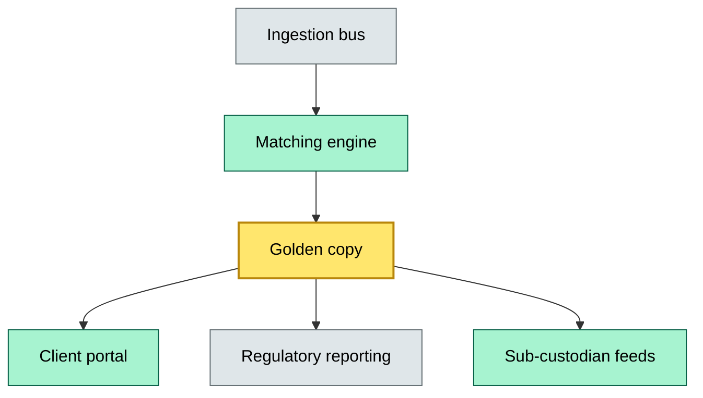

# C8-06 Data architecture — BRIEF
> **Category:** Cx — Custody & Settlement · **Difficulty:** ◉/◑/○/◔ · **Banking-relevant:** yes / 💳
>
> **One-liner:** The layered design of custody data — from raw trade feeds to golden-copy instrument records, with clear ownership, lineage, and recovery boundaries — that ensures a single source of truth across all custody systems and jurisdictions.
>
> **Why an enterprise architect / trainee cares:** Data is the only non-transferable asset a custodian has. A weak data architecture means your front office trusts different numbers than your back office, your regulator, and your sub-custodian. It is where custody moves from "holding securities" to "owning position truth."

## Quick definition
Custody data architecture is the structural and governance design of how position, transaction, corporate-action, tax, and regulatory-reporting data flows, transforms, and is stored — ensuring a single source of truth (golden copy) with defined ownership, lineage, and recoverability per data domain.

## Key ideas / terms
- **Golden copy:** The canonical, authoritative data set for instruments, positions, and transactions
- **Data domain:** Equity / Fixed Income / Derivatives / Corporate Actions / Tax / Regulatory Reporting
- **Lineage:** The immutable chain from trade input → match → safekeeping → corporate action → tax → reporting
- **RPO / RTO:** Recovery point objective and recovery time objective per data domain
- **Customer-specific data vs. omnibus data:** Individual client positions vs. pooled nominee holdings

## The mental model
Think of custody data architecture as a three-layer cake: the bottom layer is the ingestion bus (trade feeds, CSD notifications, sub-custodian transfers), the middle layer is the transformation and golden-copy engine (matching, attribution, corporate-action attribution), and the top layer is the distribution mesh (client portals, regulatory reporting, sub-custodian reconciliation feeds).

The cake collapses if the middle layer lacks a unique-instrument key across jurisdictions. A sibling concept is the master data management (MDM) layer — the custody data architecture is MDM scoped to instruments and positions, but with an added compliance dimension (regulatory snapshots, tax residency, custody instructions with legal enforceability).

## One diagram (mandatory)

```

## When to use / when NOT to use
- ✅ **Use when:** Designing a new custody platform, integrating a sub-custodian, or defending data-gap findings
- ⚠️ **Avoid when:** Point-solution build; first validate the capability map (C8-04) before designing data domains

## Banking example
A custodian's golden-copy failed to link an ISIN to a return-of-capital corporate action because the fix was in the equity instrument master while the action was in the corporate-actions domain. The data architecture lacked cross-domain lineage. When the client claimed capital, the custodian could not prove entitlement and faced a €1.1 M cost-to-serve.

## Common confusions (don't mix these up)
- **Data architecture vs. database schema:** Data architecture is the structure, governance, and flow; a schema is one implementation
- **Golden copy vs. copy of the record:** Golden copy is the canonical authoritative source, not any single snapshot
- **Client data vs. omnibus data:** Client data is segregated (individual burden of proof); omnibus is pooled

## Interview / recall prompt
> "Explain custody data architecture in 2 minutes without notes."
- It is a three-layer design: ingestion → transformation → distribution
- It ensures one golden-copy position truth across all systems
- It enforces data-domain ownership, lineage, and recovery boundaries

## Status
☐ Not started · See detail doc: `details/C8-06-data-architecture.md`

---
**One diagram required. Both brief + detail must exist before ✓.**
