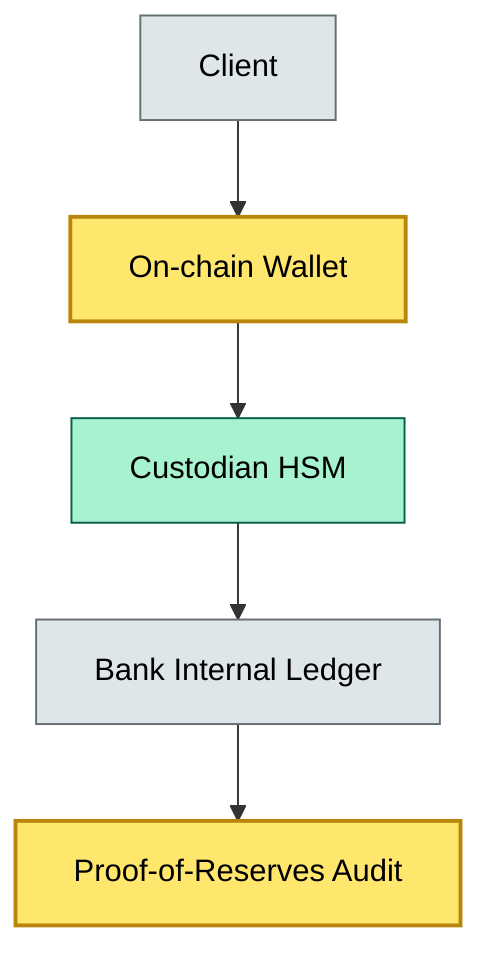

# C9-01 Digital Assets Custody — BRIEF

> **Category:** C9/C10 — Asset Custody · **Difficulty:** ◑ · **Banking-relevant:** yes / 💳

> **One-liner:** Digital assets custody is the secure holding, administration, and transfer of tokenized or native crypto assets on behalf of clients, combining cold-storage key management with real-time accounting and regulatory reporting.

> **Why an enterprise architect / trainee cares:** Every major bank is evaluating tokenized deposits, carbon credits, or CBDC. If you cannot explain custody—cold wallets, hardware security modules, proof-of-reserves, and legal ownership separation—you sound naive in front of the CIO and the risk committee.

## Quick definition

Custody of digital assets is the safekeeping and administration of cryptographic keys that control on-chain value, mirrored by a ledger of off-chain entitlements. Unlike fiat custody (where the bank is the counterparty to a ledger entry), digital asset custody must prove that client holdings are mathematically backed by on-chain proofs while the bank actually holds the private keys in hardware.

## Key ideas / terms

- **Cold storage:** Private keys stored offline (air-gapped) in hardware security modules (HSMs) or encrypted hardware wallets; never exposed to network traffic.
- **Hot wallet:** Private keys in an online service for trading; higher liquidity but must be actively managed with multi-sig and withdrawal limits.
- **Proof of reserves:** A cryptographic audit showing that the custodian’s on-chain holdings ≥ total client entitlements.
- **Gas fees:** Network transaction cost, paid by the wallet owner (or custodian, if passed through).
- **Key custody vs asset custody:** Key custody = who controls the private key; asset custody = who holds the on-chain balance. Legal and technical custody should be separable.

## The mental model

Digital asset custody sits between three boundaries: the crypto exchange/mediator layer, the bank’s internal ledgers, and the regulator. The bank must hold enough keys to transact but never so many that a single incident controls all funds. The mental model is "zero-knowledge custody": the client proves the bank holds assets without the bank ever exposing raw keys, and the bank proves ownership to regulators without publishing all addresses.

## One diagram (mandatory)


```

## When to use / when NOT to use

- ✅ **Use when:** Launching a tokenized-deposit product, integrating a crypto exchange, or storing client NFTs/carbon credits on a public chain.
- ⚠️ **Avoid when:** No client demand, no settlement partner, and no legal wrapper (partnership or LLC) to hold keys—regulatory risk is unbounded.

## Banking example

HSBC tested tokenized US Treasuries on a private chain (JPMorgan’s Onyx proof-of-concept). The custody model used multi-party computation (MPC) key splits: no single officer held a full key. The bank's internal ledger mirrored the on-chain balance. DORA and the EU MiCA framework require that custody risks be managed under the same ICT risk management rules as traditional assets.

## Common confusions (don't mix these up)

- **Direct custody** vs **indirect custody:** Direct = bank holds keys; indirect = bank holds entitlement to a transfer agent or exchange.
- **Key custody** vs **asset custody:** Holding the key is technical; legally the bank must demonstrate ownership, which requires additional documentation.

## Interview / recall prompt

“Explain digital asset custody in 2 minutes without notes.”
- Cold-storage keys vs hot-wallet liquidity needs.
- MPC > single-key custody; one operator loss = frozen funds.
- Proof-of-reserves = regulator’s audit demand, not marketing.
- Reconciliation must map on-chain UTXOs to off-chain client ledgers.
- Legal wrapper required in most jurisdictions to separate client assets from bank assets.

## Status
☐ Not started · See detail doc: `details/C9-01-digital-assets-custody.md`

---
**One diagram required. Both brief + detail must exist before ✓.**
