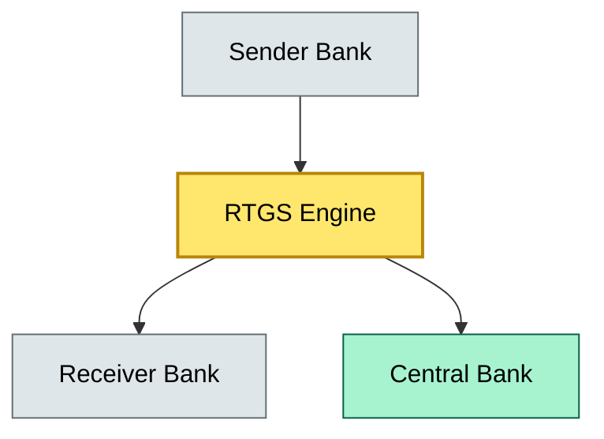

# C9-02 T0 Same-Day Settlement — BRIEF

> **Category:** C9/C3 — Settlement & Clearing · **Difficulty:** ◑ · **Banking-relevant:** yes / 💳

> **One-liner:** T0 same-day settlement is the bank-led or interoperable real-time gross settlement (RTGS) mechanism that completes payment and fund transfers within the same business day, replacing deferred net settlement with immediate, irrevocable finality.

> **Why an enterprise architect / trainee cares:** Central banks worldwide are pushing for T+0; project timelines, risk limits, and core banking upgrades hinge on whether your bank can support atomic settlement or must batch via CLS/RTGS.

## Quick definition

T0 same-day settlement is the final transfer of payment and funds before the business day closes, using RTGS or a blockchain-based finality layer. It eliminates cut-off windows, compresses liquidity buffers, and swaps batch risk for per-transaction risk.

## Key ideas / terms

- **RTGS (Real-Time Gross Settlement):** Each payment is settled individually, not netted, at the central bank.
- **Atomic settlement:** Both legs of a trade (cash and security) settle simultaneously; one leg failure rolls back the other.
- **CLSS (CLS Bank):** Continuous Link Settlement is the FX netting mechanism that provides T+0 value-date settlement.
- **Liquidity saving:** Eliminates need for pre-funded end-of-day positions because each transaction is final once committed.

## The mental model

The mental model is a "zero-latency ledger": every participant sees the same state at the same time, and there are no pending days. The trade-off is operational: you gain finality and reduced counterparty risk, but you pay in real-time liquidity, heartbeat infrastructure, and stringent availability requirements.

## One diagram (mandatory)


```

## When to use / when NOT to use

- ✅ **Use when:** Large-value corporate payments, central-bank digital currency (CBDC) integration, or private-chain settlement layers where daily cut-offs create business friction.
- ⚠️ **Avoid when:** Liquidity is constrained, the RTGS provider has <99.99% SLA, or the bank lacks atomic two-way settlement capability.

## Banking example

The ECB's TARGET Instant Payment Settlement (TIPS) uses T0 for low-value instant retail payments. For large corporate payments, T0 is enabled via the RTGS link with CLS. The business reason: treasurers can move funds immediately after contract signing, not waiting for next-day T+1.

## Common confusions (don't mix these up)

- **T0 settlement** vs **finality in blockchain:** T0 is a policy/product attribute; blockchain finality is a protocol property. They can coexist but are not the same.

## Interview / recall prompt

“Explain T0 settlement in 2 minutes without notes.”
- RTGS vs batch settlement: immediate vs netted.
- Atomic settlement prevents Herstatt risk (one leg fails, the other cannot default).
- Liquidity savings vs real-time liquidity requirement.
- CBDC / DvP (delivery vs payment) synergy.
- Central-bank interoperability is the dependency.

## Status
☐ Not started · See detail doc: `details/C9-02-t0-same-day-settlement.md`

---
**One diagram required. Both brief + detail must exist before ✓.**
