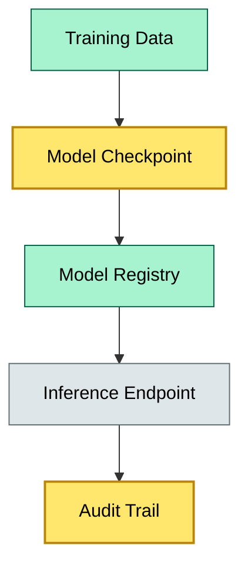

# C9-03 AI/ML Custody — BRIEF

> **Category:** C9/C10/C12 — Model & Data Governance · **Difficulty:** ○ · **Banking-relevant:** yes / 💳

> **One-liner:** AI/ML custody is the secure storage, versioning, and access-control of models, weights, training data, and inference artifacts so that regulatory audits, lineage, and reproducibility can be proven in a banking context.

> **Why an enterprise architect / trainee cares:** Regulators demand explainability, model risk thresholds, and data provenance for every AI system in credit scoring and fraud detection. Without custody, you cannot prove model fair-lending compliance or audit training-data bias.

## Quick definition

AI/ML custody is the safe-keeping of machine-learning models, embeddings, hyperparameters, and training datasets with cryptographic integrity and access control, enabling regulatory auditability and deterministic reproduction.

## Key ideas / terms

- **Model registry:** A centralized store of versioned, signed models with metadata (owner, training data SHA, performance metrics).
- **Data lineage:** The provenance trail from raw data to final model weights, required for audits and regulatory explanation.
- **Weights as assets:** In some tokenized-AI use cases, model weights are treated as IP or tokenized assets and thus fall under digital-asset custody.
- **Feature store:** A managed, versioned repository of computed features used for training and inference.

## The mental model

The mental model is "model as auditable document": just as a bank stores a signed mortgage note, it must store a signed model checkpoint with a tamper-evident log of who accessed it and when. The difference from traditional software is that small weight changes can cause large, undetectable behavior shifts.

## One diagram (mandatory)


```

## When to use / when NOT to use

- ✅ **Use when:** Deploying supervised ML for loan decisions, monitoring, or risk scoring; model weights are classified or regulated.
- ⚠️ **Avoid when:** The model is a simple heuristic or the bank lacks an MLOps platform; corner-case rigor may be overkill.

## Banking example

A bank's credit-scoring model is trained on 5 years of loan data. Under the EU Artificial Intelligence Act and the Basel ICAAP framework, the bank must prove that model weights have not been tampered with post-validation. A signed model registry, with SHA-256 hashes of weights and a write-once audit trail, satisfies the OCC's Model Risk Management guidance.

## Common confusions (don't mix these up)

- **Model custody** vs **model governance:** Custody = storage; governance = policy, review, and approval.
- **Feature store** vs **data warehouse:** Feature store is online-compute, time-aware, and model-relevant; data warehouse is batch-oriented for reporting.

## Interview / recall prompt

“Explain AI/ML custody in 2 minutes without notes.”
- Model registry + hash verification = tamper evidence.
- Data lineage is regulatory; explainability requires provenance.
- Weights are mutable; binary of code vs weights needs versioning.
- Inference logs are part of custody (who ran what, when, on what data).
- Fair-lending audits need model-version + training-period traceability.

## Status
☐ Not started · See detail doc: `details/C9-03-ai-ml-custody.md`

---
**One diagram required. Both brief + detail must exist before ✓.**
