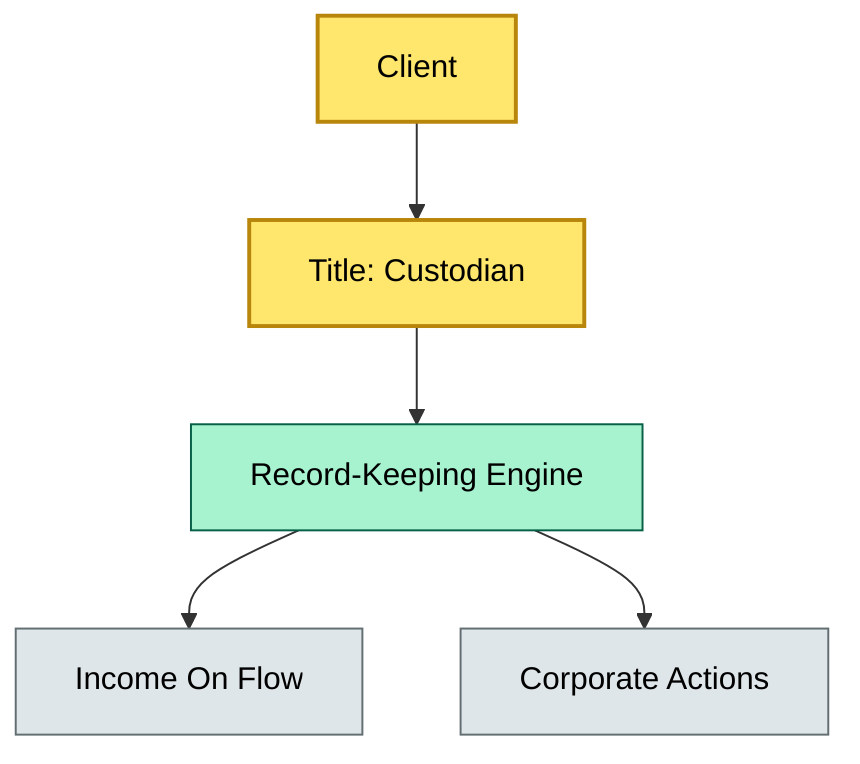
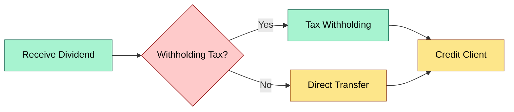
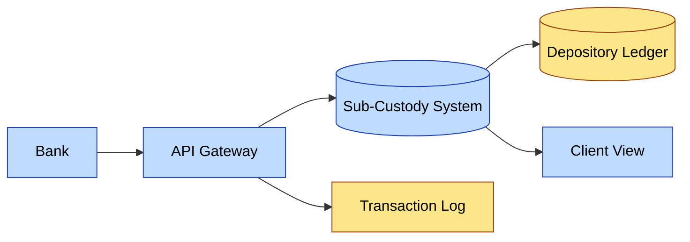

# [C1] What is custody? — DETAIL
> **Category:** C1 Foundations · **Difficulty:** ● · **Banking-relevant:** yes / 💳
> **Companion brief:** `briefs/C1-01-what-is-custody.md`
>
> > **Target reader:** enterprise architect who must *explain, justify, and defend* the topic — not just recite it.

---

## 1. Precise definition
Custody is the ancillary service of safekeeping, administration, and transfer of securities or other financial instruments on behalf of a client, where the custodian holds legal title in trust or designated arrangement, and the client retains beneficial ownership and economic entitlements. It is defined by law and regulation (e.g., UCITS Directive, AIFMD, EU Capital Requirements Regulation risk-weight framework) not by commercial convention. The custodian does not typically have discretion over the portfolio; it executes instructions or corporate actions on receipt of a verified mandate.

## 2. Why it exists (the problem it solves)
Before custody, securities were paper held in physical form, and loss or theft meant permanent loss of title and income. The shift to book-entry (global custodian model) solved settlement risk but created the need for:
- **Legal title separation** so the custodian is not exposed to fraud or commingling.
- **Corporate action processing** because the issuer's register requires a single address; without a custodian, each investor would need to track dividends, splits, and proxy rights individually.
- **Financing and rehypothecation** (when permitted) to monetize idle securities against LHSF, generating income that flows back to the client.
The architectural pain point: without a custody abstraction layer, a bank must hold legal title and risk operational failure; with it, the bank insulates its balance sheet but must share revenue and manage the custodian's credit and operational risk.

## 3. Core concepts & vocabulary
| Term | Precise meaning |
|------|-----------------|
| Legal title | The name registered on the issuer's books; the custodian is the legal owner |
| Beneficial ownership | The client's residual claim on income, voting, and underlying asset value |
| Omnibus account | A pooled account where many clients' securities are held under one number; legal title is shared |
| Segregated account | Client-specific sub-accounts or sub-custody arrangements preserving legal separation |
| Rehypothecation | The custodian re-lends client securities to a third party for cash; generates yield but creates stress-test exposure |
| Corporate actions | Events altering the form or entitlement of an instrument; custodian processes them at the issuer level |
| Lien | The custodian's right to withhold securities to secure unpaid fees or liabilities |
| Initiatives | Day-to-day operational service (dividend remittance, tax withholding) |

## 4. How it works (architecture / mechanism)
Custody is a bounded operational service with four pillars:
1. **Ingress:** Trade instructions, corporate action notices, and corporate action elections
2. **Holding Engine:** The custodian's ledger (sub-custodian or depository global ledger) tracking legal title
3. **Processing Engine:** Corporate actions, income processing, withholding tax, and proxy voting
4. **Egress:** Dividends, interest, and redemption proceeds routed to the client's account via an ACH/SEPA network

The bank's enterprise architecture must map: which systems own legal title data? Which systems generate client statements? Where is the boundary between the bank's portfolio accounting and the custodian's sub-custody record?

### 4.1 Diagrams

**Diagram A — Core structure** (highlight load-bearing parts = amber, supporting = grey):


**Diagram B — Member-level lifecycle** (highlight decisions = green, failure = red, money = gold):


**Diagram C — Bank-to-depository aggregation** (highlight service/data = blue, context = grey):


## 5. Variants, options & trade-offs
| Variant | When to pick | When to avoid | Key trade-off axis |
|---------|--------------|---------------|--------------------|
| Segregated custody | Large UHNWIs, regulatory scrutiny | High-cost, low-liquidity assets | Legal safety vs. operational cost |
| Omnibus custody | Retail, multi-asset funds | Need for client-level transparency | Efficiency vs. audit granularity |
| Direct custody | In-house asset management | Regulatory capital for custody risk | Revenue capture vs. arm's-length governance |
| Rehypothecation | Yield-sensitive clients | Stress-test or hair-cut requirements | Income vs. funding liquidity risk |

## 6. Relationships to sibling topics
- **Asset management:** Asset management *instructions* custody but does not *hold* title; it is a consumer of custody services.
- **Settlement / clearing:** Settlement is the transfer of legal title; custody is the perpetual record and servicing of that title.
- **Prime brokerage:** Prime brokerage is a bundled offering; custody is a component, not the whole.
- ** depository (e.g., DTCC, Euroclear):** The bank is often a sub-custodian or direct member; the depository is the apex legal title holder for many markets.

## 7. Banking / financial-services context 💳
In 2019, SIX SIS failed to process the Apple Inc. dividend for several clearing members due to a tax-withholding-report mismatch, causing client income to be delayed and forcing banks to absorb interest costs. The bank's operational risk model assumed custody income would arrive on T+2; instead, income was delayed until the cross-border tax reporting was reconciled. This is a classic: custody is not only a safekeeping function but also a revenue-loss and regulatory-windfall channel, requiring operational risk capital, data governance, and reconciliation SLAs.

## 8. Reference architecture / worked example
**Problem:** A wealth management bank wants to onboard a €2bn segregated equity mandate.
**Decision:** Use SIX SIS as sub-custodian, with the bank's settlement engine as the record owner for client statements.
**AdR:**
```markdown
# ADR-01: Custody Model for Segregated Equity Mandate
## Status
Accepted
## Context
Onboarding €2bn segregated equity mandate for UHNWIs.
## Decision
Adopt SIX SIS as global custodian; bank maintains client-facing book-of-record and statement.
## Consequences
- + Reduced legal title risk; SIX SIS is regulated.
- + Centralized corporate actions at SIX SIS.
- - Shared revenue with SIX SIS.
- - Operational dependency on SIX SIS downtime.
## Alternatives considered
1. Direct custody with local depositories (rejected: too many bilateral agreements).
2. Omnibus (rejected: client demanded segregated).
```

## 9. Maturity & adoption signals
- **Adopt when:** client mandate requires segregated custody, regulatory framework mandates sub-custodian separation.
- **Anti-signals (don't adopt yet):** no legal entity structure for segregated accounts, no reconciliation between sub-custodian and bank records.
- **Common failure modes:** (1) revenue leakage due to fee customization errors, (2) tax withholding mismatches, (3) rehypothecation overage beyond client limits.

## 10. Common confusions — the "don't mix" list
| Often confused | Real distinction |
|----------------|-----------------|
| Custody vs. asset management | Custody holds and services; asset management decides what to buy/sell |
| Custody vs. prime brokerage | Prime brokerage is a bundle including custody; custody is a service |
| Legal title vs. beneficial ownership | Legal title is who is on the register; beneficial ownership is who gets the income |
| Custody vs. settlement | Settlement is a one-time title transfer; custody is the ongoing record |

## 11. Tools & standards to know
- **Regulations:** UCITS Directive, AIFMD, CRR, MiFID II, EMIR, DORA
- **Standards:** ISO 20022 for messaging, ISITC for corporate actions
- **Tooling:** Bloomberg/Refinitiv for corporate actions, SIX SIS portals, SWIFT wss and mx for settlement
- **Mandatory reading:** "Custody and the European Securitisation Landscape" — BIS Quarterly Review

## 12. ADR template (ready to fill in)
```markdown
# ADR-{{NN}}: {{decision}}
## Status
Accepted | Proposed | Deprecated
## Context
{{...}}
## Decision
{{...}}
## Consequences
- Positive ...
- Negative ...
- ...
## Alternatives considered
1. ...
2. ...
```

## 13. Practice — apply it
1. **Recall:** define custody and its four pillars in 2 min without notes.
2. **Model:** produce an ArchiMate diagram showing custody as a business service with inbound/outbound relations.
3. **ADR:** write a decision doc choosing between segregated and omnibus for a new fund.
4. **Defend:** roleplay explaining why custody is not investment advice.

## Summary
Custody is the legal safeguard and operational substrate that makes modern asset ownership possible. It is the guardian of title, the processor of corporate actions, and the gatekeeper of income. A bank that confuses custody with asset management, or omits the reconciliation layer between sub-custodian and client records, will face regulatory scrutiny, revenue leakage, and operational risk that scope-creep can become a balance-sheet liability. Treat custody as a bounded, audited service with strict interfaces and SLAs.

---
**Status:** ✅ Covered
*Last updated: 2026-06-22*

---
**One diagram required. Both brief + detail must exist with ≥1 mermaid each before ✓.**
