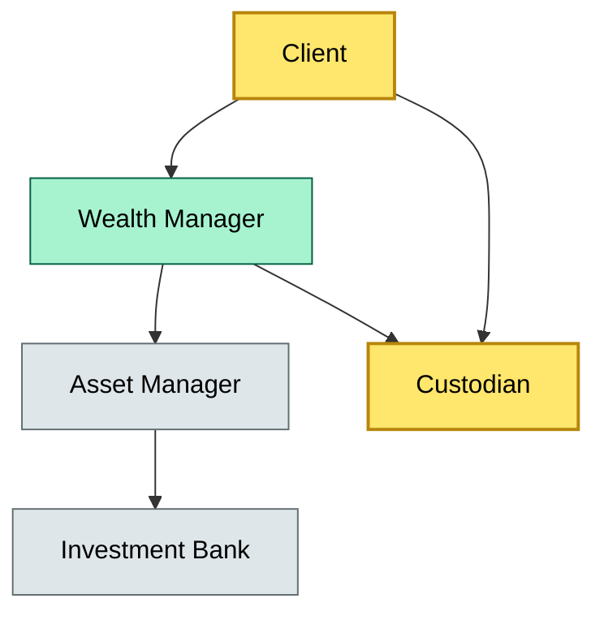
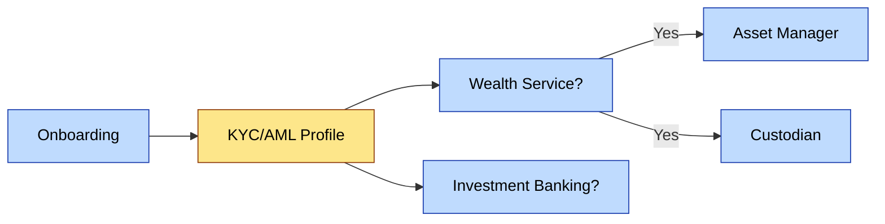

# [C2] Custody vs asset management vs wealth management vs investment banking — boundaries — DETAIL
> **Category:** C2 Foundations · **Difficulty:** ● · **Banking-relevant:** yes / 💳
> **Companion brief:** `briefs/C1-02-custody-vs-am-vs-ib.md`
>
> > **Target reader:** enterprise architect who must *explain, justify, and defend* the topic — not just recite it.

---

## 1. Precise definition
Custody is the necessity to safeguard financial instruments; asset management is the responsibility to allocate capital for return; wealth management coordinates the financial lifecycle of a household; investment banking raises capital or advises on strategic transactions. These are *service* distinctions, not *product* distinctions, and regulators treat them as separate regulated activities because of conflict-of-interest exposure, not because of technical convenience.

## 2. Why it exists (the problem it solves)
Historically, wealth advisors held assets in their own name and made trading decisions. The Great Depression and subsequent regulatory frameworks (U.S. SEC Investment Advisers Act, EU MiFID II) split advice from asset holding to protect clients. The architectural consequence: any bank that offers both wealth and custody must have a governance layer that prevents a wealth advisor from commingling personal information with custodial decisions. Without this, the bank faces: (1) regulatory fines for conflict, (2) client disputes over who authorized a trade, and (3) data privacy breaches because wealth and custody data are mixed.

## 3. Core concepts & vocabulary
| Term | Precise meaning |
|------|-----------------|
| Discretionary mandate | The client grants the asset manager authority to trade without per-trade instruction |
| Non-discretionary mandate | The client instructs the asset manager on each trade; the manager does not trade independently |
| Fiduciary duty | The legal obligation to act exclusively in the client's interest; a *higher* standard than safekeeping |
| Safekeeping duty | A contractual, not a fiduciary, obligation to retain assets and process corporate actions correctly |
| Conflict of interest | When a wealth manager chooses an asset manager that pays the wealth advisor a referral fee rather than selecting on merit |
| Advisory vs. execution | IB advises on a bond issuance; asset management decides how much to hold in a portfolio |

## 4. How it works (architecture / mechanism)
The service boundaries are enforced by:
1. **Identity & authorization:** A client is a single natural person (or legal entity) whose KYC record is tagged with *allowed services*
2. **Service mesh contracts:** Each service (custody, AM, WM, IB) publishes a contract (e.g., OpenAPI / AsyncAPI) describing its capabilities and boundaries
3. **Transaction provenance:** Every change of legal title, trade, or advice must be attributable to a specific service identity and a client consent token
4. **Reconciliation layer:** The bank's internal ledger must reconcile service outputs (e.g., trade confirmations, custody statements, IB mandates) to detect divergences

If the bank does not enforce these, a wealth manager may issue a trade via a brokerage interface that is processed through a custody settlement system, but the wealth manager's CRM does not capture the risk rationale — leaving a gap in the audit trail.

### 4.1 Diagrams

**Diagram A — Service boundary architecture** (highlight critical = revenue, core = function, context = support):


**Diagram B — Decision authority flow** (highlight decisions = green, risk = red, money = gold):


**Diagram C — Client onboarding and service tagging** (highlight service/data = blue, context = grey):


## 5. Variants, options & trade-offs
| Variant | When to pick | When to avoid | Key trade-off axis |
|---------|--------------|---------------|--------------------|
| In-house asset manager + external custody | Bank controls strategy, outsources safekeeping | Conflict of interest if same entity advises and manages | Control vs. regulatory independence |
| Third-party asset manager + in-house custody | In-house control in both layers | Higher operational cost, regulatory scrutiny on custody | Governance vs. cost |
| Wealth manager as prime broker (custody + AM + IB) | Easiest client experience | Bribery/conflict risk, expensive | UX vs. governance |
| Discretionary vs. non-discretionary | Client risk appetite | Client discipline in non-discretionary | Autonomy vs. oversight |

## 6. Relationships to sibling topics
- **Custody:** A prerequisite and a sub-service for asset management and wealth management; not a prerequisite for investment banking (which may hold proceeds in a separate settlement account).
- **Asset management:** A consumer of custody; a provider of instructions to IB (e.g., negotiating a private placement with an IB syndicate).
- **Wealth management:** An orchestrator; it calls AM, CUST, and IB, and must not conflate their outputs without reconciliation.
- **Investment banking:** An originator of deals; its advisory or underwriting output becomes a potential custodial asset only after settlement.

## 7. Banking / financial-services context 💳
In 2008–2009, several European wealth houses were fined by national supervisors for "recommending" the bank's own asset management products to custody clients without disclosing that the wealth advisor was also compensated by the asset manager (a conflict of interest under MiFID I and later MiFID II). The banks involved had integrated CRM and custody systems, but no automated conflict-of-interest scan. The architectural fix: tag every product recommendation with a *disclosure flag* and an *orphan review* by compliance before execution. The lesson: wealth, custody, and asset management are technically separable services, and the enterprise architecture must enforce that separability in data and workflow, not just in org charts.

## 8. Reference architecture / worked example
**Problem:** A Swiss universal bank wants to offer a new "wealth + custody" product combining private banking, asset management, and SIX SIS custody.
**Decision:** Use a service mesh where (1) the wealth manager is a separate legal entity with its own KYC registry, (2) the asset manager is a distinct service with discretionary mandates, and (3) the custodian is a third-party sub-custodian. A central reconciliation service matches trade instructions to custody holdings daily.
**ADR:**
```markdown
# ADR-02: Service Boundaries for Integrated Wealth+Custody
## Status
Accepted
## Context
Onboarding new universal banking product; risk of conflict-of-interest and data silo.
## Decision
Three separate services with a reconciliation hub and a conflict-of-interest scanner.
## Consequences
- + Regulatory safe harbor (MiFID II compliance).
- + Client-trust transparency.
- - Higher integration cost; need daily reconciliation.
- - Three-party contract matrix.
## Alternatives considered
1. Single integrated platform (rejected: too high regulatory risk).
2. Separate legal entities only (rejected: too high cost).
```

## 9. Maturity & adoption signals
- **Adopt when:** the bank has a separate compliance layer for conflict-of-interest scanning, and a reconciliation engine between service outputs.
- **Anti-signals:** wealth manager and asset manager use the same CRM without import/export controls.
- **Common failure modes:** (1) wealth advisor recommends in-house asset manager without disclosure, (2) custody and trading ledgers diverge, (3) client thinks one provider, but three regulated entities are involved.

## 10. Common confusions — the "don't mix" list
| Often confused | Real distinction |
|----------------|-----------------|
| Custody vs. asset management | Custody holds; asset management decides |
| Wealth management vs. asset management | WM is holistic planning; AM is investment only |
| Investment banking vs. asset management | IB advises on capital raising; AM buys/sells |
| Non-discretionary vs. discretionary | Non-discretionary = client instructs each trade; discretionary = manager decides |

## 11. Tools & standards to know
- **MiFID II / AIFMD / UCITS:** Regulatory definitions of investment services and conflicts
- **ISO 20022:** For settlement and corporate action messaging
- **SimCorp/Advent/FIS:** Systems that historically conflate custody and AM records; need reconciliation
- **Tooling:** Alphasense, Bloomberg, regulatory surveillance for conflict-of-interest alerts

## 12. ADR template (ready to fill in)
```markdown
# ADR-{{NN}}: {{decision}}
## Status
Accepted | Proposed | Deprecated
## Context
{{...}}
## Decision
{{...}}
## Consequences
- Positive ...
- Negative ...
- ...
## Alternatives considered
1. ...
2. ...
```

## 13. Practice — apply it
1. **Recall:** distinguish custody, asset management, wealth management, and IB in one sentence each.
2. **Model:** produce an ArchiMate diagram showing four distinct services with relations and a reconciliation hub.
3. **ADR:** write a decision doc on whether to build or buy an integrated wealth+custody platform.
4. **Defend:** roleplay explaining the conflict-of-interest risk to a CRO.

## Summary
The boundaries between custody, asset management, wealth management, and investment banking are not merely product labels; they are regulatory and operational boundaries. A bank's enterprise architecture must treat them as distinct, independently auditable services with clear ownership, conflict scans, and reconciliation. The greatest risk is not operational failure within a single service, but the collision of services when a wealth advisor's recommendation, an asset manager's trade, and a custodian's holding are not ring-fenced. When you can explain where the liability lies if the trade is wrong, you have drawn the boundary correctly.

---
**Status:** ✅ Covered
*Last updated: 2026-06-22*

---
**One diagram required. Both brief + detail must exist with ≥1 mermaid each before ✓.**
