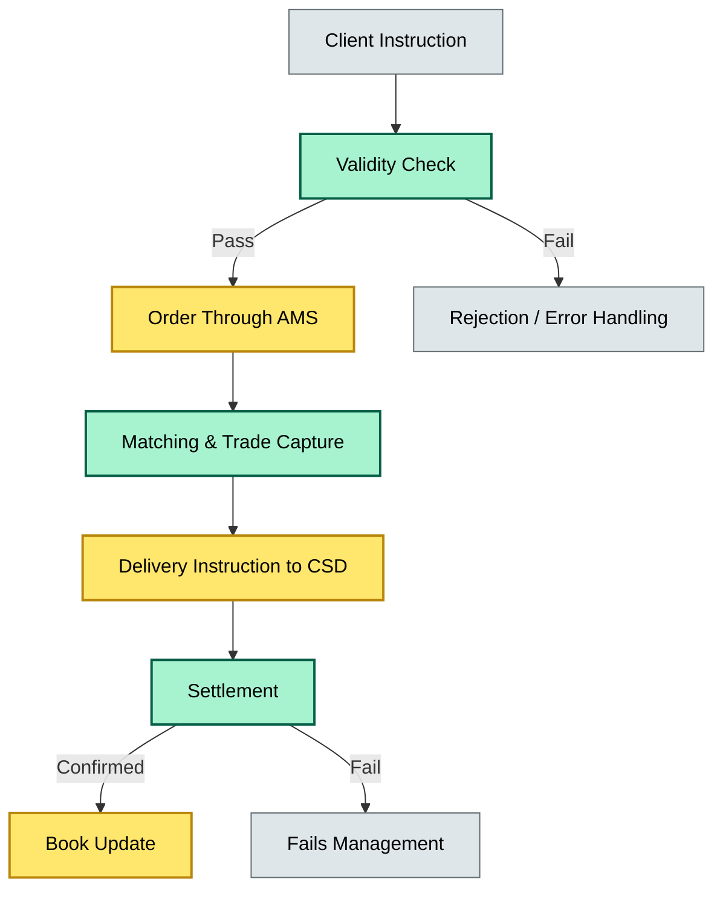
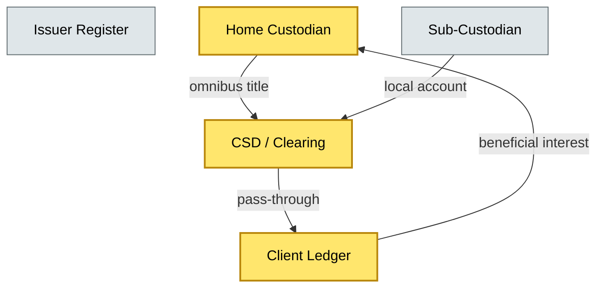
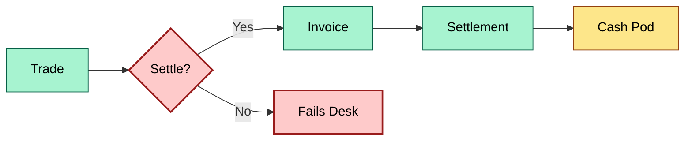

# [C1] Asset classes held — DETAIL
> **Category:** C1 Foundations · **Difficulty:** ● · **Banking-relevant:** yes / 💳
>
> **Companion brief:** `briefs/C1-03-asset-classes-held.md`
>
> > **Target reader:** enterprise architect who must *explain, justify, and defend* the topic — not just recite it.

---

## 1. Precise definition
Custody is a regulated trust service defined under MiFID II (Art. 4(1)(35)) as "the safekeeping and administration of financial instruments for third parties and ensuring that all securities transactions are settled in accordance with applicable regulatory requirements." It covers:
- **Cash** (currencies, including EM currencies via FCMB arrangements)
- **Listed equity** (shares, ETFs, indices)
- **Fixed income** (government, corporate, quasi-sovereign, securitized)
- **Derivatives** (futures, swaps, options — typically over-the-counter or cleared)
- **Alternative assets** (real estate, commodities, structured products, crypto-assets under evolving regulation)
- **Ancillary rights** (dividends, coupon, voting rights, tax credits)

The custodian holds **legal title** (nominee) or **direct title** (DRS) on the issuer’s register, while the client holds **beneficial title** (the economic interest). The operational state machine is:



## 2. Why it exists (the problem it solves)
Without custody, every client would need direct access to issuer registers, central securities depositories (CSDs), and settlement systems. That creates unacceptable single points of failure: a client computer crash, a rogue trader, or a regulatory freeze could freeze billions in value. Custody emerged from the need for **segregation of duties** and **legal finality of ownership**. The 1970s auto-focuses illustrate this: when settlement failed, courts ruled that physical presence of a certificate did not equate to legal ownership — bank’s role as intermediary and record-keeper became legally defensible.

## 3. Core concepts & vocabulary
| Term | Precise meaning |
|------|-----------------|
| **Omnibus account** | A pooled account where one nominee holds assets for multiple beneficial owners; legal title is in the nominee’s name. |
| **Segregated account** | The custodian holds separate, legally traceable accounts for each beneficial owner; title is specific, not pooled. |
| **Pass-through ownership** | The beneficial owner bears direct rights (tax, voting) even though the nominee appears on the register. |
| **AIF / UCITS vehicle** | Fund structures (UCITS=open-ended; AIF=alternative) where custody is embedded in the offering prospectus. |
| **Beneficial owner vs legal owner** | Beneficial = economic interest and rights; Legal = name on issuer register for transfer and voting. |
| **CSD (Central Securities Depository)** | Entity that maintains securities accounts and effects transfers (e.g., Euroclear, Clearstream). |
| **Account Operator** | Entity that can instruct the CSD to move securities on behalf of the account owner (the custodian, under agreement). |

## 4. How it works (architecture / mechanism)

### 4.1 Diagrams

**Diagram A — Core structure** (highlight load-bearing parts = amber, supporting = grey):


**Diagram B — Lifecycle / flow** (highlight decision points = green, failures = red, money = gold):


**Diagram C — Data-integrity boundary** (highlight dimensions: service=blue, data=gold, context=grey):


## 5. Variants, options & trade-offs
| Variant | When to pick | When to avoid | Key trade-off axis |
|---------|--------------|---------------|--------------------|
| **Omnibus** | High-volume, low-ticket retail funds; cost economies | Transparency, fail recovery, legal enforceability | Cost vs. transparency / legal traceability |
| **Segregated** | Institutional mandates, SSPE-eligible funds, fiduciary | Cost, scalability, operational complexity | Trust vs. cost |
| **In-house (direct CSD)** | Large banks with own CSD access (e.g., Deutsche Börse) | High CapEx, regulatory scrutiny, limited diversification | Control vs. regulatory risk |
| **Agency (bare trust)** | Beneficiary-bearing, direct ownership (DRS + pass-through) | Higher operational burden, CSD requirements | Cost vs. direct legal claim |

## 6. Relationships to sibling topics
- **C1-04 (Where custody sits):** Defines the organizational and governance boundary; this topic defines *what* crosses that boundary.
- **C2-01 (T+0 / settlement):** Custody settlement is the enabler; without custody, settlement is just book entry.
- **C3-01 (Operational risk):** Sub-custody risk, nominee risk, and fail-management are all operational-risk vectors.
- **C4-01 (RegTech / reporting):** MiFID II UCITS / AIFMD reporting depends on custody data as the source of truth.

## 7. Banking / financial-services context 💳
Under **CSDR**, banks must report holdings of financial instruments to competent authorities at least monthly, and daily for G-SIIs. Under **DORA**, custody infrastructure is a *critical ICT third-party* — its outage or breach triggers a major incident review. Under **Basel III / FRTB**, client assets must be *ring-fenced* and not commingled with proprietary assets.

Real-world consequence: In 2017, **BNY Mellon** failed to reconcile a $330 million cash balance for **BlackRock** due to a legacy system migration. BlackRock used the failure to unlock cash for other obligations, but the root cause was the custodian datastore (the "book"), not the CSD (Euroclear). The lesson: custody data-integrity is the primary risk; CSD is only the downstream pipe.

## 8. Reference architecture / worked example
**Problem:** A UK universal bank wants to onboard a new AIF with both EU and U.S. feeder vehicles. The AIF mandates segregation for U.K. investors (FCA Requirement 2A) but pools for EU single-market.

**Decision:** Use a segregated structure for the U.K. feeder via BNY Mellon (Direct CSD access) and an omnibus structure for the EU feeder via Clearstream (CS).

**Resulting ADR:**
```markdown
# ADR-07: Custody structure for multi-jurisdiction AIF
## Status
Accepted
## Context
UK FCA mandates segregation; EU UCITS mandates cost efficiency
## Decision
- UK feeder: BNY Mellon segregated account, pass-through to 2A
- EU feeder: Clearstream omnibus, sub-custodian in Switzerland
- Reconciliation engine: Daily SMIR, weekly CAMEP
## Consequences
- Positive: Regulatory compliance, client trust
- Negative: Higher cost, reconciliation latency
## Alternatives considered
1. In-house custody (rejected: DORA + capital)
2. Single omnibus (rejected: FCA breach)
```

## 9. Maturity & adoption signals
- **Adopt when:** Regulatory reporting proves automation; sub-custodian network is instrumented with API-based reconciliation.
- **Anti-signals (don't adopt yet):** Paper-based safekeeping; reconciliations manual > 48 hrs; no inventory of asset classes.
- **Common failure modes:** (1) Unreconciled sub-custodian positions causing phantom balances; (2) Collateral rehypothecation tied to wrongly classified "free" assets; (3) Crypto custody without segregation (covered by EMIR-equivalent rules pending).

## 10. Common confusions — the "don't mix" list
| Often confused | Real distinction |
|----------------|------------------|
| Custody vs Operational risk | Custody is the *state/service*; operational risk is the *probability of harm to that service* |
| Sub-custody vs Prime brokerage | Sub-custody = safekeeping delegation; prime brokerage = financing + execution + custody bundled |
| Nominee vs. Agent | Nominee = legal title; Agent = instruction only, no title |

## 11. Tools & standards to know
- **Frameworks/IR-2 / NINE:** MiFID II (Art. 4), UCITS V, AIFMD, CSDR, DORA Article 8
- **Common tooling:** IDC / Tamarac wealth management platform, iRecs / FIS for reconciliation, SWIFT, Euroclear/Clearstream connectivity
- **Mandatory reading:** CSDR Regulation (EU) 2014/65; DORA Regulation (EU) 2022/2554

## 12. ADR template (ready to fill in)
```markdown
# ADR-{{NN}}: {{decision}}
## Status
Accepted | Proposed | Deprecated
## Context
{{...}}
## Decision
{{...}}
## Consequences
- Positive ...
- Negative ...
- ...
## Alternatives considered
1. ...
2. ...
```

## 13. Practice — apply it
1. **Recall:** define in 2 min without notes.
2. **Model:** produce an ArchiMate/UML diagram from scratch.
3. **ADR:** write a decision doc applying it to the multi-jurisdiction AIF example above.
4. **Defend:** roleplay explaining to a non-technical CRO / CIO.

## Summary
Custody is the legal and operational anchor of every bank’s balance sheet of held assets. It is not merely "holding stuff"; it is a multi-dimensional boundary — legal, economic, technological, and regulatory — that separates client wealth from bank risk. An enterprise architect who cannot articulate what asset classes cross that boundary, where they live in the ledger stack, and how they reconcile to the CSD is not ready to architect a bank’s settlement or repo infrastructure.

---
**Status:** ☐ Not started · ☐ In progress · ✅ Covered
*Last updated: 2026-06-23*

---
**One diagram required. Both brief + detail must exist with ≥1 mermaid each before ✓.**
