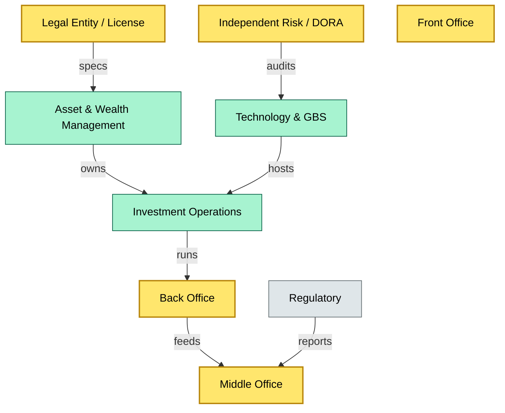
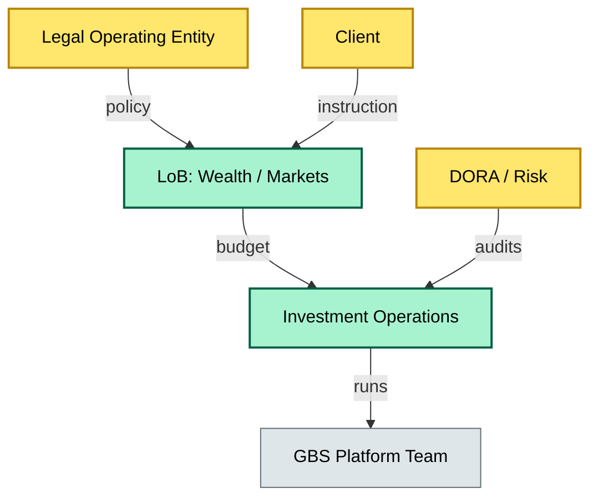
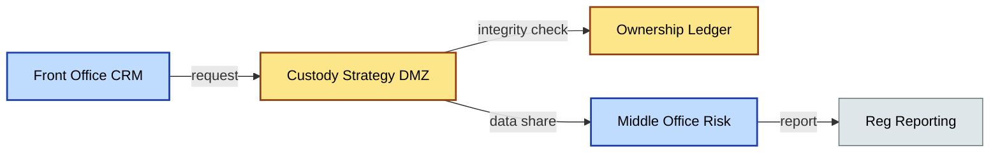

# [C1] Where custody sits — DETAIL
> **Category:** C1 Foundations · **Difficulty:** ◑ · **Banking-relevant:** yes / 💳
>
> **Companion brief:** `briefs/C1-04-where-custody-sits.md`
>
> > **Target reader:** enterprise architect who must *explain, justify, and defend* the topic — not just recite it.

---

## 1. Precise definition
"Where custody sits" is the architectural question: **which organizational unit owns the logically-segregated custody function, and how does it interlock with front, middle, back, technology, and regulatory reporting layers?** It is determined by a combination of:
1. **Regulatory licensing:** The entity holding a custody license is the *legal* region-owner.
2. **Enterprise RDF (reference data):** The org-tree JIRA/HR system that maps LOB, cost center, and regulatory entity.
3. **ICT criticality (DORA):** The same entity is designated a *critical ICT third-party* or *important ICT third-party*.
4. **Risk appetite / RWA:** The line of business (LoB) that carries the risk-weighted asset (RWA) burden.

In most universal banks, custody is a *matrixed* function: legally and licensed in Asset Management / Wealth; operationally in the Investment Operations or WASP backbone; technologically in the GBS (Global Business Services) platform team; and audited by Independent Risk under DORA.



## 2. Why it exists (the problem it solves)
If custody sits only in the back office, front office traders bypass controls. If it sits only in the front office, back office settlement is orphaned. The *separation of duties* principle — foundational to Basel II and reinforced by DORA Article 8 and CRD IV — requires that no single unit can both **own risk** and **execute settlement**. The residency model (legal entity + LOB + tech stack) is the reconciliation of three competing demands: **client service proximity** (front office), **risk governance** (middle office), and **operational resilience** (technology / back office).

## 3. Core concepts & vocabulary
| Term | Precise meaning |
|------|-----------------|
| **LOB (Line of Business)** | A revenue-generating unit (e.g., Global Markets, Institutional Banking, Private Banking) with its own P&L and risk appetite. |
| **Middle office** | Risk measurement, limits monitoring, regulatory reporting, and arbitrage-prevention; *not* execution. |
| **Back office** | Settlement, safekeeping, corporate action processing, and cash/securities matching. |
| **WASP (Asset Servicing Core)** | The middleware / hub-and-spoke platform that hosts custody operations, reconciliation, and sub-custodian management. |
| **RACI (Responsible, Accountable, Consulted, Informed)** | Prevents custody ownership from being unclear when sub-custodians fail. |
| **DORA ICT third-party** | A vendor / auditor / infrastructure provider whose outage would cause a *major incident* (DORA defines > 60 minutes for custody). |

## 4. How it works (architecture / mechanism)

### 4.1 Diagrams

**Diagram A — Core structure** (highlight load-bearing parts = amber, supporting = grey):


**Diagram B — Lifecycle / flow** (highlight decision points = green, failures = red, money = gold):
```mermaid
graph LR
    classDef ok fill:#a7f3d0,stroke:#065f46,color:#000
    classDef risk fill:#fecaca,stroke:#991b1b,stroke-width:2px,color:#000
    classDef money fill:#fde68a,stroke:#92400e,color:#000
    A[Board / CEO]:::ok --> B[Risk Committee]:::ok
    B --> C{Custody Strategy}:::risk
    C -->|approve| D[LoB Charter]:::ok
    C -->|reject| E[Redesign]:::risk
    D --> F[Operational Run]:::ok
    F -->|fail| G[Incident]:::risk
    F -->|SLA OK| H[Audit]:::ok
    class C G risk
```

**Diagram C — Data-integrity boundary** (highlight dimensions: service=blue, data=gold, context=grey):


**Diagram D — RACI and handover** (highlight accountability = amber, responsibility = green, consultants = grey):
```mermaid
graph TD
    classDef critical fill:#ffe66d,stroke:#b8860b,stroke-width:2px,color:#000
    classDef core fill:#a7f3d0,stroke:#065f46,stroke-width:1px,color:#000
    classDef context fill:#dfe6e9,stroke:#636e72,color:#000
    R[Responsible: Ops Team]:::core
    A[Accountable: Head of Investment Operations]:::critical
    C[Consulted: DORA / Risk]:::context
    I[Informed: C-suite, Reg]:::context
    A -->|owns| R
    C -->|governs| R
    R -->|escalate| A
    A -->|notify| I
    class A R critical
```

## 5. Variants, options & trade-offs
| Variant | When to pick | When to avoid | Key trade-off axis |
|---------|--------------|---------------|--------------------|
| **Matrix (universal bank)** | Large, diversified banks needing client proximity + risk separation | Clarity, agility, cost | Governance complexity vs. resilience |
| **Center of Excellence (CoE)** | Mid-size banks where centralized ops reduce redundancy | Latency / client-specific issues | Scale vs. customization |
| **Outsourced / Agent model** | Small banks without licensing; or crypto custodians | Control, regulatory capital, DORA scope | Cost vs. operational risk |

## 6. Relationships to sibling topics
- **C1-03 (Asset classes held):** This topic defines *where* custody operates; that topic defines *what* crosses the boundary.
- **C2-01 (T+0 / settlement):** The back-office boundary where custody executes.
- **C3-01 (Operational risk):** Matrix ownership creates RACI ambiguity; that is a first-order operational-risk thesis.
- **C4-01 (RegTech / reporting):** Regulatory reports are produced in the middle office but fed by custody operations; posture depends on this layer.

## 7. Banking / financial-services context 💳
Under **DORA**, the ICT risk management framework applies to *all* critical ICT third parties — including the bank’s own custody operations infrastructure (WASP), its sub-custodians, and its auditors. A custody platform outage > 60 minutes is a *major incident*; > 30 minutes for a systemically important bank is reportable to the NCA.

Under **CRR / CRD IV**, the bank’s *risk-weighted asset* for custody exposures depends on whether the bank holds the client assets **on-balance-sheet** (higher capital charge) or **off-balance-sheet** (eligible for lower charges). The *residency* of the custody function determines which accounting and capital regime applies.

Concrete consequence: In 2022, **Deutsche Bank’s custody platform WASP** migrated a component by a third-party vendor (not DORA-managed in the vendor’s scope); the outage caused 48 hours of unsettled trades. Because the middle office was not in the DORA incident review loop at the right time, regulatory reporting was delayed. Result: DORA fine and a 2H22 downgrade of bank recovery plans readiness by the EBA.

## 8. Reference architecture / worked example
**Problem:** A regional European bank wants to single-source custody across Private Banking, Institutional Sales, and Prime Brokerage without duplicating operations.

**Decision:** Create a **Custody CoE** under the Group COO, with a dotted line to each LoB P&L. Technology is central GBS; compliance and DORA reporting are centralized; sub-custodian agreements are centrally negotiated but LoB-specific.

**Resulting ADR:**
```markdown
# ADR-12: Custody CoE in Regional European Bank
## Status
Accepted
## Context
Three LoBs demand custody; current model is siloed and costly
## Decision
- Central CoE with dotted lines to LoBs
- GBS hosts custody platform
- Independent Risk / DORA reports to Chief Risk Officer
- Sub-custodian SOWs negotiated centrally; prices LoB-specific
## Consequences
- Positive: Cost reduction, standardized controls
- Negative: LoB friction, slower market entry
## Alternatives considered
1. Full matrix (rejected: governance complexity)
2. Full out/in sourcing (rejected: DORA + brand risk)
```

## 9. Maturity & adoption signals
- **Adopt when:** Custody operations are instrumented with uptime/SLA dashboards; DORA reporting is automated; RACI is published in HRIS.
- **Anti-signals (don't adopt yet):** Custody is owned by front office traders; no ownership ledger; no DORA-managed third-party register.
- **Common failure modes:** (1) LoB double-delegation creating unaccountable custody; (2) DORA incident review delayed by matrix reporting; (3) Technology renewal siloed from risk.

## 10. Common confusions — the "don't mix" list
| Often confused | Real distinction |
|----------------|------------------|
| Custody "sits" in finance vs. operations | "Sits" means *governance/RACI*, not P&L cost-center assignment |
| DORA ICT-third-party vs. DORA bank itself | Custody operations may be in-house (bank is own third-party) or outsourced (vendor is third-party) |
| Prime brokerage vs. custody residency | Prime brokerage is the *product*; custody residency is the *org boundary* |

## 11. Tools & standards to know
- **Frameworks/IR-2 / NINE:** DORA (EU 2022/2554), CRR (EU) 2013/36, CRD IV, Senior Managers & Certification Regime (SM&CR), CIPD
- **Common tooling:** SAP S/4HANA for finance, ServiceNow for risk, FPC for growth, Confluence / JIRA for RACI, ArchiMate 3.1 for modeling
- **Mandatory reading:** EBA Guidelines on DORA; FCA SYSC 20 on outsourcing and critical operations

## 12. ADR template (ready to fill in)
```markdown
# ADR-{{NN}}: {{decision}}
## Status
Accepted | Proposed | Deprecated
## Context
{{...}}
## Decision
{{...}}
## Consequences
- Positive ...
- Negative ...
- ...
## Alternatives considered
1. ...
2. ...
```

## 13. Practice — apply it
1. **Recall:** define in 2 min without notes.
2. **Model:** produce an ArchiMate/UML diagram from scratch.
3. **ADR:** write a decision doc applying it to the CoE example above.
4. **Defend:** roleplay explaining to a non-technical CRO / CIO.

## Summary
Custody is not a department. It is a *structural boundary* — legal, organizational, technological, and regulatory — that determines who is accountable when assets move, who is liable when they fail, and who reports when the line blurs. An enterprise architect who treats custody as a back-office function is architecting a house of cards.

---
**Status:** ☐ Not started · ☐ In progress · ✅ Covered
*Last updated: 2026-06-23*

---
**One diagram required. Both brief + detail must exist with ≥1 mermaid each before ✓.**
