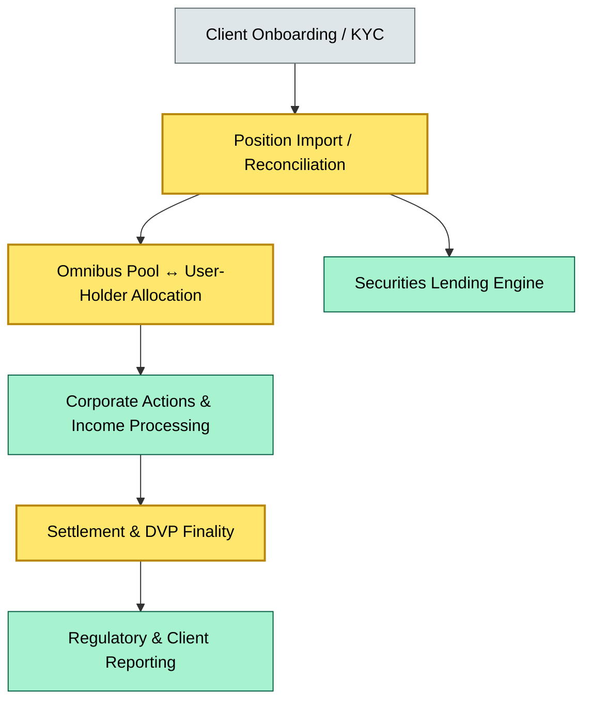
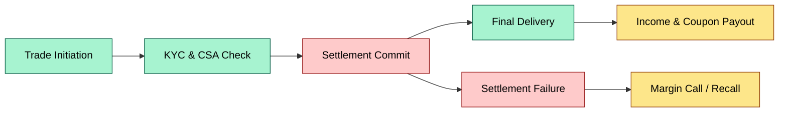
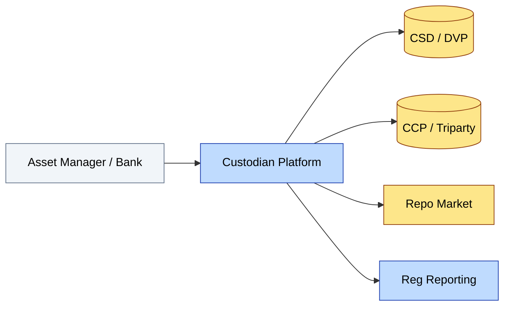
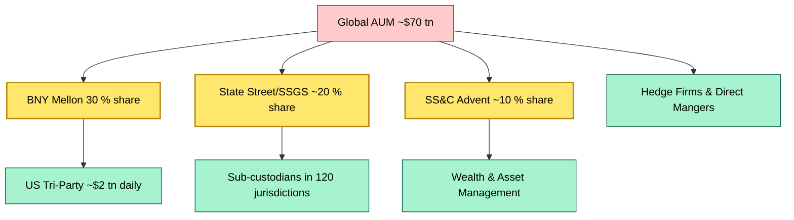

# C1-07 Industry landscape (key players, market share, today's dynamics) — DETAIL
> **Category:** C1 Foundations · **Difficulty:** ◑ (Core) · **Banking-relevant:** yes / 💳
>
> **Companion brief:** `briefs/C1-07-industry-landscape.md`
>
> > **Target reader:** enterprise architect who must *explain, justify, and defend* the topic — not just recite it.

---

## 1. Precise definition
Securities custody is the provision of safe-keeping, settlement, income collection, corporate-action processing, proxy voting, securities lending, and collateral management services on behalf of third-party asset owners. In the OSI model of financial infrastructure, the custodian operates at *Layer 3 (Settlement) + Layer 4 (Records Management)*, bridging issuers, depositories, clearing houses, and end investors. The industry is characterized by high *fixed-cost infrastructure* (vaults, data centers, identity-management platforms like iVentures) and *low marginal cost* per AUM dollar once the system is built, which creates strong *network effects* and *moats*.

## 2. Why it exists (the problem it solves)
Before centralized custodians, each asset manager maintained its own *physical* safe-deposit boxes and *manual* ledgers. The 1970s operational risk events (e.g. the 1974 Bankhaus Herstatt failure; the 1980s PSCM custody fraud) demonstrated that *physically segregated* assets could be misassigned or frozen. Custody emerged as the *systemic backstop*: one trusted entity holds title for many clients, reducing verification steps, lowering counterparty risk, and enabling *fungible* transferability. The modern architecture layer is therefore a *multi-tenant registry* with high-assurance electronic bookkeeping.

## 3. Core concepts & vocabulary
| Term | Precise meaning |
|------|-----------------|
| **Omnibus account** | A single nominee-name ledger where many clients' securities are pooled under a custodian-appointed nominee. |
| **User-holder account** | The end investor's visible holding within the omnibus structure; rights enforceable against the custodian. |
| **Triparty repo** | A repo where a *triparty agent* (often the custodian or a sub-custodian agent) manages collateral in a segregated of automated way. |
| **DPCC** | Depository Trust & Clearing Corporation — the US central securities depository; custodian AUM ultimately references DTCC or Euroclear. |
| **Set-off rights** | Automatic netting of a custodian's obligations to a bank against its claims on that bank (CRD IV / BRRD anti-contingent). |
| **Client securities lending** | Revenue-generating revenue stream from lending securities to short-sellers, usually managed via *securitization* or *lending agent*. |
| **Fungibility** | Interchangeability of securities within the same class; a property of centralized registries that custody platforms provide. |
| **Nominee account** | A legal structure where the custodian holds title on behalf of the client; the client's beneficial ownership is contractual. |
| **ISDAs for custody** | RTRS (Central securities depositories), CREST, Euroclear / Clearstream linkages via CSDs. |
| **DRW / Acacia** | BNY Mellon digital clearing platforms; modern API-first custody systems. |
| **State Street Global Services (SSGS)** | The back-office and custody servicing arm of State Street Corporation; a dominant *sub-custodian*. |
| **SS&C Advent** | Back-office and wealth-management software stack; financial data and custody service combined. |
| **Tri-Party repo** | A CCP-like repo facility; BNY Mellon Tri-Party Index; settles ~ $2 tn daily in US. |
| **Ultimate Beneficial Owner (UBO)** | The natural person(s) who ultimately owns a security; known to custodian but not necessarily to all downstream parties. |
| **ACATS transfer** | Automated Customer Account Transfer Service; the standard US transfer-of-custody channel between broker-dealers and custodians. |
| **CBPR / Intermediary access** | Central bank payment-system access for custodians; flows through Fedwire or TARGET2-Securities. |
| **Contingent liability** | Off-balance-sheet liabilities (e.g., repo borrow commitments, securities-lending stock loans) that may crystallize. |
| **Revenue basis** | Percentage of AUM + per-unit processing + per-transaction trading; defines fee exposure to market cycles. |
| **Men too low / low fee** | The "fee basis" is the percentage of AUM charged to the client; at low levels custodians shift to *volume* revenue. |
| **Sub-custodian** | A local-market entity engaged by the global custodian to hold assets in a foreign jurisdiction. |
| **Depositary receipt** | A traded instrument representing cross-border ownership; custodian channels further creation/cancellation. |
| **SOX / DORA / CSDR** | SOX (Sarbanes-Oxley) and DCAR (DORA) compliance obligations; CSDR (Target 2 Securities) standardizes EU settlement; all affect custody architecture. |

## 4. How it works (architecture / mechanism)
The custody platform is effectively a *multi-tenant financial database*:
1. **Onboarding & KYC string** → client is identified, risk-scored, and assigned a *client security master* record.
2. **Position import** → issuer feeds, CSD gross lists, and *i-pos* (internal position) records are reconciled.
3. **Ownership allocation** → *omnibus pool* distributes positions to the *user-holder* view; can be *segregated* (LCH, Euroclear) at additional cost.
4. **Corporate actions** → *CA event* → *pro-rata* deduction or *scheme* → *income collection* → *reinvestment* or * payout*.
5. **Settlement wrapper** → *buy-side* and *sell-side* trade flows into *DC* (delivery versus payment / payment versus payment); custodian guarantees *final transfer*.
6. **Securities lending** → *borrow* contract → return / recall → *income split* between borrower and lender.
7. **Reporting / compliance** → *regulatory* (DORA, Basel III liquidity) + *client* (T+1 / T+2 / T+n reports) + *audit* (SOX internal-control attestations).

The front-office (trading) and back-office (custody) systems are increasingly *separated* — governed by an enterprise *data contract* that enforces *bounded context* rules.

### 4.1 Diagrams
**Diagram A — Core structure** (highlight load-bearing parts = amber, supporting = grey):


**Diagram B — Lifecycle / flow** (highlight decision points = green, failures = red, money = gold):


**Diagram C — Ecosystem map** (highlight service = blue, data = data, boundary = context):


**Diagram D — Concentration and systemic risk** (highlight critical = amber, risk = red, core = green):


## 5. Variants, options & trade-offs
| Variant | When to pick | When to avoid | Key trade-off axis |
|---------|--------------|---------------|--------------------|
| **Omnibus + sub-custodian** | Large AUM, low fee tolerance, cross-border need | Regulatory preference for segregated; high fiduciary scrutiny | Low cost vs. counterparty concentration |
| **Direct/segregated via CSD** | Institutional clients (pension funds, insurance) demanding ring-fencing | High fees; limited eligible markets; operational friction | Safety vs. cost |
| **API-based digital custody (BNY/DRW)** | Banks building T+0 or real-time settlement | Legacy integration cost; change-management risk | Latency vs. transformation risk |
| **Multi-vendor / best execution** | Disruption-averse boards; negotiating leverage | Data reconciliation gap; multiple SLA targets | Resilience vs. operational complexity |
| **Client securities lending** | Yield-hungry asset owners; T+2 / T+3 fee sensitivity | Operational risk of recall; short-squeeze risk | Yield vs. counterparty/operational risk |

## 6. Relationships to sibling topics
- **C1-07 → C1-08 (glossary):** This topic *populates* the glossary with terms like "DPCC," "triparty," "omnibus." The glossary is the *vocab layer*; the landscape is the *industry layer*.
- **C1-07 → C2-01 (settlement life cycle):** Custody *produces* the securities position that settlement *consumes*; without accurate custody data, settlement fails at T+0/T+1.
- **C1-07 → C3-01 (collateral management):** Counter-party repo and triparty positions depend on *custodian* collateral ledgers that must be reconciled with *internal* margin models.
- **C1-07 → C5-01 (risk & compliance):** Concentration risk and DORA operational risk are *directly* driven by oligopoly custody providers.

## 7. Banking / financial-services context 💳
A Tier-1 investment bank holds $150 bn in triparty repo with BNY Mellon. If the bank's *internal collateral position* engine diverges from the custodian's *DRW* position report by even a small amount (e.g., a failed substitution instruction), the triparty agent will *continue to call collateral* while the CCP has not (or has). This creates a **liquidity squeeze**: the bank must post *more* repo, triggering an **in-house collateral waterfall** that depletes the LCR buffer and increases NSFR leverage. The *regulator* (e.g., the SRB or the ECB) will view this as a *liquidity mismatch* rooted in *data-latency* between the bank's *order-to-cash system* and the custodian's *registry*. Under **DORA**, the bank's ICT risk committee must demonstrate *resilience* of this architecture layer; under **CSDR** the *T2S* interface must reconcile within a 30-minute *settlement fail* window.

## 8. Reference architecture / worked example
**Problem:** A regional investment manager wants to consolidate three custodians (BNY, State Street, and a local sub-custodian) onto a *single* internal treasury system.

**Decision:** Build an *integration wrapper* (middleware) rather than a replacement.

**Architecture:**
1. *Data ingestion* layer pulls position and transaction feeds from each custodian via *CSD / i-Recs / OMNIUM* protocols.
2. *Reconciliation* engine runs *MNR* (mutual netting) vs. internal *P&L* system.
3. *Risk engine* computes *collateral sufficiency* daily.
4. *Reporting* layer serves *regulatory* (DORA, Amending Regulation) and *client* (T+3) requirements.

Key ADR: **ADR-01: Single view of custody without migration**.
- *Context:* Option A (full migration) is blocked by *local-law* segregation rules in CH and DE.
- *Decision:* *Hybrid* — *gold-source* (BNY) + *local custodians* for *tax-traded* lines.
- *Consequences:*
  - *Positive*: no migration cost, no local-law breach.
  - *Negative*: *data-latency* risk, more *integration* complexity.
  - * mitigation*: *hourly* reconciliation, *circuit-breakers* on revaluation.

## 9. Maturity & adoption signals
- **Adopt when:** The bank's *settlement engine* already supports *CSD API (i-Recs)* or *DVP* standards; *management* is willing to subsidize *integration* cost for *operational resilience*.
- **Anti-signals (don't adopt yet):** No *CSD connectivity*; *legacy* *physical* vault only; *low AUM* (under $10 bn) relative to *CUST* + *fiduciary* cost.
- **Common failure modes:**
  - 1. *Data reconciliation drift* between *internal* and *custodian* positions.
  - 2. *Regulatory change* (e.g., *CSDR DORA*) outpaces *custodian* platform updates.
  - 3. *Concentration risk* in a single *TP* (triparty) provider or *CSD*.

## 10. Common confusions — the "don't mix" list
| Often confused | Real distinction |
|----------------|------------------|
| Custodian vs. Depository | Custodian is a *service provider* with a *client-agent* relationship; Depository is a *national-level* physical/electronic holder. |
| Triparty repo vs. bilateral repo | Triparty uses a *third-party agent* (often the custodian) to hold collateral safely; bilateral repo is a *direct* two-way agreement. |
| Set-off vs. netting | Set-off is *legal authority* to net claims *before* payment; netting is the *operational* process of aggregating and settling. |

## 11. Tools & standards to know
- **Frameworks / IR-2 / NINE:** *ISO 20022* for messaging; *CSDR* T2S; *DORA* 4th AML-D5.
- **Common tooling:** *i-Recs* (Beward/BNY), *OMNIUM* (Annex), *RTS* (Euroclear), *Draw.io / Archi / Grafana*, *Bloomberg* *Omneon* for *PRP* (positions).
- **Mandatory reading:** *HFAA / ISC* guidance on *mortgage-backed securities* custody; *BIS* *CPM* guidelines on *risk mutualization*.

## 12. ADR template (ready to fill in)
```markdown
# ADR-07: Custody landscape & concentration risk
## Status
Proposed
## Context
The bank holds $150 bn off-balance-sheet via triparty repo. BNY and State Street collectively control ~50 % of global AUM. A regulatory review (Supvisory) flagged *concentration risk* in contingency *TP* failure.
## Decision
Adopt a *BestArgument* integration pattern:
- *Gold source*: BNY Mellon DRW (US repo, T+0).
- *Local*: Keep *sub-custodian* lines for *tax-traded* jurisdictions.
- *Integration*: Build a *middleware* *reconciliation* layer with *hourly* *sanity checks*.
## Consequences
- *Positive*: Operations continuity; *regulatory* resilience.
- *Negative*: *Operational* complexity; *data-latency* risk.
- *Mitigation*: *Circuit-breaker* *gateways*; *daily* *reconciliation*; *stress-test* *TP* failure.
## Alternatives considered
1. *Full migration to BNY only* — infeasible due to *local laws* (CH, DE).
2. *Build in-house custody* — prohibitively expensive; *no* *network effects*.
3. *Use a *spin-off* new custodian* — *no* *brand* or *settlement* depth.
```

## 13. Practice — apply it
1. **Recall:** Define security custody in two minutes without notes.
2. **Model:** Produce an ArchiMate diagram of a bank ↔ custodian ↔ CCP ↔ CSD relationship.
3. **ADR:** Write a decision document applying the *concentration-risk* finding to the bank's *liquidity* *LCR*.
4. **Defend:** Roleplay explaining *triparty repo* and *margin call* risk to a non-technical CRO.

## Summary
The custody industry is an *oligopoly* of systemically important intermediaries. For an enterprise architect, the strategic imperative is not to *choose* a vendor lightly but to *design* an architecture that can *tolerate* concentration risk, *reconcile* with competing settlement layers, and *comply* with DORA and CSDR mandates *without* sacrificing *settlement finality*.

---
**Status:** ☐ Not started · ☐ In progress · ✅ Covered
*Last updated: 2026-09-14*

---
**One diagram required. Both brief + detail must exist with ≥1 mermaid each before ✓.**
