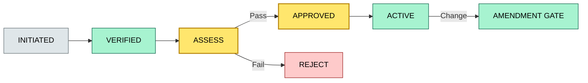
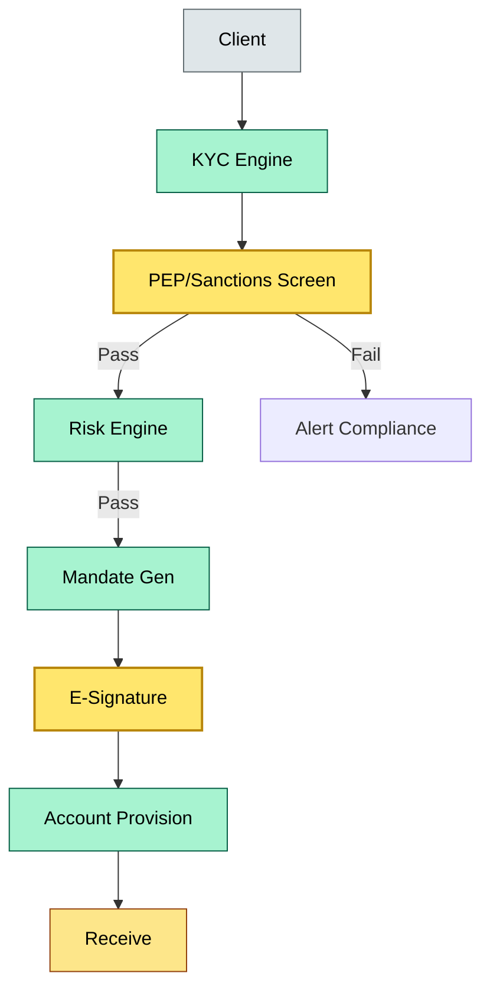

# [C2] Client onboarding — DETAIL
> **Category:** C2 Core Business Flows · **Difficulty:** ◑ · **Banking-relevant:** yes / 💳
> **Companion brief:** `briefs/C2-01-onboarding.md`

> > **Target reader:** enterprise architect who must *explain, justify, and defend* the topic — not just recite it.

---

## 1. Precise definition
Client onboarding is the end-to-end regulatory and technical workflow that (a) verifies a counterparty's identity and beneficial ownership, (b) assesses their risk profile and suitability for custody services, (c) establishes a legal relationship (mandate or custody agreement) with appropriate signatures and audit trails, (d) provisions the bank and sub-custodian account structures, and (e) gates all subsequent asset receipts behind a clearance state. It is not account opening; it is the prerequisite for legally defensible custody receipt.

## 2. Why it exists (the problem it solves)
Before onboarding gates were enforced, banks discovered months later that a counterparty was a shell, that a mandate had been back-dated, or that an asset class was outside the signed scope. The 2015 Panama Papers and 2016 FinCEN leak made it clear that who the ultimate beneficial owner is matters more than the named account holder. Onboarding prevents mis-allocated legal title, sanctions exposure, and inspector-findings. Architecturally, onboarding is the one process where human judgment must be backed by immutable machine checks (PE screening, PEP lists, KYC API responses).

## 3. Core concepts & vocabulary
| Term | Precise meaning |
|------|-----------------|
| KYC | Identity verification, source-of-wealth proof, and beneficial ownership declaration checked against a standard (FATF 40 recommendations) |
| PEP | Politically exposed person: an individual in a prominent public position or a close associate; triggers enhanced due diligence |
| AML | Anti-money laundering: ongoing monitoring, suspicious activity reporting, and sanctions screening |
| Source of funds | The legitimate origin of the assets being onboarded (salary, business sale, inheritance) |
| Source of wealth | The broad origin (salary, capital gains, trust) without the specific transaction trail |
| Suitability | Whether the client's risk tolerance and knowledge are appropriate for a given asset class |
| Mandate | The signed legal instruction authorizing custody, trading, and corporate actions |
| GL reset | General ledger reset creating a new passive account to hold custody holders |
| FOC-M | First of the month settlement date when the account is ready to receive |
| Risk appetite | Stated risk tolerance on a defined scale (1–10) that drives asset-class limits |

## 4. How it works (architecture / mechanism)
Onboarding is a bounded state machine with five states:
1. **INITIATED** — client submits identity docs and mandate narrative.
2. **VERIFIED** — e-KYC/video KYC resolves identity; PEP/sanctions screening runs.
3. **ASSESSED** — compliance reviews risk appetite, source of funds, and PEP outcomes.
4. **APPROVED** — mandate signed and legal executed; account structure provisioned.
5. **ACTIVE** — asset receipts are permitted; monitoring begins.

The state machine must be irreversible: once APPROVED, reverting to VERIFIED requires a manual compliance override with dual authorization.

### 4.1 Diagrams
**Diagram A — Onboarding state machine** (highlight critical gates = gold, red = reject):


**Diagram B — Data flow to compliance and custody** (highlight decision = green, money = gold):


## 5. Variants, options & trade-offs
| Variant | When to pick | When to avoid | Key trade-off axis |
|---------|--------------|---------------|--------------------|
| Full onboarding (C2-01 + C2-02 + C2-03 + C2-12) | New institution, new country, new asset class | Internal product change, same-country sub-custodian switch | Completeness vs. velocity |
| Simplified / light onboarding | Low-risk retail, same-country, same structure | High-net-worth, cross-border, or PE shared service | Speed vs. regulatory defense |
| e-KYC only | Digital-first clients, strong e-identity frameworks | Weak e-identity infrastructure | Cost vs. fraud risk |
| Video KYC + e-identity | Mid-to-high-risk, remote jurisdictions | On-site regulatory requirement | Reach vs. evidence of liveness |

## 6. Relationships to sibling topics
- **C2-02 (account structure):** Onboarding defines the account type (segregated vs omnibus) which then determines provision mechanics.
- **C2-03 (receiving safekeeping):** Onboarding must gate the receipt step; no onboarding, no assets.
- **C2-04 (delivery to CSD):** Onboarding determines whether the asset being received is eligible for CSD settlement.
- **C3-05 (AML/KYC obligations):** Onboarding is the first enforcement of FATF/AML obligations; it feeds directly into ongoing monitoring.
- **C3-07 (financial crime):** Onboarding is the primary fraud-prevention line; a failed onboarding is a financial-crime failure mode.

## 7. Banking / financial-services context 💳
In 2017, a European private bank onboarded a politician from a non-EU country using a local law firm as introducer. The PEP screening tool had a 72-hour cache and failed to refresh after the political appointment. Six months later, OFAC and EU sanctions were applied retroactively to the firm. The bank could not unwind positions because onboarding had been signed; the legal team spent 90 days proving beneficial ownership separation. The resulting fine was 2% of CET1. The lesson: onboarding is the legal defense line; the architect must eliminate cached-results risk by forcing real-time lookups on every onboarding run.

## 8. Reference architecture / worked example
**Problem:** A wealth manager rebuilds its remote onboarding for a US private client with complex trust structures.
**Decision:** Video KYC + manual compliance review + Pinned-ID e-signature on a tamper-evident blockchain audit trail.
**ADR:**
```markdown
# ADR-11: Remote Trust-Structure Onboarding
## Status
Accepted
## Context
Virtual onboarding for a US private client with a multi-generational trust and a 50-shareholder beneficial ownership chain.
## Decision
Accept remote video KYC with a compliance interview; mandate signed via blockchain-attested e-signature; GL reset provisioned with a 30-day trial asset hold.
## Consequences
- + Faster, lower-touch onboarding for US trust clients.
- - Higher compliance-team headcount required for manual review.
- - Legal must accept blockchain-attested signatures for US sanctions compliance.
## Alternatives considered
1. In-person onboarding (rejected: not feasible for trust structure).
2. E-KYC only (rejected: trust structure required manual review).
```

## 9. Maturity & adoption signals
- **Adopt when:** client volume > 100/month, regulatory inspection frequency > annually, or new asset class introduced.
- **Anti-signals (don't adopt yet):** onboarding run time > 21 days, >15% manual overrides, no real-time PEP/sanctions cache refresh.
- **Common failure modes:** (1) reliance on stale PEP lists, (2) missing source-of-wealth documentation, (3) incomplete mandate signature audit trail.

## 10. Common confusions — the "don't mix" list
| Often confused | Real distinction |
|----------------|-----------------|
| Onboarding vs account opening | Onboarding is regulatory/legal; account opening is technical. You can open an empty account without onboarding, but you cannot receive assets until onboarding is approved. |
| KYC vs AML | KYC is the initial identity verification; AML is the ongoing surveillance for suspicious transactions. |
| e-KYC vs video KYC | e-KYC is document upload + OCR; video KYC adds a live identity-verification interview. |
| Suitability vs risk appetite | Suitability is the bank's assessment; risk appetite is the client's stated willingness. |

## 11. Tools & standards to know
- **Regulations:** FATF 40 Recommendations, EU 6th AML Directive, US Bank Secrecy Act, MiFID II (transaction reporting triggers)
- **Standards:** ISO 12770 for financial services, ISO 20241 for e-identity
- **Tooling:** Refinitiv World-Check, ComplyAdvantage, Dun & Bradstreet, Cyence, iProov, Twilio video KYC
- **Mandatory reading:** Basel IV -- The Basel Committee on Banking Supervision; "Onboarding as a Weapon" — Celent, 2022

## 12. ADR template (ready to fill in)
```markdown
# ADR-{{NN}}: {{decision}}
## Status
Accepted | Proposed | Deprecated
## Context
{{...}}
## Decision
{{...}}
## Consequences
- Positive ...
- Negative ...
- ...
## Alternatives considered
1. ...
2. ...
```

## 13. Practice — apply it
1. **Recall:** list the five onboarding states and why each is a gate.
2. **Model:** produce an ArchiMate business process diagram for onboarding with all controls.
3. **ADR:** write a decision doc choosing video KYC vs e-KYC for a specific trust-structure client.
4. **Defend:** roleplay explaining onboarding requirements to a non-technical AML officer.

## Summary
Client onboarding is the first and most consequential gate in custody. Without it, every subsequent flow (account structure, safekeeping, settlement, corporate actions) is legally exposed. The architect must enforce a state machine with real-time screening, dual-authorization overrides, and an immutable audit trail. Treat onboarding as infrastructure, not a form.

---
**Status:** ✅ Covered
*Last updated: 2026-06-22*

---
**One diagram required. Both brief + detail must exist with ≥1 mermaid each before ✓.**
