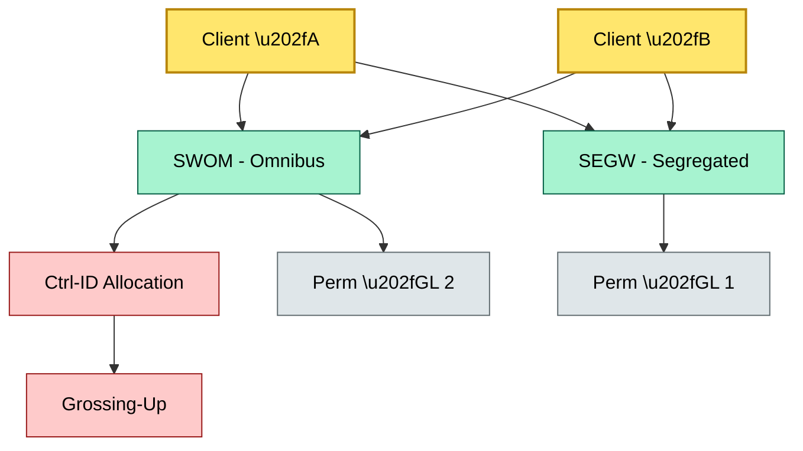
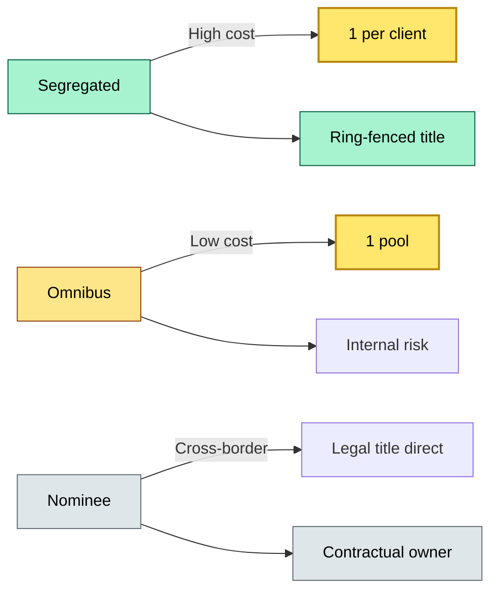

# [C2] Account structure — DETAIL
> **Category:** C2 Core Business Flows · **Difficulty:** ◑ · **Banking-relevant:** yes / 💳
> **Companion brief:** `briefs/C2-02-account-structure.md`

> > **Target reader:** enterprise architect who must *explain, justify, and defend* the topic — not just recite it.

---

## 1. Precise definition
Account structure is the systemic decision that determines the legal entity of record for client assets, the granularity of per-client entitlements, and the internal risk-control mechanism used to map pooled legal title to individual beneficial ownership. The three canonical models are:
- **Segregated:** legal title is held in a structure where each client's securities are ring-fenced and identifiable at the issuer or depository level.
- **Omnibus:** legal title is held in a single pooled account owned by the custodian; internal risk-control processes (e.g., collateral pooling, grossing-up) allocate entitlements.
- **Nominee:** legal title is held by the custodian in its own name; the client has no direct register entitlement and must assert rights via contract and claim against the custodian.

## 2. Why this exists (the problem it solves)
Before book-entry custody, securities were paper certificates; there was no account structure choice. The emergence of omnibus accounts solved operational cost by pooling legal title, but created the problem of internal entitlement tracking. Nominee accounts solved cross-border tax and compliance complexity by allowing the custodian to hold title directly, but removed direct client register relationships. Segregated accounts solved the regulatory problem of ring-fencing legal title but multiplied GL resets and operational work. Every bank carries all three models, and the choice is not purely economic; it is regulatory-driven.

## 3. Core concepts & vocabulary
| Term | Precise meaning |
|------|-----------------|
| Segregated account | Client-specific sub-accounts or sub-custody arrangements where legal title can be traced to an individual beneficial owner at the issuer/depository level |
| Omnibus account | Single pooled legal-title account shared by many clients; entitlements determined by internal risk controls and grossing-up |
| Nominee account | The custodian holds title directly and maintains the register; clients assert rights contractually |
| Grossing-up | The net-to-gross translation of omnibus positions for regulatory, tax, and risk reporting |
| Ctrl-ID (Control ID) | Internal identifier mapping omnibus shares to individual client entitlements |
| GL reset | General ledger reset creating a new passive account for a client or pooled line |
| SIPC protection | US deposit insurance analog for broker-dealer custody; not legal title protection |
| Tax gross-up | The process of calculating the pre-tax price to offset withholding tax in a pooled structure |
| Book-entry | The transfer of ownership without physical securities, via a depository or sub-custodian ledger |
| Title chain | The chain from issuer register \u2192 depository (central) \u2192 sub-custodian \u2192 bank \u2192 client beneficiary |

## 4. How it works (architecture / mechanism)
Account structure is implemented by three interconnected systems:
1. **Account provisioning engine:** generates GL resets, SWIFT BIC assignments, and control IDs.
2. **Risk-control engine:** computes omnibus grossings, validates segregate vs. pool, and enforces concentration limits.
3. **Reporting engine:** aggregates positions for CSDR, Basel, tax, and client reporting.

The provisioning engine must handle three lanes:
- **Segregated lane:** one GL per client; no grossing; direct register access at CSD level.
- **Omnibus lane:** one GL per pool; sub-ledgers internal; daily grossing; Ctrl-ID-based allocation.
- **Nominee lane:** one GL per nominee nominal; entitlement tracking is contract-based; no direct register access.

A misconfiguration in any lane produces a downstream reconciliation gap.

### 4.1 Diagrams
**Diagram A — Three account structures and their SPL** (highlight structure type = gold, internal = green):


**Diagram B — Account structure choice matrix** (highlight cost = gold, risk = red):


**Diagram C — Grossing-up lifecycle** (highlight error = red, pass = green):
```mermaid
graph LR
    classDef ok fill:#a7f3d0,stroke:#065f46,color:#000
    classDef risk fill:#fecaca,stroke:#991b1b,color:#000
    classDef money fill:#fde68a,stroke:#92400e,stroke-width:1px,color:#000
    Start[Morning secure data]:::ok --> Gross[Orchestrate]:::critical
    Gross --> Validate{Ctrl-ID map complete?}:::risk
    Validate -->|Yes| Sort[Sort \& resolve]:::ok
    Validate -->|No| Alert[Alert ops]:::risk
    Sort --> Report[Regulatory rep]:::money
    Alert -->|Manual fix]:::risk
    class Gross critical
```

## 5. Variants, options & trade-offs
| Variant | When to pick | When to avoid | Key trade-off axis |
|---------|--------------|---------------|--------------------|
| Segregated | UHNWI, regulatory mandate, legal title risk | High-volume retail | Legal safety vs. operational cost |
| Omnibus | Retail, ETFs, high-volume institutional | Regulatory requiring per-client title | Efficiency vs. audit granularity |
| Nominee | Cross-border, non-EU tax regimes, emerging markets | Client demands register access | Compliance vs. client transparency |
| Hybrid (segregated base + omnibus overflow) | Large wealth managers | Complex tax, basis tracking | Operational vs. regulatory tension |

## 6. Relationships to sibling topics
- **C2-03 (receiving safekeeping):** Account structure determines whether receipts are credited to a segregated GL or an omnibus sub-ledger.
- **C2-04 (delivery to CSD):** Segregated routes directly to a CSD account; omnibus routes to the custodian's CSD account.
- **C2-06 (cash management):** Omnibus cash pooling works best with omnibus securities; segregated requires per-client cash sweeps.
- **C3-02 (client asset rules):** Segregation is mandatory for misappropriation protection; omnibus must be backed by internal segregation controls.
- **C7-02 (strong governance):** Account structure must be mapped to the Strong Controls Analyst (CFA) ring-fencing.

## 7. Banking / financial-services context 💳
In 2023, a major European wealth manager discovered that its omnibus cash pool was not grossing up correctly for CSDR reporting because the sub-custodian's position feed was delayed by 12 hours. The firm had held-for-custody assets that it should have used as collateral; internal collateral math was off by €42m, triggering a misc ratio breach. The root cause was that the omnibus GL reset was not real-time-synced with the sub-custodian. The architecture lesson: omnibus structures demand real-time position feeds or they become an operational risk exposure in disguise.

## 8. Reference architecture / worked example
**Problem:** A US private bank onboarded a new Asia-Pacific UHNWI practice with $800m in Asia-Pacific equities and wants tax-efficiency without a Singapore sub-custodian.
**Decision:** Segmentate the Asian holdings into a designated omnibus sub-custody line with a gross-up engine and a per-country tax engine; use segregated accounts for the US stock leg.
**ADR:**
```markdown
# ADR-02: Omnibus vs Segregated for Asia-Pacific UHNWI
## Status
Accepted
## Context
$800m Asia-Pacific equity mandate; Singapore as CSD; no local sub-custodian; tax-efficiency required.
## Decision
Use an omnibus omnibus structure with real-time gross-up and per-country withholding tax; maintain segregated structure for US G-1484 holdco.
## Consequences
- + Tax efficiency (monthly dividend)
- + Single sub-custodian relationship
- - Gross-up latency is a financial-risk exposure
- - Regulatory reporting complexity (CSDR + withholding-tax cross-check)
## Alternatives considered
1. Full segregated in Singapore (rejected: too expensive, no local title).
2. Full nominee (rejected: no direct tax grossing).
```

## 9. Maturity & adoption signals
- **Adopt when:** client assets >$100m, regulatory mandates per-client title, or tax-gross efficiency required.
- **Anti-signals:** >100 omnibus lines without manual grossing, >24-hour data latency in position feeds, missing Ctrl-ID mapping docs.
- **Common failure modes:** (1) omnibus GL not synchronized with sub-custodian position engine, (2) control-ID drift between bank and sub-custodian, (3) illegal re-use of omnibus funds for proprietary operations.

## 10. Common confusions — the "don't mix" list
| Often confused | Real distinction |
|----------------|-----------------|
| Omnibus vs nominee | Omnibus has pooled legal title with internal risk; nominee has the custodian as legal title holder with no internal pool. |
| Segregated vs omnibus | Segregated = per-client legal title trace; omnibus = pooled title with internal allocation. |
| GL reset vs control ID | GL reset is the accounting identity; control ID is the internal entitlement mapping. |
| Hire/custody vs. deposit | Deposit is bank-owned funds; custody is client-owned assets held in trust. |

## 11. Tools & standards to know
- **Regulations:** CSDR (T2S), EU Capital Requirements Regulation (CRR), US SIPC rules, FATF 40
- **Standards:** ISO 20022 for messaging, ISITC for corporate actions, T2S participation agreements
- **Tooling:** Bloomberg OASYS, SIX SIS, Euroclear Pro, Clearstream, State Street, SWIFT wss/bcs
- **Mandatory reading:** "Custody Structures: A Practitioner's Guide" — TMC Magazine, 2022

## 12. ADR template (ready to fill in)
```markdown
# ADR-{{NN}}: {{decision}}
## Status
Accepted | Proposed | Deprecated
## Context
{{...}}
## Decision
{{...}}
## Consequences
- Positive ...
- Negative ...
...
## Alternatives considered
1. ...
2. ...
```

## 13. Practice — apply it
1. **Recall:** name the three account structures and the primary trade-off axis for each.
2. **Model:** draft an ArchiMate diagram showing segregated GL vs. omnibus GL + sub-ledger.
3. **ADR:** write a decision doc choosing a structure for a $500m Middle-East mandate with no local depository.
4. **Defend:** roleplay explaining omnibus gross-up to a non-technical CRO.

## Summary
Account structure is the first and most consequential architectural decision in custody. It determines legal title, cost, regulatory burden, and downstream data flows. The architect must map every account structure to GL resets, sub-custodian feeds, and regulatory reporting. Omnibus is the default for efficiency but requires real-time instruments and machinery; segregated is the default for safety but expensive; nominee is the default for cross-border tax complexity but opaque.

---
**Status:** ✅ Covered
*Last updated: 2026-06-22*

---
**One diagram required. Both brief + detail must exist with ≥1 mermaid each before ✓.**
