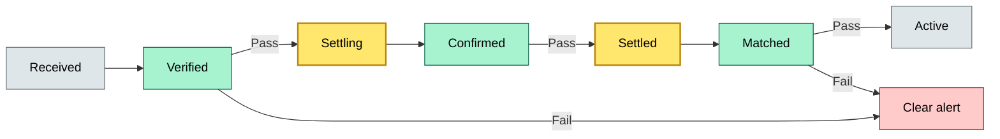
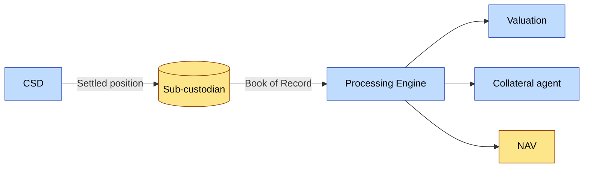

# [C2] Receiving and safekeeping assets — DETAIL
> **Category:** C2 Core Business Flows · **Difficulty:** ◑ · **Banking-relevant:** yes / 💳
> **Companion brief:** `briefs/C2-03-receiving-safekeeping.md`

> > **Target reader:** enterprise architect who must *explain, justify, and defend* the topic — not just recite it.

---

## 1. Precise definition
Receiving and safekeeping is the bounded operational workflow that processes a trade instruction from arrival through settlement to a credited, reconciled position in the custody ledger. It enforces DVP/DvP rules per the trade context, maintains a continuous audit trail of legal title, and produces a position record that is the single source of truth for valuation, NAV, collateral, and reporting.

## 2. Why this exists (the problem it solves)
Before Accrual-Storing-and-Noting (ASN), securities were held as paper; receiving meant physical delivery by messenger. Electronic settlement introduced settlement risk: the seller could revoke, the buyer could default. The safekeeping function solved the problem of proving who holds title at any moment and protecting against fraud by maintaining an indelible record. Today, the residual problem is **timing**: settlement windows shorten (T+1 \\u2190 T+0), and any delay between instruction and credit creates operational risk, capital charges, and valuation noise.

## 3. Core concepts & vocabulary
| Term | Precise meaning |
|------|-----------------|
| Trade instruction | A normalized message (buy/sell/transfer) carrying asset ID, quantity, price, currency, and account target |
| Value date | The calendar date on which legal title passes; T+0, T+1, or T+2 per market convention |
| DVP (Delivery versus Payment) | Both securities move to the buyer and cash to the seller on the same day; mutual risk reduction |
| DvP (Delivery versus Value) | Securities move first; cash (or PV difference) completes later; the "delivery-before-payment" model |
| Position (stock position) | The legal entitlement to a quantity of an instrument held or owed on a given date |
| Debit (hold) | A temporary reduction in available cash or securities to cover a pending settlement; a liability in substance, a contra-asset in form |
| Credit | A permanent increase in the asset side of the client ledger, representing legal title |
| Sub-custodian | The custodian that holds legal title on the bank's behalf; the bank is the beneficial owner |
| Confirmation | The bilateral or multilateral exchange of trade details to verify execution and settlement |
| Trade history record (THR) | The cumulative audit of all trade events for fit-and-proper, CSDR, and audit purposes |
| Trade date (T0) | The calendar date on which the trade is agreed between counterparties |
| Settlement date (T+1, T+2) | The date title changes hands; the CSD-level legal transfer event |
| Result code | The system-generated status (e.g., 02, 30, 31, 35, 40, 44, RO, FO) per UTI \u00b7 isin mapping |

## 4. How it works (architecture / mechanism)
Receiving and safekeeping is a state machine with seven formal states and three checkpoint gates:

1. **Received:** The instruction is parsed and normalized from ISDA, DTCC, T2S, or local message format.
2. **Verified:** The trade is checked for format, validity, and available-to-trade status. If the trade is in the wrong status (e.g., `35` - success in wrong system), the gate fails.
3. **Settling:** The bank calculates debits and credits, locks cash/securities, and sends a matching reject to the MDR. This is the DVP/DvP engine.
4. **Confirmed:** The confirmation partner acknowledges all trade details (price, quantity, fees, tax).
5. **Partsettle:** For non-core trades (e.g., options, repo), the bank may settle received but not delivered instruments; this is a one-sided action.
6. **Settled:** The legal title change is completed; the position is credited in the book of record.
7. **Matched:** The sub-custodian records agreement; the position is now "received and matched" in the sub-custodian system.

The book of record is the canonical source: if the sub-custodian and CSD disagree, the bank's book of record is used for valuation and NAV because the bank is the counterparty to the client.

### 4.1 Diagrams
**Diagram A — Receiving and safekeeping state machine** (highlight critical state = gold, failure = red):


**Diagram B — DVP/DvP engine with cash and securities flow** (highlight money = gold, risk = red):
```mermaid
graph TD
    classDef critical fill:#ffe66d,stroke:#b8860b,stroke-width:2px,color:#000
    classDef core fill:#a7f3d0,stroke:#065f46,stroke-width:1px,color:#000
    classDef context fill:#dfe6e9,stroke:#636e72,color:#000
    classDef money fill:#fde68a,stroke:#92400e,stroke-width:1px,color:#000
    Sell[Sell party]:::context -->|+| Sale>>(Sale instruction):::money
    Buy[Buy party]:::context -->|+| Buy>>(Buy instruction):::money
    Sale --> Match[MDR Matching]:::core
    Buy --> Match
    Match -->|Reject| Alert[(Alert ops)]:::risk
    Match -->|Pass| DDR[DDR confirm]:::critical
    DDR -->|Sec| CashOut[Cash to seller]:::money
    DDR -->|Sec| StockIn[Stock to buyer]:::money
    StockIn --> GL[(Book of Record)]:::critical
    CashOut --> GL
    class Match,DDR critical
```

**Diagram C — Position custody after settlement** (highlight service = blue, data = orange):


## 5. Variants, options & trade-offs
| Variant | When to pick | When to avoid | Key trade-off axis |
|---------|--------------|---------------|--------------------|
| T+2 standard | Most markets, mature infrastructure | Markets moving to T+1 | Stability vs. speed |
| T+1 | EU, UK, US equities | Emerging markets | Faster settlement vs. operational readiness |
| T+0 | Central bank reserves, instant-transfer systems | Equity markets | Near-real-time vs. monetary-system risk |
| DvP (floating-rate) | Jurisdictions where cash settlement completes after securities | Markets with tight settlement windows | Flexibility vs. default risk |
| DVP-with-repurchase | Trade financing via repo side-car | Non-repo instruments | Liquidity vs. complexity |

## 6. Relationships to sibling topics
- **C2-04 (delivery to CSD):** Delivery to CSD is the CSD-level legal transfer; receiving and safekeeping is the bank's internal ledger representation of that transfer.
- **C2-05 (settlement):** Settlement is the DVP mechanism; receiving and safekeeping is the process of executing and confirming that mechanism.
- **C2-06 (cash management):** Received cash is the output of successful settlement; cash management rules the target account and sweep logic after receive.
- **C2-07 (NAV valuation):** The credited position from safekeeping is the input to daily valuation and accruals.
- **C2-10 (collateral management):** Positions held in safekeeping are the pool against which collateral is pledged.
- **C3-06 (DORA):** Receiving and safekeeping is in scope for DORA; the 2024-2027 rollout will require resilience testing of the settlement engine.

## 7. Banking / financial-services context 💳
In 2020, a major European custodian discovered a 24-hour delay in position credits after a T+1 settlement migration. A €1.2bn block of equity trades was credited on D+1 instead of D, but the sub-custodian had already re-invested or re-hypothecated the shares under the old policy. The bank had to buy in the shares on the open market at a 14-basis-point premium, losing €1.7m. The root cause was a missing checkpoint gate after settlement to prevent sub-custodian re-use until credit was confirmed.

## 8. Reference architecture / worked example
**Problem:** A global custody bank wants to process equity instructions from a new fintech onboarding consumer clients in 14 markets.
**Decision:** Deploy a cloud-native position-engine with real-time STEP-722/20022 inbound, T+1 DvP for emerging markets, and T+2 DVP for equities. Include a hard gate: no sub-custodian re-use until position status = `Settled` \|\| `Settled & confirmed`.
**ADR:**
```markdown
# ADR-03: Real-Time Position Engine
## Status
Accepted
## Context
Onboard consumer trading via fintech in 14 markets; T+1 and T+2 settlement; sub-custodian re-use charges.
## Decision
Adopt cloud-native position engine with MEMS-style constraints (M-ts, M-ms), real-time STEP 722 inbound, and a 'no-re-use' gate until Settled or Settled & confirmed.
## Consequences
- + Faster time-to-market for consumer trading
- - Higher infra cost; new dependency on cloud vendor
- - Need real-time sub-custodian position feeds (or compensating controls)
## Alternatives
1. Legacy mainframe with daily batch (rejected: too slow).
2. T+2 only (rejected: competitive disadvantage).
```

## 9. Maturity & adoption signals
- **Adopt when:** trade volume > 1M/month, projects for T+1, or CSD migration to T+1.
- **Anti-signals:** >2-hour settlement latency, no real-time position feed, manual break remediation.
- **Common failure modes:** (1) sub-custodian re-use before settlement confirmation, (2) incorrect result code mapping, (3) corporate-action expiry causing position mismatch.

## 10. Common confusions — the "don't mix" list
| Often confused | Real distinction |
|----------------|-----------------|
| Receiving vs safekeeping | Receiving is the active processing; safekeeping is the perpetual state after credit |
| Trade date vs settlement date | Trade date is agreement; settlement date is title change |
| DVP vs DvP | DVP = simultaneous exchange; DvP = securities first, cash later |
| Debit vs credit | Debit = temporary hold (reverse); Credit = permanent title entry |
| Exchange Settlement (ES) vs Cash Settlement (CS) | ES = securities net; CS = cash net; both involve DvP but with different netting domains |

## 11. Tools & standards to know
- **Regulations:** CSDR, DORA, MiFID II (trade reporting), FATF 40, Basel III (operational risk capital), T2S participation agreements
- **Standards:** ISO 20022 (CTIS-MT562, CTIS-CH35B), ISO/TC 262 for market signals, Swift 2022 cmd suite
- **Tooling:** DTCC, Euroclear, Clearstream, SIX SIS, OpenLink, TMX Tech, State Street, SWIFT, Fidessa/Detica
- **Mandatory reading:** "The Mechanics of Modern Securities Settlement" — BIS, 2021

## 12. ADR template (ready to fill in)
```markdown
# ADR-{{NN}}: {{decision}}
## Status
Accepted | Proposed | Deprecated
## Context
{{...}}
## Decision
{{...}}
## Consequences
- Positive ...
- Negative ...
...
## Alternatives considered
1. ...
2. ...
```

## 13. Practice — apply it
1. **Recall:** name the seven states and three checkpoint gates.
2. **Model:** draft an ArchiMate business process diagram for receiving with all states and gates.
3. **ADR:** write a decision doc choosing T+1 vs T+2 for a new market entry.
4. **Defend:** roleplay explaining a break response to a non-technical CFO.

## Summary
Receiving and safekeeping is the first operational proof of custody: the moment an instruction becomes a position. It is a state machine with seven states and three checkpoint gates. The architect must design for idempotency, enforce real-time checkpoints, and treat the book of record as canonical. A single lapse in the settlement gate can produce valuation errors, regulatory exposure, and direct proprietary loss.

---
**Status:** ✅ Covered
*Last updated: 2026-06-22*

---
**One diagram required. Both brief + detail must exist with ≥1 mermaid each before ✓.**
