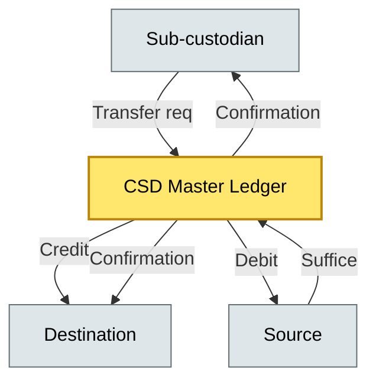
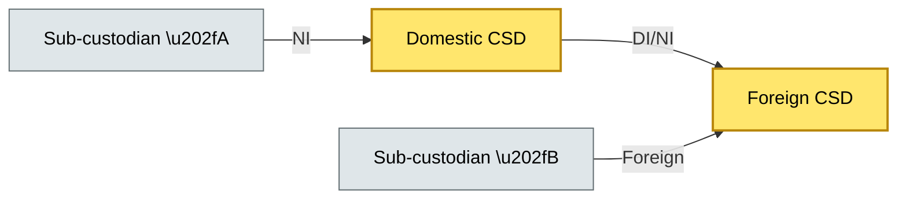

# [C2] Delivery to CSD — DETAIL
> **Category:** C2 Core Business Flows · **Difficulty:** ◑ · **Banking-relevant:** yes / 💳
> **Companion brief:** `briefs/C2-04-delivery-to-csd.md`

> > **Target reader:** enterprise architect who must *explain, justify, and defend* the topic — not just recite it.

---

## 1. Precise definition
Delivery to a Central Securities Depository (CSD) is the book-entry transfer of legal title from a sub-custodian (or its own account) to a beneficiary institution or end investor, mediated by the CSD's ledger, netting, and settlement engine. The CSD is the final legal arbiter of title for a given market; once its records acknowledge the transfer, the title change is irrevocable by the custodian.

## 2. Why this exists (the problem it solves)
Before depositories, securities were paper certificates shipped by courier; settlement failures were irreversible, and theft in transit meant permanent loss of title. The CSD introduced a centralized ledger, central counterparty settlement risk, and netting. The problem it solved: the absence of a single, trusted, replacementfor the paper-certificate system. Today, the residual problems are: the CSD's state is immutable (once updated, no refund), the CSD is a single point of failure (every market converges on 1–3 CSDs), and the CSD's APIs are the only interface between the bank and legal title.

## 3. Core concepts & vocabulary
| Term | Precise meaning |
|------|-----------------|
| Central Securities Depository (CSD) | A legal entity that holds securities in book-entry form and provides securities settlement services; e.g., Euroclear, DTCC, Clearstream, Euroclear UKI, Japan Securities Depository |
| Book-entry | The physical form of securities: the master ledger at the CSD, with no paper equivalent |
| Netting | The multilateral offsetting of buy and sell obligations to reduce settlement value |
| D1 / D2 | Domain 1 (cash) and Domain 2 (securities) in TARGET2-Securities (T2S); the CSD moves securities in one domain and cash in the other |
| Settlement bank | The bank that holds a direct or indirect account with the CSD or with a CSD participant |
| Swapped collateral | Securities pledged to the CSD in exchange for a DVP or DvP, and used to obtain a loan |
| Custody balance | The quantity of a security held on the CSD's books for a specified beneficial owner |
| Specification | The input or output message that triggers a receipt or transfer; contains who, what, how much |
| DTC (De Matto DWN) | Depository model: ownership is based on the quantity held for each beneficial owner on the books of a single depositary |
| ICR (Intermediary-Centric Rights) | Direct model: ownership is based on the ultimate beneficial owner, regardless of where securities are held |
| Account merge | A legal process to merge two sub-custodian accounts, reducing custodian liability |
| Payment instruction | The cash component of a DVP, sent through an e-money scheme or fed through a TARGET2 gross settlement system |
| Instruction | The securities component of a DVP or DvP |
| Maturity date (in T2S) | The T+1 or T+2 settlement date for a specific domain |
| Qualifying transaction | The securities-position update chain in T2S that identifies all holders and their movements |
| Settlement bank credit / debit | The entry on a payment or securities position indicating a credit (positive) or debit (negative) event |
| Reconciliation | The external match between the CSD and the sub-custodian ledger to ensure accurate record-keeping |

## 4. How it works (architecture / mechanism)
Delivery to a CSD is a book-entry transfer solving the exchange of instructions (SSI) between two parties. The process:
1. **Initiate:** The sub-custodian subsystem sends a request for transfer to the CSD, honoring the Standard Settlement Instructions (SSI) pre-agreed parameters (BIC, account numbers, address, specimen signatures).
2. **Receive:** The CSD receives the transfer request.
3. **Validate:** The CSD validates the request against all relevant rules: the transfer fits the requested criteria (regulation might require a minimum or maximum limit), the transfer stays within the instruction time window, and the sender has sufficient securities to transfer.
4. **Process:** The CSD updates its master ledger: debit the source account, credit the destination account.
5. **Notify:** The CSD sends a confirmation to both the source and the destination, confirming that the transfer was completed (or rejected).
6. **Settle:** The CSD processes the cash component (payment instruction) through the same pipeline.
7. **Update:** The CSD updates its security balance.
8. **Other:** The CSD sends an instruction-received response to both the sender and the recipient.

The CSD is the black-box boundary: once the CSD confirms, the transfer is complete and cannot be reversed by the bank.

### 4.1 Diagrams
**Diagram A — CSD delivery architecture** (highlight CSD = gold, bank = blue, risk = red):


**Diagram B — T2S netting and settlement** (highlight CSD = gold, cash = green, risk = red):
```mermaid
graph LR
    classDef critical fill:#ffe66d,stroke:#b8860b,stroke-width:2px,color:#000
    classDef core fill:#a7f3d0,stroke:#065f46,stroke-width:1px,color:#000
    classDef context fill:#dfe6e9,stroke:#636e72,color:#000
    classDef money fill:#fde68a,stroke:#92400e,stroke-width:1px,color:#000
    CSD[Euroclear/DTCC/Clearstream]:::critical -->|Net| Net[Net]:::money
    CSD -->|D1 (cash)| D1[D1/D2]:::core
    CSD -->|D2 (securities)| D2[D2]:::core
    D1 -->|Fund| Pairs[Matching]:::core
    D2 -->|Fund| Pairs
    class CSD critical
```

**Diagram C — Cross-border settlement with DI/NI** (highlight CSD = gold, bank = blue, risk = red):


## 5. Variants, options & trade-offs
| Variant | When to pick | When to avoid | Key trade-off axis |
|---------|--------------|---------------|--------------------|
| DTC (Depository Model) | Most equity, bond, and money-market markets | Jurisdictions moving to ICR | Account-based tracking vs. B-U-accounting |
| ICR (Direct Model) | Some European banks, SRR accounts | Markets with limited infrastructure | Direct title vs. sub-custodian complexity |
| T2S integration | EU markets | Markets without T2S | Real-time gross settlement vs. local CSD cost |
| Direct investment (DI/NI) | Cross-border, direct holding | Markets with strong CSD monopoly | Direct title vs. local regulatory cost |
| Account merge | Consolidating sub-custodian relationships | Markets with strict turnover regulations | Line count reduction vs. regulatory cost |

## 6. Relationships to sibling topics
- **C2-03 (receiving safekeeping):** Receiving is the bank's internal credit; delivery to CSD is the legal title step that makes it irrevocable.
- **C2-05 (settlement):** CSD delivery is the securities-position update in DVP/DvP; settlement is the overall mechanism.
- **C3-06 (DORA):** The CSD pipeline is in scope for DORA; 2024-2027 operational resilience testing for CSD interfaces must demonstrate recovery-time objectives.
- **C7-05 (repudiation / settlement risk):** Repudiation risk is highest at the CSD hand-off; once acknowledged, the CSD bears the title risk.
- **C2-10 (collateral management):** Collateral pledges are executed in the CSD; the CSD is the legal backstop.

## 7. Banking / financial-services context 💳
In 2023, Greece's Amfissa S.A. CSD transitioned from T+2 to T+1. A netting error in June 2023 caused 2,000 transactions to fail settlement; the bank had to unwind €4bn in positions, losing €1.7m in premium. The operational cause: a database sequence drift between the bank's matching engine and the Amfissa CSD. The risk: the CSD is the apex; if its state diverges from the bank's, the bank must absorb the reversion cost.

## 8. Reference architecture / worked example
**Problem:** A global custody bank wants to deliver securities to a beneficiary in a market served by a national CSD (e.g., a Greek or a Japanese CSD).
**Decision:** Use the local CSD's DI/NI link with Standard Settlement Instructions (SSI) to avoid bilateral re-validation.
**ADR:**
```markdown
# ADR-04: Cross-border CSD Delivery
## Status
Accepted
## Context
Delivery of €500m equity to a Greek corporate through Amfissa S.A. CSD.
## Decision
Use DI/NI link with SSI; avoid bilateral re-validation; accept CSD-swap collateral for DvP; monitor netting error counts daily.
## Consequences
- + Faster, lower-cost delivery
- + Fewer bilateral checks
- - CSD-swap collateral is a counterparty risk
- - Netting errors must be monitored daily
## Alternatives
1. Parallel delivery to a foreign sub-custodian (rejected: higher cost, slower).
2. T2S direct integration (rejected: not available for this asset class).
```

## 9. Maturity & adoption signals
- **Adopt when:** cross-border delivery >10% of volume, or market moving to account merger.
- **Anti-signals:** >1 foundation for every CSD call (no caching), no daily netting error monitoring, no CSD-swap collateral exposure limits.
- **Common failure modes:** (1) CSD state drift, (2) netting error under-reporting, (3) DI/NI link downtime.

## 10. Common confusions — the "don't mix" list
| Often confused | Real distinction |
|----------------|-----------------|
| CSD vs. exchange | CSD = legal title holder; exchange = price discovery + trade execution |
| DTC vs ICR | DTC = depository based; ICR = direct investor based |
| CSD delivery vs settlement | CSD delivery = legal title transfer; settlement = the process |
| Account merge vs CSD immersion | Account merge = consolidation of custodian relationships; CSD immersion = direct CSD holding |
| Payment instruction vs instruction | Payment = cash; instruction = securities |

## 11. Tools & standards to know
- **Regulations:** CSDR, DORA, MiFID II (trade reporting), FATF 40, T2S participation agreements, local CSD rules
- **Standards:** ISO 20022, CTIS-MT562, T2S specification (domain D1/D2), DTC specification, ICR specification
- **Tooling:** DTCC, Euroclear, Clearstream, RTS (Real-time settlement), SWIFT, Fidessa, OpenLink, Amfissa S.A., Japan Securities Depository
- **Mandatory reading:** "The design, development and operation of a European CSD" — BIS, 2021

## 12. ADR template (ready to fill in)
```markdown
# ADR-{{NN}}: {{decision}}
## Status
Accepted | Proposed | Deprecated
## Context
{{...}}
## Decision
{{...}}
## Consequences
- Positive ...
- Negative ...
...
## Alternatives considered
1. ...
2. ...
```

## 13. Practice — apply it
1. **Recall:** name the DTC and ICR models and the title chain.
2. **Model:** draft an ArchiMate diagram showing the CSD as a black-box boundary with the title chain.
3. **ADR:** write a decision doc choosing between DTC and ICR for a new market.
4. **Defend:** roleplay explaining CSD risk to a non-technical CRO.

## Summary
Delivery to a CSD is the legal, book-entry transfer of title via the apex depositories. The CSD is the final arbiter; once it acknowledges, the transfer is irrevocable. The architecture must treat the CSD as a black-box boundary with immutable state but with real-time reconciliation as a compensating control.

---
**Status:** ✅ Covered
*Last updated: 2026-06-22*

---
**One diagram required. Both brief + detail must exist with ≥1 mermaid each before ✓.**
