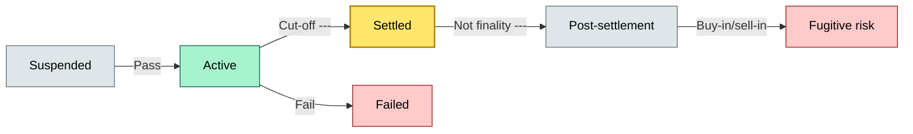
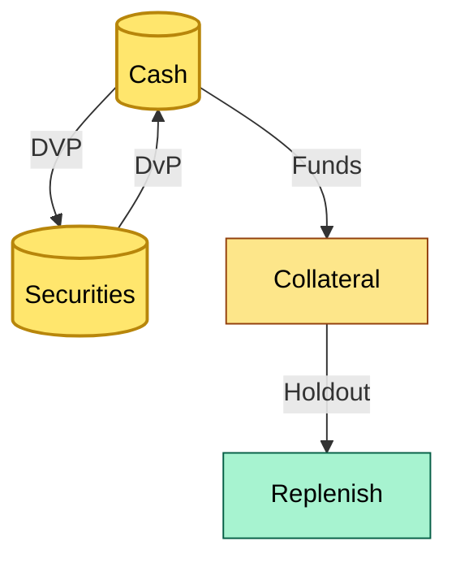
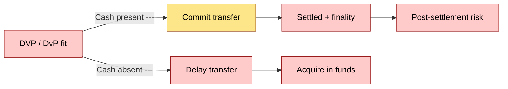

# [C2] Settlement: cash and securities — DETAIL
> **Category:** C2 Core Business Flows · **Difficulty:** ◑ · **Banking-relevant:** yes / 💳
> **Companion brief:** `briefs/C2-05-settlement.md`

> > **Target reader:** enterprise architect who must *explain, justify, and defend* the topic — not just recite it.

---

## 1. Precise definition
Settlement is the process by which a transaction is resolved into a final transfer of securities and cash between counterparties, simultaneous (DVP) or sequential (DvP), value-dated, and subject to market-specific trade cut-offs. It is the point at which settlement risk is minimized, but not eliminated. Once settled (or partially settled), the positions are entered into the parties' books, but counterparty risk remains in the post-settlement period (e.g., the risk that a securities transfer is reversed for a reason that is not immediately apparent).

## 2. Why this exists (the problem it solves)
Before the 1970s, settlement was "three-day") — a paper-based back-office process where trades were settled manually via paper, courier, and bank wire. This created Herstatt risk (one party paying but not receiving because of the time-zone gap). The introduction of electronic settlement systems (DTC, Euroclear, Clearstream, now T2S) solved the physical-transfer problem but introduced:
- **Latency:** Batch windows, batch-to-batch jitter, and reconciliation delays.
- **Cut-off risk:** A trade submitted too late for the value date settles on T+1 instead of T+0 or T+1, producing carry cost.
- **Finality ambiguity:** Some "settled" states are not irreversible (buy-in / sell-in windows).
- **Netting risk:** CSD netting errors (e.g., Amfissa 2023) can leave positions unsettled without obvious failure until the next validation.

The architect must design for idempotency, for cut-off-aware scheduling, and for a "no post-settlement reversal" policy.

## 3. Core concepts & vocabulary
| Term | Precise meaning |
|------|-----------------|
| DVP (Delivery versus Payment) | Simultaneous or nearly simultaneous exchange of securities and cash; reduces herding and fraud risk |
| DvP (Delivery versus Value) | Securities transfer first; cash transfer completes later (or via a different network); allows for delivery-before-cash |
| Trade cut-off | The deadline by which a trade must be submitted to the settlement system to meet the value date |
| Value date / effective date | The calendar date on which the trade is legally effective and settled; T+0, T+1, or T+2 |
| Finality | The point at which a transfer is no longer reversible; funds are debited and released |
| Settlement risk / Herstatt risk | The risk one party pays but does not receive the corresponding asset because of a time-zone or liquidity delay |
| Pay-in | The first-time introduction of reserves required for securities, margins, or other assets |
| Buy-in / sell-in | Short-term repurchase/sale of assets to close a trade that has failed to settle after a pre-agreed period |
| Schemes | OTP-II (offline, with central counterparty), OTP-I (online), T2S (real-time gross settlement for securities and cash) |
| Maturity date | The date on which a security's term ends and proceeds are generated |
| Transfer condition | A condition that must be fulfilled for a transfer to be executed; e.g., both cash and securities must be available |
| Standard Settlement Instructions (SSI) | Pre-agreed parameters (BIC, account numbers, address, specimen signatures) that allow the CSD to execute settlements without repeating bilateral checks |
| Payment instruction | The cash component of a DVP, sent through an e-money scheme or fed through a TARGET2 gross settlement system |
| Qualifying transaction | The securities-position update chain in T2S that identifies all holders and their movements |

## 4. How it works (architecture / mechanism)
Settlement is the process by which a transaction is resolved into a final transfer of securities and cash. The exact mechanism varies by market (OOP, OTC, exchange-traded, secondary issue) and by instrument (cash versus securities).

### 4.1 Diagrams
**Diagram A — Settlement state machine** (highlight cut-off = gold, failure = red):


**Diagram B — Cash and securities settlement flow** (highlight total = green, funds = gold):


**Diagram C — DVP/DvP fit breakdown** (highlight "fit" = green, "fail" = red):


## 5. Variants, options & trade-offs
| Variant | When to pick | When to avoid | Key trade-off axis |
|---------|--------------|---------------|--------------------|
| T+2 | EU, UK, US equities; legacy systems | Markets moving to T+1 | Stability vs. speed |
| T+1 | EU, UK, US equities and cash; emerging-market pilots | Markets without infrastructure | Faster settlement vs. operational readiness |
| T+0 | Central bank reserves, instant-transfer, digital assets | Equity markets with physical transfer | Near-real-time vs. monetary-system risk |
| DVP (simultaneous) | High-value, fiat-currency, exchange-traded | Cash-short, or asset-short positions | Risk reduction vs. liquidity requirement |
| DvP (floating) | Cash-restricted, early-stage, or T+1 markets | Light liquidity, tight windows | Speed vs. settlement risk |

## 6. Relationships to sibling topics
- **C2-04 (delivery to CSD):** CSD delivery is the securities-position update in DVP/DvP; settlement is the overall mechanism
- **C7-05 (repudiation/settlement risk):** Settlement risk is the core risk; finality, buy-in, and cut-off are the defense mechanisms

- **C3-06 (DORA):** DORA 2024-2027 requires operational resilience and incident reporting for all settlement systems; the architect must design for recovery time objectives per DORA
- **C2-03 (receiving safekeeping):** Receiving is the book-of-record credit; settlement is the position-update chain
- **C2-06 (cash management):** Cash flows in settlement; cash management rules the target account and sweep logic

## 7. Banking / financial-services context 💳
In a 2020 pandemic period, a European bank's T+1 equities settlement failed for 1 day due to a settlement engine queue. The solo ticket processor was understaffed; the settlement engine was in manual mode. As a result, ~€1.2bn in equity trades were settled T+2, incurring ~€240k in carry cost. The root cause was not a technical failure but a labor failure in a batch window.

## 8. Reference architecture / worked example
**Problem:** A global custody bank wants to compare DVP vs DvP for a new market and evaluate the capital impact of T+0 on repo.
**Decision:** Use T+1 DVP for the new market; adopt T+0 for repo where borrowing is collateralized; T+2 for emerging markets until national infrastructure catches up.
**ADR:**
```markdown
# ADR-05: DVP vs DvP and T+ Migration
## Status
Accepted
## Context
Governance cross-border settlement for 14 markets; DVP vs DvP for US, EU, UK, Japan; T+0 for repo; T+2 with T+1 pilot for emerging markets.
## Decision
T+1 DVP for most markets; T+0 for repo; T+2 for emerging markets until local infrastructure is ready.
## Consequences
- + Risk reduction (DVP), lower latency (T+1), lower carry (T+0 repo)
- - Higher infra cost for T+0; higher operational readiness; higher capital for T+2
- - cut-off monitoring must be tighter
## Alternatives
1. T+1 DvP for all (rejected: higher settlement risk)
2. T+0 for everything (rejected: not competitive for equity)
```

## 9. Maturity & adoption signals
- **Adopt when:** trade volume > 1M/month, projects for T+1, or CSD migration to T+1
- **Anti-signals:** >2-hour settlement latency, no real-time position feed, manual break handling
- **Common failure modes:** (1) time-zone, (2) cash-short, (2) securities-short, (2) liquidity-short, (3) netting-error

## 10. Common confusions — the "don't mix" list
| Often confused | Real distinction |
|----------------|-----------------|
| DVP vs DvP | DVP = simultaneous; DvP = delivery-first, cash-later |
| Trade cut-off vs value date | Cut-off is the submission deadline; value date is the settlement date |
| Settlement vs mutual | Settlement = title transfer; mutual = gate around title transfer |
| Pay-in vs settlement | Pay-in = first-time introduction; settlement = title-first transfer |
| Buy-in vs sell-in | Buy-in = repurchase to close sold position; sell-in = short-term sale to close bought |

## 11. Tools & standards to know
- **Regulations:** CSDR, MiFID II, DORA, FATF 40, Basel III operational risk, T2S, OTP-I/II, herstatt-risk |
- **Standards:** ISO 20022, CTIS-MT562, ISO/TC 262 for market signals, T2S specification
- **Tooling:** DTCC, Euroclear, Clearstream, T2S, Fidessa, SWIFT, RTGS, HQLA
- **Mandatory reading:** EOUs for settlement --- BNA --- *Retail Security --- Banks* (EB); "The Design and Operation of European CSDs" --- BIS; "T2S Implementation Guide"

## 12. ADR template (ready to fill in)
```markdown
# ADR-{{NN}}: {{decision}}
## Status
Accepted | Proposed | Deprecated
## Context
{{...}}
## Decision
{{...}}
## Consequences
- Positive ...
- Negative ...
...
## Alternatives considered
1. ...
2. ...
```

## 13. Practice — apply it
1. **Recall** DVP/DvP and the three settlement risk types ( HT - HTL - s)
2. **Model**: draw a state machine with cut-off gate
3. **A:** write a decision doc choosing DVP vs DvP for a new market
4. **Defend**: roleplay explaining herstatt risk to a non-technical CRO

## Summary
Settlement is the most consequential gate in custody. The architect must design for cut-off awareness, for DVP/DvP choice, and for a "no post-settlement reversal" policy. All three dimensions are interdependent: DVP reduces settlement risk; T+1 reduces liquidity; T+0 reduces carry, but increases operational risk.

---
**Status:** ✅ Covered
*Last updated: 2026-06-22*

---
**One diagram required. Both brief + detail must exist with ≥1 mermaid each before ✓.**
