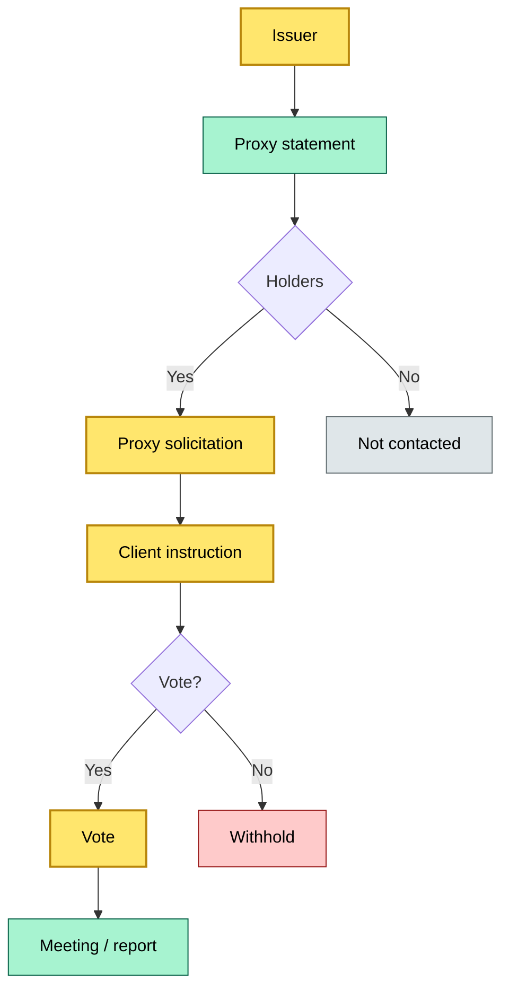
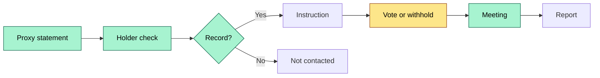
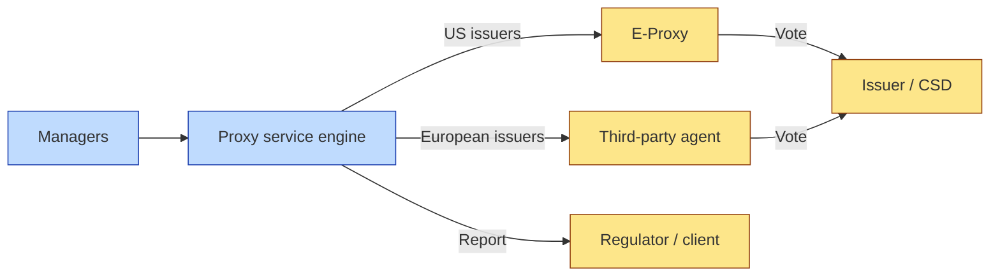

# C2-09 — Proxy services: voting, general meetings, shareholder-related services — DETAIL
> **Category:** C2 — Core Business Flows · **Difficulty:** ◑ · **Banking-relevant:** 💳
>
> > **Companion brief:** `briefs/C2-09-proxy-voting.md`
> >
> > > **Target reader:** enterprise architect who must *explain, justify, and defend* the topic — not just recite it.

---

## 1. Precise definition
Proxy services are the operational and compliance-driven process by which a custody or asset-management institution receives proxy solicitations, captures client instructions or votes, executes the votes, and reports the results for shareholder meetings, corporate actions, and related corporate governance events.

## 2. Why it exists (the problem it solves)
Shareholders are often institutional — they prefer to delegate voting rather than attend meetings physically. This delegation creates a chain:
- The issuer sends a proxy to the shareholder.
- The shareholder sends it to the custodian/agent.
- The custodian or agent votes the proxy.

Without a reliable proxy service, the issuer and shareholders lose the ability to delegate. Failure modes:
- **Non-participation:** The share votes are not cast, and the client cannot defend its interests.
- **Late voting:** The vote arrives after the cutoff and is rejected.
- **Wrong vote:** The vote is cast against the client’s instruction due to human error.
- **Non-compliance:** The regulator (e.g., SEC) requires disclosure of voting records; the bank must retain and report.

Proxy services exist to ensure that shareholders’ votes are faithfully represented and that the process is auditable.

## 3. Core concepts & vocabulary
| Term | Precise meaning |
|------|-----------------|
| Proxy | A document authorizing a delegate to vote on a shareholder’s behalf. |
| Proxy voting | The act of voting using a proxy. |
| Proxy solicitation | The request for a client to provide a vote or instruction. |
| Proxy instruction | The client’s direction to vote or to abstain. |
| General meeting / annual meeting | The forum where shareholders vote. |
| Proxy statement | The document that contains voting instructions and meeting details. |
| Cut-off / deadline | The last time to accept proxy instructions. |
| Time / date / time | The specific time a meeting starts. |
| Method / voting | Paper, electronic, in-person, or online voting. |
| Voter / proxy | The delegate who receives the proxy. |
| Release / surrender / keep-physical | The legal act of giving up a stock. |
| Introduction / both / dual / formal / informal | Categories of shareholders (institutional, beneficial owner, physical). |
| Trustee / corporate / large / trust / client / document / set | Entities that hold shares. |
| A-1 / A-2 / B-1 / 2 / 3 / 4 / 5 | Shareholder class identifiers. |
| European / extra-European / non-European / home | The geographical area. |
| National / local / Foreign | The jurisdiction. |
| Self-proxy | A proxy that contains an election by the client directly. |

## 4. How it works (architecture / mechanism)
### Step 1: Proxy solicitation ingestion
- The proxy service receives:
  - **Direct from issuer:** MPI / proxy statements.
  - **From clearing agent:** aggregate proxy materials.
  - **From issuer’s registrar:** input from the record date and ex-dividend date.
  - **Via third-party routing / issuer’s electronic portal:** Basel, ETHZ, EDI.
- The system validates:
  - **Validity / legal:** the proxy is endorsed by the issuer and legally enforceable.
  - **Holder / asset:** the client holds the shares on the record date.
  - **Shareholder identity:** the shares are not in a margin or securities lending account.
  - **Issuance date:** the proxy is sent within the timeline.
  - **Share class / name / ticker / issue:** the proxy is for the correct class.
  - **Location:** the proxy is sent to the correct address.

### Step 2: Proxy instruction
- The client (or delegated asset manager) receives a proxy instruction to:
  - **Vote** (for, against, abstain).
  - **Proxy the vote** (delegate fully).
  - **Withhold** (do not vote the shares).
  - **Proxy vote** (vote the shares on behalf of a client).
- The client replies through:
  - **Proxy letter:** physical.
  - **Online / electronic:** e-proxy.
  - **In-person:** at the meeting.
- For bulk / institutional voting:
  - The custodian aggregates all client proxy instructions.
  - The custodian decides:
    - If the instruction rate is high, the custodian may vote in aggregate.
    - If instructions are conflicting, the custodian may use a standard voting policy.

### Step 3: Confirming
- The CSD or transfer agent confirms that:
  - The holder’s proxy is valid.
  - The record date is correct.
- The proxy service confirms:
  - The vote is valid.

### Step 4: Voting
- The vote is cast:
  - **Electronic / remote voting:** via the issuer’s online portal.
  - **In-person voting:** at the meeting, via a proxy card.
  - **Proxy agent:** the custodian (or a third-party agent) votes.
- The vote is recorded with:
  - **Proposal / ballot / resolution.**
  - **Direction / vote / date / time.**
  - **Result / how votes were cast.**
- The CSD or registrar records the vote.

### Step 5: Printing / proxy statement
- The vote is printed on a proxy statement.
- The statement may be sent to:
  - **Commission / regulator reporting / fund regulator / principal:** to               ;
  - **The issuer:** to confirm the vote was recorded.
- The statement includes:
  - **Shareholder / client:** identification.
  - **Record date / record / 임계 / 타간:** the record date.
  - **Votes received / votes cast / votes withheld.**
  - **Outcome / ballot:** how votes were cast.
  - **Timing / result:** the result and timing.

### Step 6: Reporting
- **Internal report:** the operations team reports on proxy activity, non-participation.
- **External report:** the fund reports the vote to the client or regulator.
- **Adverse control:** the compliance team reviews voting policy and proxy.

## 4.1 Diagrams

**Diagram A — Core structure** (highlight soliciting = green, vote = amber):



**Diagram B — Lifecycle / flow** (highlight solicitation = green, vote = gold):



## 5. Variants, options & trade-offs
| Variant | When to pick | When to avoid | Key trade-off axis |
|---------|--------------|---------------|--------------------|
| Electronic / e-proxy | Large client base; reduced cost; faster turnaround | Some jurisdictions still require physical; regulatory acceptance of e-proxy | Cost vs legal finality |
| Third-party agent | Lack of expertise; high volume; post-market trading | Service dependency; less control; higher cost | Control vs cost |
| Automated / auto-voting | Standard policy voting; low-stakes votes | Conflicts of interest; regulatory scrutiny if policy is opaque | Efficiency vs accountability |
| Manual / paper proxy | Low volume; high-stakes / contested votes | Labor-intensive; higher error | Control vs error |
| Direct mail / in-person | Clients who prefer paper | Not scalable | Preference vs scalability |
| Bot-based voting | High volume; low cost | High risk of error; low client control | Scale vs control |

## 6. Relationships to sibling topics
- **C2-08 Corporate actions:** Proxy is a subcategory of corporate events; some CAs are directly voting items (e.g., director elections, mergers).
- **C2-10 Collateral management:** Shares pledged as collateral may lose voting rights, but the custodian must manage proxy instructions for pledged shares if allowed.
- **C2-11 Borrowing & lending:** In securities lending, the borrower may need to vote proxies; the lender may delegate voting to the borrower or the custodian.

## 7. Banking / financial-services context 💳
A UK pension fund holds 5% of a listed company. The company calls an annual meeting to vote on a major transaction. The custodian:
- Receives the proxy from the issuer.
- Consolidated proxy instructions from the fund manager.
- The fund manager instructs a "Yes" vote.
- The custodian votes as instructed.
- The custodian records the vote and reports it to the issuer and to the fund manager for regulatory reporting (e.g., SEC).
- The shareholder is protected: the vote is cast, the process is auditable, and the client’s interests are represented.

Failure mode: A custodian fails to vote due to a technical issue with the issuer’s electronic portal. The shareholder does not vote, and the transaction passes without dissent. The pension fund loses its strategic voice.

## 8. Reference architecture / worked example
### Scenario
A US investment manager needs to handle proxy voting for 500 institutional clients across 30 issuers.

### Decision
- **Electronic / e-proxy** for US issuers.
- **Third-party agent** for European issuers (to handle language and legal complexity).
- **Automated / auto-voting** for routine votes (director elections) with a published policy.
- **Manual / paper proxy** for contested or high-stakes votes.

### Diagram


ADR-09: Proxy voting service for institutional clients.

## 9. Maturity & adoption signals
- **Adopt when:** the institution holds a significant block of shares and has regulatory or reputational reasons to vote.
- **Anti-signals (don’t adopt yet):** low shareholdings; no regulatory requirement; no vote-through opportunity.
- **Common failure modes:**
  1. **Late / missed deadline:** a common operational error.
  2. **Wrong issuer / wrong class:** a shareholder vote sent to the wrong entity.
  3. **Released shares:** shares in a margin or lending account that lost voting rights, leading to a non-participation.

## 10. Common confusions — the “don’t mix” list
| Often confused | Real distinction |
|----------------|----------------|
| Proxy vs proxy vote | Proxy = authority; vote = actual ballot. |
| Proxy vs proxy solicitation | Proxy = authority; solicitation = the request. |
| Proxy vs proxy statement | Proxy = authority; statement = the document. |
| Proxy vs proxy instruction | Proxy = authority; instruction = direction. |

## 11. Tools & standards to know
- **Standards/IR:** SEC Proxy Rules; OECD Guidelines; IOSCO Principles; Proxy Voting Guidelines.
- **Common tooling:** Proxy voting platforms (ISS, Menlo, Gemini), issuer portals, agent bank interfaces, IRS reporting tools.
- **Mandatory reading:** SEC Rule 14a-8; IOSCO Proxy Voting Guidance; AIFMD reporting.

## 12. ADR template (ready to fill in)
```markdown
# ADR-09: Proxy voting service for institutional clients
## Status
Accepted

## Context
Pension fund holds 5% of a listed company and needs to vote at the annual meeting.

## Decision
- Custodian votes as instructed.
- Report vote to regulator and client.

## Consequences
- Positive: client representation; Negative: operational risk.
- ...

## Alternatives considered
1. Third-party agent — higher cost.
2. In-house voting team — high cost.
```

## 13. Practice — apply it
1. **Recall:** define the proxy lifecycle in 2 min without notes.
2. **Model:** draw a flow from issuer to custodian to voting to reporting.
3. **ADR:** write a decision for an agent-based voting service for European issuers.
4. **Defend:** roleplay explaining a missed proxy vote to a non-technical CRO.

## Summary
Proxy services are a specialty within corporate actions. They sit at the intersection of custody, asset management, and governance.

---
**Status:** ☐ Not started · ☐ In progress · ✅ Covered
*Last updated: 2026-09-14*

---
**One diagram required. Both brief + detail must exist with ≥1 mermaid each before ✓.**
