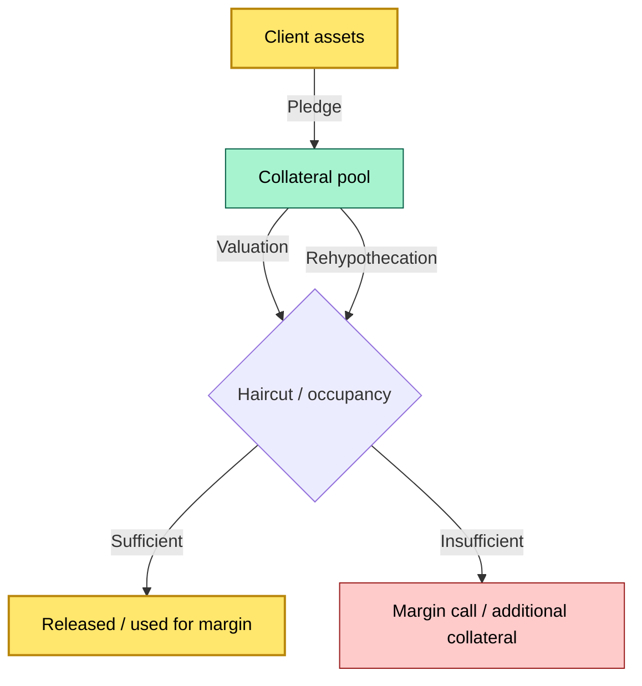
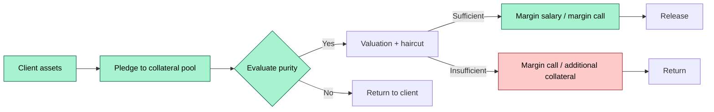
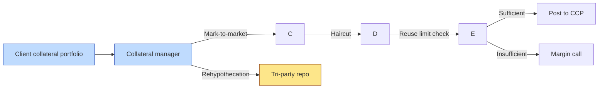

# C2-10 — Collateral management: pledges, releases, reinvestment, rehypothecation — DETAIL
> **Category:** C2 — Core Business Flows · **Difficulty:** ◑ · **Banking-relevant:** 💳
>
> > **Companion brief:** `briefs/C2-10-collateral-management.md`
> >
> > > **Target reader:** enterprise architect who must *explain, justify, and defend* the topic — not just recite it.

---

## 1. Precise definition
Collateral management is the custody and operational process of pledging, sourcing, agreeing, valuing, monitoring, and releasing client or third-party assets that are delivered as security for a financing obligation.

## 2. Why it exists (the problem it solves)
Without collateral management, clients cannot efficiently use their assets to borrow. Without control over the process, the custodian:
- Cannot enforce occupancy limits or margin calls.
- Risks mixing client collateral with proprietary assets (a regulatory breach).
- Cannot track how much collateral is available vs. how much is pledged.
- Cannot return accurate collateral to the client on demand.

The failure mode of no segregated collateral management is a client asset breach (e.g., the bank has no documentation that $500m of client assets were returned after a purchase).

## 3. Core concepts & vocabulary
| Term | Precise meaning |
|------|-----------------|
| Pledge | The act of delivering assets to a counterparty as security for a financing transaction. |
| Rehypothecation | The pledging of collateral that has itself been received by the pledgee to a third party or for trading. |
| Valuation | The periodic mark-to-market of pledged assets to determine base value and allowable amount. |
| Haircut | The reduction between market value and allowable collateral value. |
| Occupancy | The proportion of a client’s segregated assets currently pledged, shown in % or currency. |
| Liability / receivable / disclosure | The borrowing obligation (liability) and the amount pledged (receivable), with disclosure of reuse. |
| Return | The process of returning pledged assets to the pledgor upon obligation fulfillment or upon demand. |
| Reinvestment | The return or deployment of returned collateral into a reinvestment vehicle or cash account. |
| CCO (Client Collateral Obligations) | The secure-only portfolio of client collateral. |
| CCOR (Client Collateral Reutilization Option) | The handling of collateral rights. |
| CCOR (Client Collateral Utilization) | The reprocessing of collateral within a single limit. |
| FCR (Funding & Collateral Reutilization) | The process of financing and reusing collateral. |
| FCTB (Flexible Currency and Time-Bond) | The trading of client assets with a single entity. |
| FCTB book | The accounting of client assets in a consolidated book. |

## 4. How it works (architecture / mechanism)
### Step 1: Pledging request / trigger
- A financing transaction (e.g., repo, securities loan, margin loan) is initiated.
- The trade desk requests collateral from the custodian.
- The system checks:
  - Whether the client account has eligible assets.
  - Whether the assets are approved for lending/pledging.
  - Whether the assets are subject to segregation or rehypothecation restrictions.

### Step 2: Pledge
- Eligible securities are transferred from the client’s safekeeping account to the collateral manager’s account.
- The transfer is recorded with:
  - Client tag
  - Asset, quantity, ISIN
  - Date and time
  - Pledge reason and financing instrument
  - Legal agreement (ISDA / CSA / SSAs, if applicable)

### Step 3: Valuation
- The collateral manager marks the assets to market.
- A haircut is applied:
  - **Collateral Amount = (Market Value) × (1 – Haircut) – Devaluation**
- The_allocation value is computed per client and per constraint (e.g., segregated, rehypothecable, non-rehypothecable).

### Step 4: Reinvestment or Reuse
- The collateral may be:
  - **Reused/rehypothecated:** lent out to a third party or traded.
  - **Invested:** placed in a repo or investment account.
  - **Held:** kept as collateral without reuse.
- The reuse rate is computed as:
  - **Reuse = (Reused Amount) / (Total Collateral)**
- Reusage must be disclosed to the client and regulated (e.g., under the SMCR or BAS.6).

### Step 5: Monitoring
- The system monitors:
  - Market value of pledged assets
  - Occupancy ratio: **(Pledged / Total Segregated)**
  - Haircut applied
  - Reuse rate
  - Margin call threshold
- A margin call is triggered if:
  - **Available Collateral < Required Collateral / (1 + Haircut)**
- The system sends alerts to the client and to the collateral manager.

### Step 6: Release
- Upon obligation fulfillment, margin call, or client request:
- The second/pledged securities are returned to the client’s safekeeping.
- The return is recorded and confirmed.
- The client is informed of the return.

### Step 7: Reinvestment
- Returned collateral is re-invested or held in a reinvestment account.
- Reinvestment can take:
  - **Cash-equivalent invest (e.g., O/N repo)**
  - **Overnight deposits**
  - **Government securities**
- The reinvestment strategy is governed by the client’s mandate.

## 4.1 Diagrams

**Diagram A — Core structure** (highlight pledge = green, release = gold):



**Diagram B — Lifecycle / flow** (highlight margin call = red):



## 5. Variants, options & trade-offs
| Variant | When to pick | When to avoid | Key trade-off axis |
|---------|--------------|---------------|--------------------|
| Segregated collateral | Regulatory requirement (FCA, EMIR) | Reduced reusability; higher occupancy cost | Legal safety vs. yield |
| Rehypothecable collateral | High reuse needed; leverage generation | Counterparty risk; rehypothecation limit; regulatory limit | Reuse vs. risk |
| Tri-party repo | Transparency, central counterparty | Platform dependency; higher cost | Transparency vs cost |
| Bilateral repo | Direct control; low cost | Counterparty concentration risk | Cost vs. safety |
| Haircut-based collateral | Standard for all assets | Lower reuse; higher call frequency | Ratios vs liquidity |
| Cash collateral | Simple; immediate liquidity | Lower yield; not as capital efficient | Safety vs yield |
| Direct borrowing | Customized terms; direct counterparty | Higher operational burden | Flexibility vs cost |

## 6. Relationships to sibling topics
- **C2-01 Onboarding:** The collateral agreement and permissions are set during onboarding (collateral eligibility, rehypothecation limits).
- **C2-11 Borrowing & lending:** Securities lending is a form of collateral-based borrowing; the two are integrated upstream.
- **C2-12 Reporting:** Collateral usage, reuse, and occupancy are reported to the regulator and client.
- **C3-02 Client asset rules:** The rehypothecation limit is a regulatory rule that must be observed regardless.
- **C3-03 MiFID II:** Transaction reporting includes collateral.

## 7. Banking / financial-services context 💳
A global prime broker has $15bn in segregated client collateral across 8,000 clients. The bank needs to post $3bn to clear derivatives with a CCP. The collateral manager:
- Identifies $3bn of eligible assets (equities, government bonds, high-liquidity corporate).
- Applies a 10% haircut, reducing the available amount to $2.7bn.
- A margin call of $300m is issued for the remainder.
- The collateral is distributed to the CCP and the bank’s clearing account.
- During the period, $1.2bn of collateral is rehypothecated to a hedge fund under a tri-party repo.

If the mark-to-market of the assets drops by 5%, the available collateral drops by $150m, triggering a further margin call.

Failure mode: In 2008, the failure to properly compute haircuts and allocate rehypothecated assets contributed to $1bn in collateral shortfall across prime brokerage desks.

## 8. Reference architecture / worked example
### Scenario
A prime broker with $12bn in client assets needs to post collateral for a cleared derivatives book.

### Decision
- 70% of collateral is rehypothecated; 30% is held unpledged.
- The rehypothecation limit is 25% for non-government securities, 50% for government.
- The collateral manager marks-to-market daily and issues margin calls.

### Diagram


ADR-10: Segmented rehypothecation limits per asset class.

## 9. Maturity & adoption signals
- **Adopt when:** the institution has a material number of financing relationships; rehypos are needed for velocity; the regulator requires occupancy controls.
- **Anti-signals (don't adopt yet):** low rehypothication; no financing book; no regulator requirement.
- **Common failure modes:**
  1. Rehypothecation limit exceeded without detection.
  2. Wrong occupancy calculation due to excluded assets.
  3. Returned collateral not available due to delayed release.

## 10. Common confusions — the “don't mix” list
| Often confused | Real distinction |
|----------------|----------------|
| Collateral vs securities lending | Collateral = security for a loan; securities lending = a separate two-way loan. |
| Rehypothecation vs reuse | Rehypothecation = pledging received collateral to a third party; reuse = broader term including rehypothecation and substitution. |
| Haircut vs margin | Haircut = reduction; margin = residual after haircut. |
| Pledge vs collateral | A pledge is an act; collateral is the asset. |

## 11. Tools & standards to know
- **Standards/IR:** EMIR Collateral Management; Basel III LCR; CSDR Client Assets; JSCC, DTC; FCP / ECP.
- **Common tooling:** Collateral management platform, valuation engine, occupancy engine, margin call engine.
- **Mandatory reading:** EMIR; CSCR; CSD; CCP; Repo market guidelines.

## 12. ADR template (ready to fill in)
```markdown
# ADR-10: Segmented rehypothecation limits per asset class
## Status
Accepted

## Context
Prime broker with $12bn in client assets; need to meet CCP collateral needs.

## Decision
- 25% for non-government; 50% for government.
- Daily mark-to-market; margin calls.

## Consequences
- Positive: reuse, compliance; Negative: repo dependency.
- ...

## Alternatives considered
1. Uniform 25% limit — higher safety but lower reuse.
```

## 13. Practice — apply it
1. **Recall:** define the collateral management lifecycle in 2 min without notes.
2. **Model:** map the data flow from custody to valuation to CCP to release.
3. **ADR:** write a decision on integrating an automated collateral valuation engine.
4. **Defend:** roleplay explaining rehypothecation to a non-technical CRO.

## Summary
Collateral management is where the custody balance sheet meets the trading book. It is the control surface that determines how much of client capital is locked, how much is available, and how much is re-deployed.

---
**Status:** ☐ Not started · ☐ In progress · ✅ Covered
*Last updated: 2026-09-14*

---
**One diagram required. Both brief + detail must exist with ≥1 mermaid each before ✓.**
