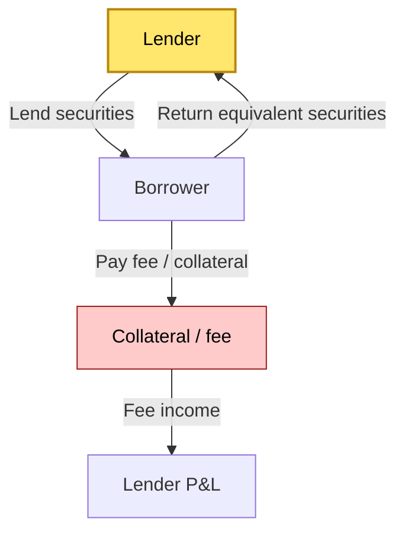
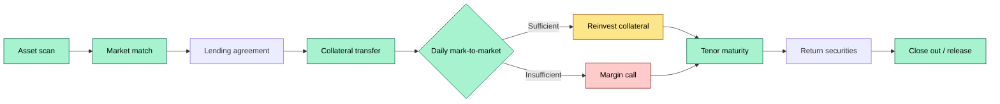
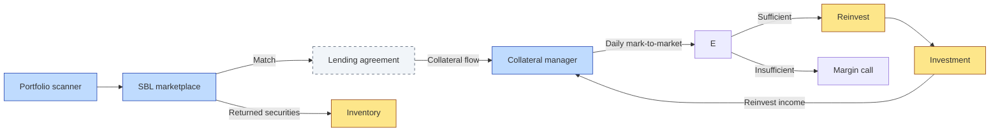

# C2-11 — Securities borrowing & lending (stock loan, repo, securities lending economics) — DETAIL
> **Category:** C2 — Core Business Flows · **Difficulty:** ◑ · **Banking-relevant:** 💳
>
> > **Companion brief:** `briefs/C2-11-borrowing-lending.md`
> >
> > > **Target reader:** enterprise architect who must *explain, justify, and defend* the topic — not just recite it.

---

## 1. Precise definition
Securities borrowing and lending is the marketplace and operational process by which a party (lender) lends securities to another party (borrower) for a fee, with a contractual obligation for the borrower to return equivalent securities (or cash-equivalent) after a specified period, typically with collateral posted by the borrower.

## 2. Why it exists (the problem it solves)
Without securities lending, investors who want to short sell would have to locate and purchase the securities (i.e., earn the full notional) and then sell them, which is capital-intensive and slows settlement. Securities lending the securities to a short-seller reduces:
- **Capital requirements:** The short-seller does not have to hold the full notional.
- **Settlement fails:** The lender’s inventory reduces the chance of a failed settlement.
- **Opportunity cost:** The lender generates fee income on idle securities.

The failure mode of no securities lending is that the market lacks liquidity for borrowing key securities, leading to higher borrow rates, tighter settlement, and lost revenue for the custodian.

## 3. Core concepts & vocabulary
| Term | Precise meaning |
|------|-----------------|
| Securities borrowing & lending (SBL) | The two-sided marketplace where securities are lent for a fee. |
| Stock lending | The temporary transfer of equities for a fee. |
| Repo (repurchase agreement) | A transaction where cash is sold with a promise to repurchase; analogous but typically cash-collateralized. |
| Short selling | Selling borrowed securities with the expectation of buying them back at a lower price. |
| SBL marketplace | A platform (e.g., BondDesk, Eurex Repo, Alpumin, CSCL, Refinitiv) where borrowers and lenders match. |
| ISLA standards | International Securities Lending Association guidelines for collateral and terms. |
| ISDA CSA | The credit support annex used to define collateral terms. |
| Total return swap (TRS) | A derivative where one party pays the total return of a security, the other pays a financing rate. |
| OVS (Offering / Valuation / Settlement) / sell-side / buy-side / sell / buy / sell / buy / supply / firm / liquidity | (Dirty terms) |
| Equal / Stable / Price / Net | Daily mark-to-market / net value / settlement value |
| Collateral | The security or cash posted by the borrower to the lender. |
| Collateral agent | The entity that holds the collateral and manages the daily calls. |
| Repo rate | The annual rate paid by the borrower for the securities. |
| Haircut | The reduction between the collateral value and the notional of the securities lent. |
| Re-hypothecation | The pledging of received collateral by the lender to a third party. |
| Transfer agent | The entity that maintains the shareholders' register. |
| Collateral pool | A pool of securities or cash that is available to be lent. |
| Margin call | A request for additional collateral when the collateral coverage falls below a threshold. |
| Close-out | The termination of a loan when the collateral falls below a threshold. |
| Turnover / volume / notional | The total value of lent securities. |
| Average tenure | The average duration of a loan, in days. |
| Net borrow | The total amount of securities lent minus the total amount returned (if any). |

## 4. How it works (architecture / mechanism)
### Step 1: Asset identification
- The SBL desk or an automated engine scans the custody portfolio for:
  - **Eligible securities:** those approved for lending (e.g., listed equities, government bonds).
  - **Not eligible:** sovereign defaults, restricted securities, securities in a settlement default.
- The engine checks:
  - Whether the securities are in a segregated account.
  - Whether the securities are in a lending pool.
  - Whether the securities are in a contractual lending arrangement.

### Step 2: Market matching
- The securities are listed on an SBL marketplace or brokered through a dealer.
- The borrower / counterparty is identified, and a **lending agreement** is entered.
- The agreement specifies:
  - **Lender, borrower, subject security.**
  - **Quantity and ISIN.**
  - **Tenor / term (e.g., overnight, 1d, 7d, 14d, long-dated).**
  - **Lending fee (an annualized rate).**
  - **Collateral type:** cash, non-cash security, or a basket.
  - **Collateral terms:** if cash, the rate; if non-cash, the haircut, the tolerance, the close-out threshold.

### Step 3: Collateral transfer
- The borrower transfers collateral to the custodian’s collateral account.
  - **Cash collateral:** the borrower credits the custodian’s cash account; the custodian reinvests the cash (e.g., overnight repo) with a portion (e.g., 50%) returned to the borrower.
  - **Non-cash collateral:** physical or book-entry securities are transferred; the custodian marks them daily; if the value falls below the haircut threshold, a margin call is issued.

### Step 4: Securities transfer
- The broker’s inventory is transferred to the borrower’s account.
- The transfer is processed through the CSD / CDS.
- The securities are **out on loan**.

### Step 5: Daily revaluation / margin call
- Each day, the custodian marks the collateral to market.
- The **haircut** is applied:
  - **Loan Value = (Collateral Market Value) × (1 – Haircut) – Devaluation**
- If the **Loan Value** falls below a **close-out threshold**, a margin call is issued:
  - **Additional collateral required = (Close-out Threshold – Loan Value) × Trigger Factor**
- The borrower must post the additional collateral within a set time (e.g., T+1).

### Step 6: Reinvestment
- Cash collateral is reinvested in a **safe, liquid asset** (e.g., overnight repo, government securities).
- The reinvestment income is:
  - Partially returned to the borrower (e.g., 50% or 75%).
  - Partially retained by the lender (e.g., 25% or 50%).
- The reinvestment engine must:
  - not reinvest in illiquid or downgraded securities (e.g., below 100% AAA or equivalent).
  - comply with the **ISLA / ISLA** collateral standards.

### Step 7: Return of securities (maturity / close-out / settlement)
- When the loan matures or is closed-out:
  - The borrower returns equivalent securities to the lender’s inventory.
  - The rebate (lending fee) is calculated:
    - **Rebate = (Loan Notional) × (Lending Fee Rate) × (Tenor in / 360)**
  - The rebate is credited to the lender’s account on the same day.

### Step 8: Record-keeping
- The system records:
  - The loan agreement terms.
  - Daily position (collateral value, haircut, loan value).
  - Margin calls, reinvestment returns, borrowing fees.
  - The close-out / end-of-tenor event.
- The records are available for reporting to regulators and for audit.

## 4.1 Diagrams

**Diagram A — Core structure** (highlight lender = green, borrower = gold):



**Diagram B — Lifecycle / flow** (highlight daily check = green, margin call = red):



## 5. Variants, options & trade-offs
| Variant | When to pick | When to avoid | Key trade-off axis |
|---------|--------------|---------------|--------------------|
| Cash collateral, reinvestment | High reuse income; low exposure; quick close-out | Counterparty risk if reinvested in non-AAA | Yield vs safety |
| Non-cash collateral (security pledge) | Lower counterparty risk; harder to liquidate | Haircut volatility; margin call frequency | Safety vs volatility |
| Term loan (fixed tenor) | Predictable revenue; lower operational cost | Lower flexibility; re-pricing risk | Certainty vs flexibility |
| Open loan (no fixed end) | High liquidity; easy to close | Re-use risk; operationalize close-out | Liquidity vs control |
| ISLA 5.1 | High-volume standard terms | Higher documentation; less customization | Standardization vs custom terms |
| Bilateral / marketplace | Market transparency; lower fees | Fragmentation; operational cost | Market efficiency vs cost |

## 6. Relationships to sibling topics
- **C2-10 Collateral management:** Securities lending is the primary use of client collateral in the SBL market.
- **C2-03 Receiving & safekeeping:** The securities must be received and in safekeeping before they are lent.
- **C2-05 Settlement:** The lent securities are not settled at the original counterparty; the borrower may trade them.
- **C2-12 Reporting:** SBL activity must be reported to regulators (e.g., MiFID II, EMIR).

## 7. Banking / financial-services context 💳
A major prime broker runs an SBL desk for its institutional clients. The desk:
- Scans the portfolio for eligible equities and sovereign bonds.
- Matches borrowers in London, New York, and Tokyo via the Alpumin marketplace.
- Lends $1bn in equity securities for 7-day tenors at 50bps.
- The borrowers post cash collateral; the broker reinvests 75% in overnight repo at 45bps.
- The 25bps spread, less operational cost, is net profit.

At month-end, the broker reports to the regulator the total SBL volume, collateral reuse, and any margin calls.

Failure mode: In 2015, a major SBL desk was found to have misestimated collateral revaluation during a market shock, causing a $50m shortfall in borrower collateral and a loss for the broker.

## 8. Reference architecture / worked example
### Scenario
A prime broker wants to automate its SBL desk across 3,000 securities and 200,000 outstanding trades.

### Decision
- An SBL marketplace integration (Alpumin, BondDesk, or a proprietary engine).
- Automated collaterals (cash and non-cash) with daily mark-to-market.
- Automated reinvestment in overnight repos or government securities.
- Automate the close-out and return-of-securities engine.

### Diagram


ADR-11: Automated SBL desk for a prime broker.

## 9. Maturity & adoption signals
- **Adopt when:** the institution has a significant inventory of securities and wants to extract yield.
- **Anti-signals (don't adopt yet):** low inventory; no SBL marketplace integration; no client demand.
- **Common failure modes:**
  1. The collateral engine fails to mark to market during a jump.
  2. A close-out is delayed, causing an exposure gap.
  3. The reinvestment violates the ISLA minimum AAA rule.

## 10. Common confusions — the “don’t mix” list
| Often confused | Real distinction |
|----------------|----------------|
| Securities lending vs repo | Securities lending = physical; repo = cash-collateralized. |
| Lender vs borrower | Lender = giver; Borrower = receiver. |
| Open vs term loan | Open = no fixed end; Term = fixed end. |
| Cash collateral vs security collateral | Cash = easy to revalue; Security = haircut and volatility. |

## 11. Tools & standards to know
- **Standards/IR:** ISLA 5, ISLA 6; ISDA CSA; Euroclear SBL; DTCC SBL; JQ; ICSDA.
- **Common tooling:** SBL marketplace (BondDesk, Alpumin), Collateral asset manager, Reinvest engine.
- **Mandatory reading:** ISLA Standards; EMIR collateral; Basel / EMIR.

## 12. ADR template (ready to fill in)
```markdown
# ADR-11: Automated securities lending desk for a prime broker
## Status
Accepted

## Context
Prime broker with 3,000 securities; needs SBL yield and reduce settlement pressure.

## Decision
- SBL marketplace integration.
- Automated collaterals credits.
- Daily mark-to-market; risk-based reinvestment.
- Margin calls = automated.
- Close-out = automated.

## Consequences
- Positive: revenue; Negative: operational complexity.

## Alternatives considered
1. Manual only — high operational overhead.
2. No SBL — zero yield.
```

## 13. Practice — apply it
1. **Recall:** define SBL in 2 min without notes.
2. **Model:** map a securities lending transaction from scanner to marketplace to close-out.
3. **ADR:** write a decision on integrating an automated reinvestment engine for cash collateral.
4. **Defend:** roleplay explaining SBL to a non-technical CRO.

## Summary
Securities lending is a high-velocity, high-frequency activity that extracts yield from idle inventory.

---
**Status:** ☐ Not started · ☐ In progress · ✅ Covered
*Last updated: 2026-09-14*

---
**One diagram required. Both brief + detail must exist with ≥1 mermaid each before ✓.**
